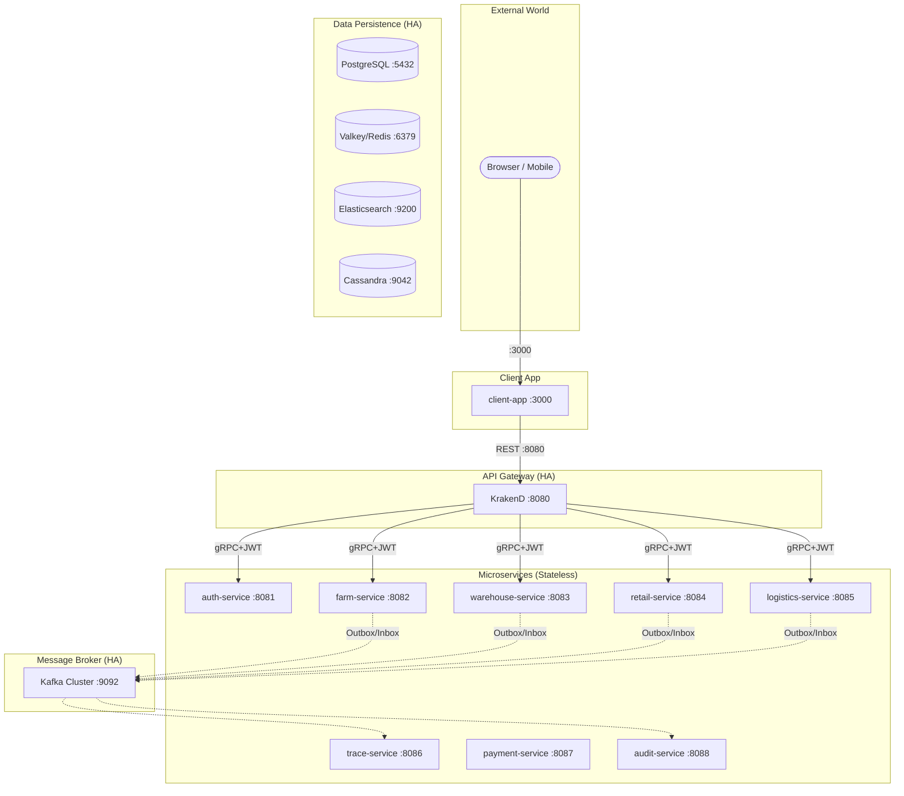

# Runtime Roasters — System Design & Architecture Deep Dive

This document provides a comprehensive technical breakdown of the **Runtime Roasters** platform. It serves as the primary technical reference for the system's distributed patterns, architectural decisions, and data flows.

---

## 🏗️ 1. High-Level Architecture & Blueprint

Runtime Roasters is built as a highly available, event-driven microservices ecosystem. The system is designed so that scaling from 1 to N instances is purely an infrastructure operation with zero logic changes.

### Core Principles (The Constitution)
- **Abstraction First:** All infrastructure (DB, Queue, Cache) is abstracted via Interfaces.
- **Calculated Consistency:** **Transactional Outbox** ensures critical events are never lost; **Inbox Pattern** ensures idempotency.
- **Dual Idempotency:** Two layers of protection: `Idempotency-Key` (HTTP) and `Transactional Inbox` (Kafka).
- **Observability by Design:** Distributed tracing (W3C) is propagated across Gateway, gRPC, and Kafka.
- **Fail-Closed Security:** Internal Zero Trust model with decentralized authorization.

### Infrastructure Overview

---

## 🌊 2. System Data Flows

### A. Identity & SSO Flow (OIDC + Kratos + Hydra)
The system uses a sophisticated SSO cycle to ensure secure, role-aware identity management.

1. **Access:** User hits `/dashboard` (Next.js).
2. **Challenge:** Next.js redirects to **Ory Hydra** for OAuth2 authorization.
3. **Identity:** Hydra delegates authentication to **Ory Kratos**.
4. **Verification:** Kratos validates credentials and notifies Hydra to accept the login.
5. **Token:** Hydra issues a JWT (Access Token) containing user `roles` and `scopes`.
6. **Persistence:** Next.js saves the JWT and uses it for all subsequent API calls.

### B. Distributed Transaction (The Retail Saga)
Ensuring atomicity across Retail, Warehouse, and Payment services.

1. **Retail Service:** Creates an Order with status `PENDING`. Records an `OrderCreated` outbox event.
2. **Warehouse Service:** Consumes the event, uses **Valkey Distributed Lock** to reserve stock, and emits `InventoryReserved`.
3. **Payment Service:** Receives Stripe Webhook (verified via HMAC), updates payment status, and emits `PaymentCompleted`.
4. **Saga Finalization:** Retail Service listens for both successes and moves the Order to `SUCCESS`. If any step fails, **Compensating Actions** (Refunds/Stock Release) are triggered.

### C. Real-time Logistics Bridge
1. **Simulation:** The Frontend "steps" through OSRM coordinate arrays.
2. **Ingress:** FE calls `UpdateLocation` (Gin/gRPC).
3. **Backend:** Logistics Service updates **Valkey GeoSearch** index for the driver.
4. **Broadcast:** Emits `LogisticsGPSUpdated` to Kafka.
5. **Traceability:** Trace Service consumes GPS events to rebuild the delivery timeline.

---

## 📜 3. Architectural Decision Records (ADR Log)

| ID | Title | Status | Decision Summary |
| :-- | :--- | :--- | :--- |
| **0001** | **Clean Architecture** | ✅ Accepted | Use **Consumer-Owned Interfaces**. Usecase defines interfaces; Infrastructure implements them. Ensures domain purity. |
| **0002** | **SigNoz Reversion** | 🔴 Reverted | Removed SigNoz/ClickHouse to save local resources. Reverted to standard OTel + Jaeger. |
| **0003** | **Two-Gate AuthZ** | ✅ Accepted | **Gate 1:** Casbin (RBAC) at the service entry. **Gate 2:** Data Scoping (ABAC) at the GORM/Repository layer via `owner_id`. |
| **0004** | **GORM Migration** | ✅ Accepted | Migrated from `sqlx` to **GORM** to accelerate developer velocity and simplify relationship management/transactions. |

---

## 🛠️ 4. Technical Standards & Patterns

### Clean Architecture Layers
- **Domain:** Pure entities + domain errors. Zero external imports.
- **UseCase:** Business logic + Interface definitions.
- **Infrastructure:** Implementations (GORM, Kafka, Valkey).
- **Delivery:** Transport handlers (gRPC, Gin).

### Security Model (Zero Trust)
1. **API Gateway:** KrakenD verifies JWT signatures and `scope` claims.
2. **Service Level:** Casbin Enforcer checks `role` vs `resource:action`.
3. **Data Level:** Repositories enforce ownership scopes (e.g., `WHERE store_id = ?`).

### Observability
- **Tracing:** W3C Trace-ID propagation across HTTP -> gRPC -> Kafka.
- **Logging:** Zap Logger with automatic `trace_id` injection.
- **Metrics:** Prometheus exporters integrated via `pkg/telemetry`.

---
*Last Updated: May 2026*
