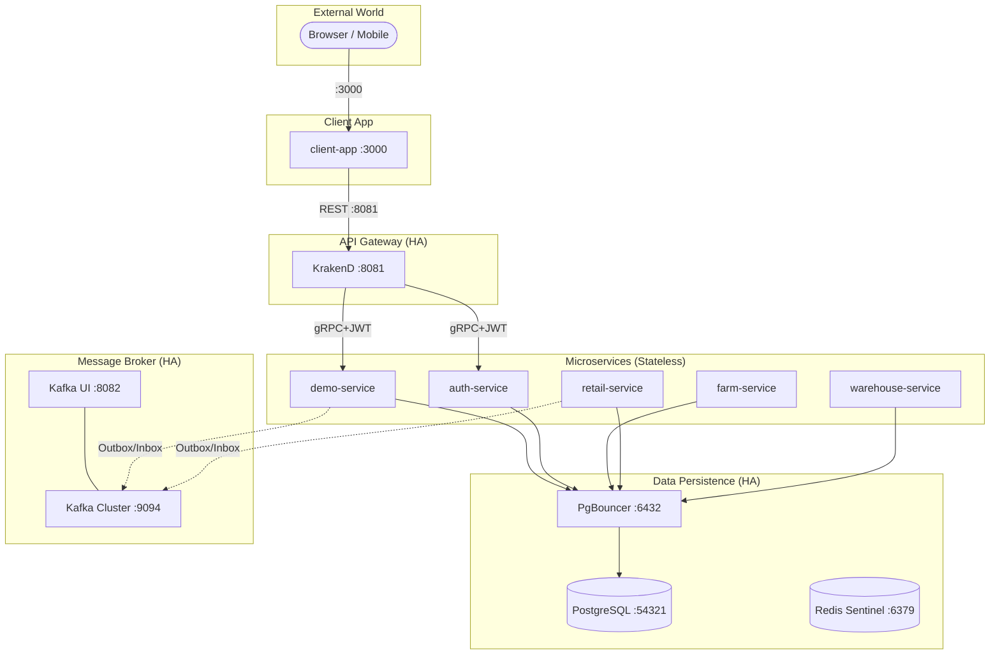

# RuntimeRoasters — System Architecture & Development Blueprint

Tài liệu này định nghĩa kiến trúc tổng thể, các tiêu chuẩn kỹ thuật và lộ trình thực thi cho dự án **RuntimeRoasters**.

---

## 1. Tầm nhìn Kiến trúc (Architectural Vision)

Mục tiêu là xây dựng một hệ thống Microservices **"Mạnh mẽ - Tin cậy - Quan sát được"**. Hệ thống không chỉ giải quyết bài toán nghiệp vụ Chuỗi cung ứng cà phê mà còn là một bản showcase về các mẫu thiết kế (Design Patterns) hiện đại nhất trong hệ sinh thái Go.

### Nguyên tắc cốt lõi (Constitution):
- **Abstraction First:** Mọi thành phần hạ tầng (DB, Queue, Cache) đều được trừu tượng hóa qua Interface.
- **Calculated Consistency:** Sử dụng **Transactional Outbox** để gửi tin và **Inbox Pattern** để nhận tin, triệt tiêu rủi ro mất dữ liệu.
- **Dual Idempotency:** Bảo vệ 2 lớp: `Idempotency-Key` (API Level) và `Transactional Inbox` (Consumer Level).
- **Observability by Design:** Mọi request mang dấu vết W3C Tracing xuyên suốt Gateway -> gRPC -> Kafka.
- **Fail-Closed Security:** Ưu tiên an ninh hơn tính khả dụng trong các trường hợp kiểm tra quyền (VD: Redis Blacklist).

---

## 2. Thiết kế High Availability (HA)

Hệ thống được thiết kế để không có điểm yếu chí tử (No Single Point of Failure).

- **Database HA**: PostgreSQL Master-Slave Replication với PgBouncer làm cổng kết nối tập trung.
- **Messaging HA**: Cụm Kafka tối thiểu 3 Brokers, Replication Factor = 3.
- **Gateway HA**: KrakenD chạy đa instance (stateless) phía sau External Load Balancer.
- **Identity HA**: Ory Kratos/Hydra chạy đa instance với shared session store (Redis).

---

## 3. Sơ đồ Hạ tầng Tổng thể

---

## 4. Chiến lược Kafka (Topic-per-Domain)

| Nhóm Domain | Topic Kafka | Producer | Consumer |
| :--- | :--- | :--- | :--- |
| Identity | `auth.user.events` | Auth | Farm, Audit |
| Commercial | `retail.order.events` | Retail | Warehouse, Trace |
| Inventory | `warehouse.stock.events` | Warehouse | Retail, Logistics |
| Logistics | `logistics.gps.events` | Logistics | Frontend (SSE) |

- **Scaling**: Sử dụng **Consumer Groups** để chia tải cho nhiều instance của cùng một service.
- **Ordering**: Dùng Business Key (VD: `order_id`) làm **Kafka Key** để bảo đảm thứ tự xử lý trên cùng 1 partition.

---

## 5. Mô hình Bảo mật 3 Tầng (Three-Gate Security)

Hệ thống áp dụng mô hình Zero Trust nội bộ:

1.  **Gate 1 (Gateway)**: KrakenD verify chữ ký JWT và kiểm tra `scope` claim (VD: `retail:app`).
2.  **Gate 2 (Service)**: Casbin Enforcer tại từng Microservice kiểm tra `role` người dùng trên RAM (In-memory).
3.  **Gate 3 (Internal)**: gRPC Interceptor tự động chuyển tiếp (propagate) JWT metadata giữa các service. System-to-system call dùng `Internal-Secret`.

---

## 6. Port Map (Final)

| Service | Port | Ghi chú |
| :--- | :--- | :--- |
| client-app | 3000 | Unified UI |
| KrakenD | 8081 | API Gateway |
| auth-service | 8082 / 50052 | Identity Proxy |
| farm-service | 8083 / 50053 | Farm Management |
| PostgreSQL | 54321 | Direct access (Dev only) |
| PgBouncer | 6432 | Connection Pooler (Primary) |
| Kafka Cluster | 9094 | Broker network |
| Valkey/Redis | 6379 | Idempotency & Cache |

---

## 10. Sprint Roadmap (Epic-based)

| Sprint | Epic Goal | Key Deliverables |
| :--- | :--- | :--- |
| **S1-3** | Foundation | Completed Infrastructure & Farm Core |
| **S4** | Security Base | E2E Auth, Token Revocation |
| **S5-6** | Saga & Consistency | Outbox/Inbox, Order Flow, Stock Reservation |
| **S7-8** | Logistics | Real-time Tracking, Redis Geo |
| **S9-10** | Transparency | CQRS, Elasticsearch, OTel, Cassandra Audit |
| **S11** | Commerce | Real Stripe Payment & Saga Phase 2 |
| **S12** | Grand Finale | System Mesh Visualization, Chaos, mTLS |

---
*Cập nhật lần cuối: 2026-05-10 bởi TechLead*
