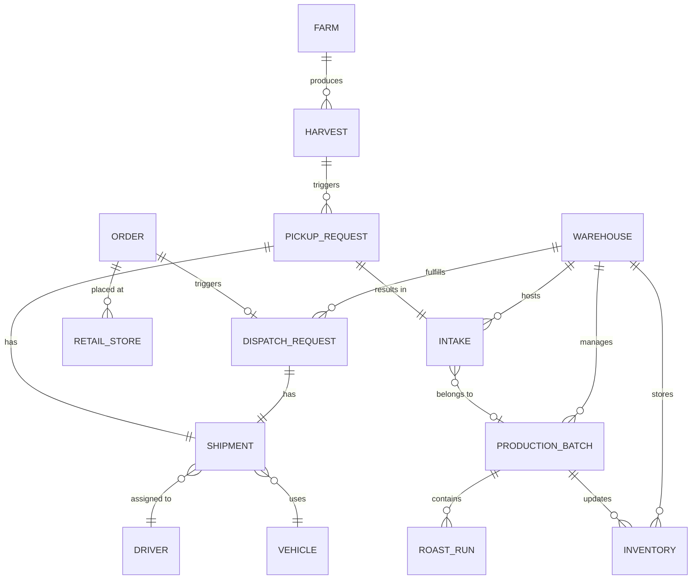
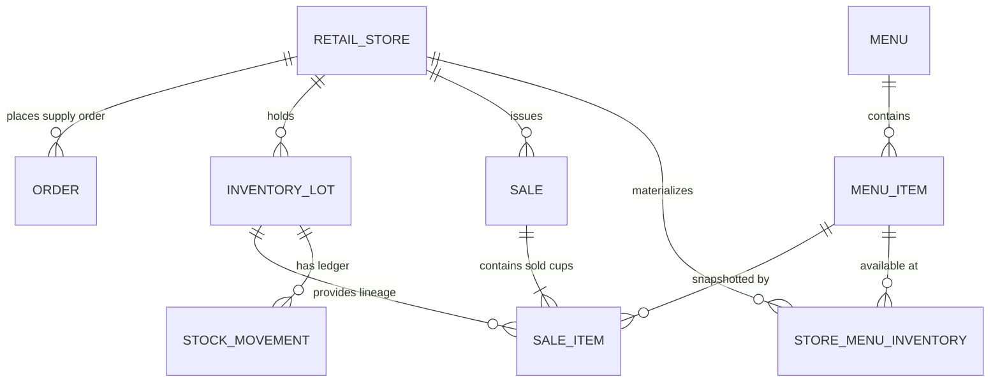

# Entity Relationship Diagram

## System Overview

## Core Entities

### Farm Service
| Entity | Description |
| :--- | :--- |
| **Farm** | Coffee plantation with location, area, and coffee type. |
| **Harvest** | A specific collection of coffee cherries from a farm. |

### Warehouse Service
| Entity | Description |
| :--- | :--- |
| **Warehouse** | Storage and processing facility. |
| **Intake** | Raw material entry into the warehouse. |
| **ProductionBatch** | Aggregation of intakes for roasting/processing. |
| **Inventory** | Stock levels per SKU in a warehouse. |
| **PickupRequest** | Request to collect harvest from a farm. |
| **DispatchRequest** | Request to send reserved stock to a store. |

### Retail Service
| Entity | Description |
| :--- | :--- |
| **RetailStore** | Coffee shop location. |
| **Order** | Existing warehouse supply-order workflow. |
| **Menu** | Versionable chain-wide menu. |
| **MenuItem** | One sellable drink-size entry from SAMPLE_MENU.md. |
| **InventoryLot** | Store stock with upstream harvest/batch/warehouse lineage. |
| **Sale** | Public POS invoice, separate from supply orders. |
| **SaleItem** | One sold cup, UI-issued `product_id`, and QR identity. |
| **StockMovement** | Immutable received/sold/adjustment ledger. |
| **StoreMenuInventory** | Materialized available units by store and menu item. |

### Logistics Service
| Entity | Description |
| :--- | :--- |
| **Shipment** | Tracking unit for moving goods (Farm->Warehouse or Warehouse->Store). |
| **Driver** | Personnel assigned to shipments. |
| **Vehicle** | Asset used for transport. |
