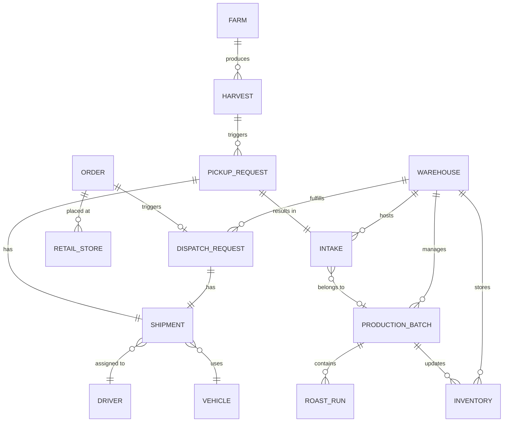

# Entity Relationship Diagram

## System Overview

## Core Entities

### Farm Service
| Entity | Description |
| :--- | :--- |
| **Farm** | Coffee plantation with location, area, and coffee type. |
| **Harvest** | A specific collection of coffee cherries from a farm. |

### Warehouse Service
| Entity | Description |
| :--- | :--- |
| **Warehouse** | Storage and processing facility. |
| **Intake** | Raw material entry into the warehouse. |
| **ProductionBatch** | Aggregation of intakes for roasting/processing. |
| **Inventory** | Stock levels per SKU in a warehouse. |
| **PickupRequest** | Request to collect harvest from a farm. |
| **DispatchRequest** | Request to send reserved stock to a store. |

### Retail Service
| Entity | Description |
| :--- | :--- |
| **RetailStore** | Coffee shop location. |
| **Order** | Customer order containing multiple SKUs. |

### Logistics Service
| Entity | Description |
| :--- | :--- |
| **Shipment** | Tracking unit for moving goods (Farm->Warehouse or Warehouse->Store). |
| **Driver** | Personnel assigned to shipments. |
| **Vehicle** | Asset used for transport. |
