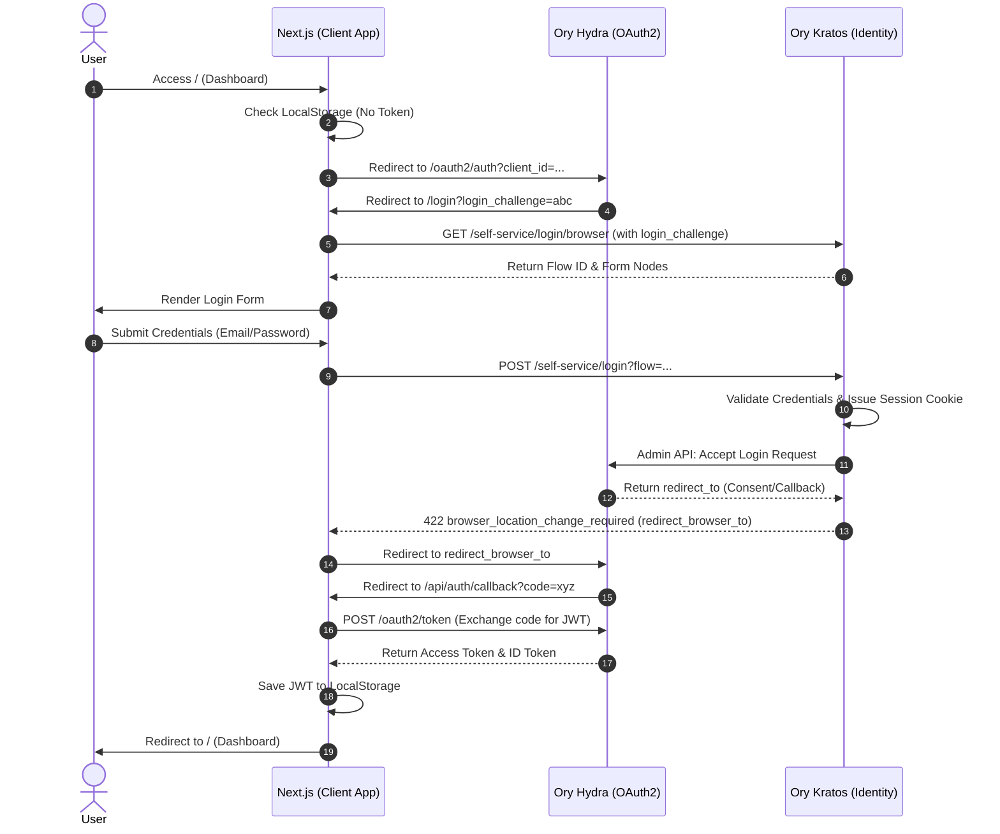
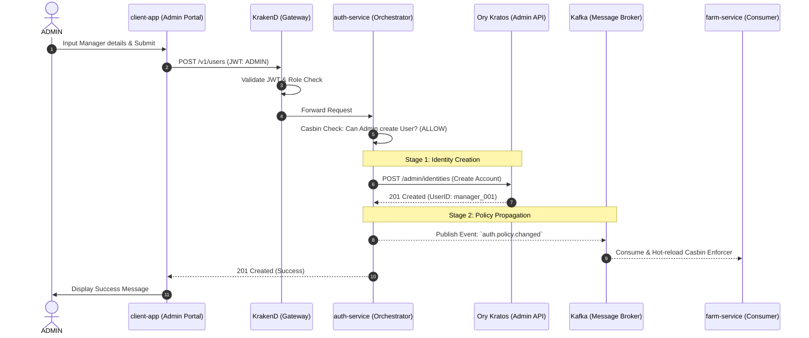

# 🌊 Runtime Roasters Architecture Flows

This document consolidates the key architectural flows of the **Runtime Roasters** platform, covering Identity, Data Consistency (CQRS/Saga), and User Management.

---

## 🔐 1. Identity & Authentication Flow

This diagram illustrates the interactions between the **Client App**, **Ory Kratos** (Identity), and **Ory Hydra** (OAuth2) during a standard SSO login cycle.

### Standard Login Sequence

---

## 📦 2. Core Business Flows (Saga & CQRS)

These flows demonstrate how the system handles high-volume transactions and data consistency across microservices.

### A. Farm to Trace (CQRS & Outbox)
1.  **Write Side (Farm Service):**
    - Receives `POST /v1/harvests`.
    - Opens a **Database Transaction**.
    - Inserts Harvest record and an **Outbox Event**.
    - Commit Transaction.
2.  **Relay Worker:**
    - Scans the Outbox table for `PENDING` events.
    - Publishes to Kafka topic `farm.harvest.created`.
    - Marks Outbox as `COMPLETED`.
3.  **Read Side (Trace Service):**
    - Consumes from Kafka.
    - Checks for duplicate messages (**Inbox Pattern**).
    - Upserts data into **Elasticsearch** for fast traceability lookups.

### B. Order SAGA (Choreography)
1.  **Retail Service:** Initiates Order (Pending) ➔ Publishes `OrderCreated`.
2.  **Warehouse Service:** Reserves stock using **Valkey Distributed Locks** ➔ Publishes `StockReserved`.
3.  **Payment Service:** Processes payment via simulated provider ➔ Publishes `PaymentCompleted`.
4.  **Retail Service:** Receives all success events ➔ Updates Order to `SUCCESS`.
5.  *Compensation:* If any step fails (e.g., Payment Declined), services publish rollback events to release reserved stock.

---

## 👥 3. User Management & Admin Flow

This flow ensures secure account creation, where only **ADMIN** users can provision new accounts through a centralized proxy.

### Admin Creates Manager Sequence

### Kafka's Role in Identity
- **Policy Sync:** Ensures new users have immediate access rights across the cluster.
- **Profile Sync:** Propagates metadata (Name, Email) to downstream services for local display.
- **Audit Logging:** Provides a permanent record of administrative actions.

---

## 🎨 4. System Visualization Flow (Control Plane)

This "Showcase-only" flow enables the **Real-time Architecture Map** on the dashboard, allowing observers to see data moving through the system as it happens.

### The Life of a Visualization Event
1.  **Event Generation**: A microservice (e.g., Payment) performs a task and publishes an event to Kafka.
2.  **Monitor Consumption**: The **Monitor Service** listens to all core business topics.
3.  **Real-time Broadcast**: The Monitor Service extracts the `Trace-ID` and event type, then pushes a lightweight JSON payload to the Frontend via **Server-Sent Events (SSE)**.
4.  **Frontend Animation**: The Dashboard receives the event and triggers an animation (e.g., a glowing pulse) along the edge connecting the participating services on the system map.

**Business Value**: Provides immediate operational visibility and a "live heartbeat" of the entire supply chain, making the complex microservices architecture tangible and easy to audit.

---
*Documented for Runtime Roasters Technical Showcase.*
