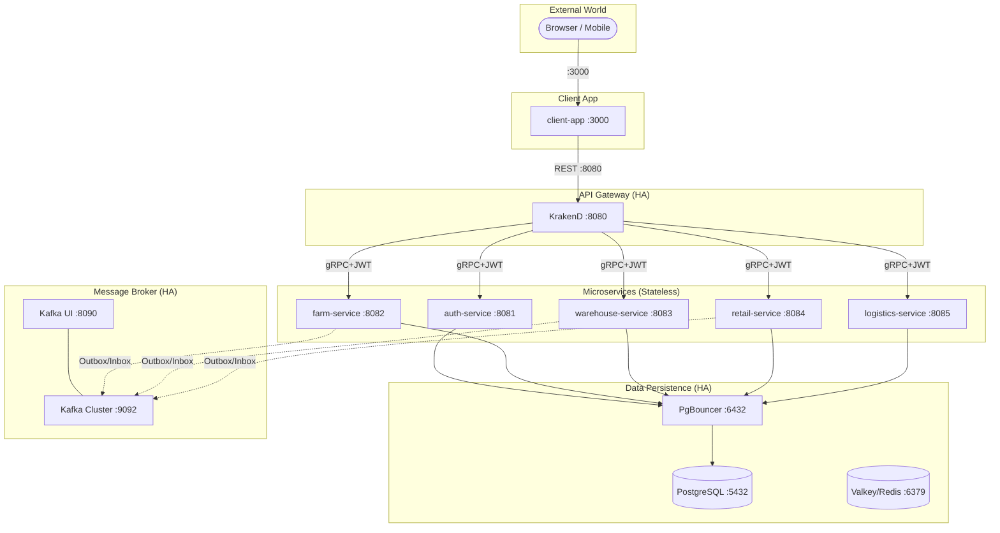

# RuntimeRoasters Architecture Documentation

Welcome to the central hub for the RuntimeRoasters system architecture. This documentation is organized following Enterprise Big Tech standards (Diátaxis Framework + ADRs) to ensure maintainability, clear separation of concerns, and structured onboarding.

## 📚 Organization Rules

1. **Architecture (High-Level):** This file and the subdirectories `adrs/` and `flows/`.
2. **Engineering (Low-Level):** Located in `docs/engineering/`. Contains implementation details, schemas, and developer guides.
3. **Business & Planning:** Located in `docs/business/`. Contains Sprints, PRDs, and Roadmaps.

---

# 🗺️ Master Index

### 1. High-Level Overview & Blueprint
- [System Architecture & Development Blueprint](#runtime-roasters-system-architecture--development-blueprint) (Below)
- [ADRs (Architecture Decision Records)](./adrs/)
- [Flows (Interaction Diagrams)](./flows/)

### 2. 🧠 Architectural Concepts (Consolidated)
- [Clean Architecture Framework](#-clean-architecture-framework--runtimeroasters)
- [High Availability (HA) & Kafka Messaging Strategy](#high-availability-ha--kafka-messaging-strategy)
- [Observability Strategy (Telemetry)](#thiết-kế-telemetry--aspire-like-observability-cho-go)
- [Resilient AuthZ Sync Architecture](#resilient-authz-sync-architecture)
- [System-Wide Architectural Standards](#system-wide-architectural-standards-runtime-roasters)

### 3. 🛠️ Engineering & Developer Guides (External)
- [Engineering Master Index](../engineering/README.md)
- [Database Models & Schemas](../engineering/database/)
- [Common Library (pkg) Reference](../engineering/reference/core-framework-pkg.md)

### 4. 📅 Project Planning & Roadmap (External)
- [Master Sprint Roadmap](../business/sprint-planning.md)
- [Sprint 4: The Resilient Farm](../business/sprint4/main.md)

---

# Runtime Roasters — System Architecture & Development Blueprint

Mục tiêu là xây dựng một hệ thống Microservices **"Mạnh mẽ - Tin cậy - Quan sát được"**. Hệ thống không chỉ giải quyết bài toán nghiệp vụ Chuỗi cung ứng cà phê mà còn là một bản showcase về các mẫu thiết kế (Design Patterns) hiện đại nhất trong hệ sinh thái Go.

### Nguyên tắc cốt lõi (Constitution):
- **Abstraction First:** Mọi thành phần hạ tầng (DB, Queue, Cache) đều được trừu tượng hóa qua Interface.
- **Calculated Consistency:** Sử dụng **Transactional Outbox** cho các luồng quan trọng và **Inbox Pattern** để nhận tin, triệt tiêu rủi ro mất dữ liệu.
- **Dual Idempotency:** Bảo vệ 2 lớp: `Idempotency-Key` (API Level) và `Transactional Inbox` (Consumer Level).
- **Observability by Design:** Mọi request mang dấu vết W3C Tracing xuyên suốt Gateway -> gRPC -> Kafka.
- **Fail-Closed Security:** Ưu tiên an ninh hơn tính khả dụng trong các trường hợp kiểm tra quyền (VD: Valkey Blacklist).

## Thiết kế High Availability (HA)

Hệ thống được thiết kế để không có điểm yếu chí tử (No Single Point of Failure).

- **Database HA**: PostgreSQL Master-Slave Replication với PgBouncer làm cổng kết nối tập trung.
- **Messaging HA**: Cụm Kafka tối thiểu 3 Brokers, Replication Factor = 3.
- **Gateway HA**: KrakenD chạy đa instance (stateless) phía sau External Load Balancer.
- **Identity HA**: Ory Kratos/Hydra chạy đa instance với shared session store (Valkey).

## Sơ đồ Hạ tầng Tổng thể



## Chiến lược Kafka (Topic-per-Domain)

| Nhóm Domain | Topic Kafka | Producer | Consumer |
| :--- | :--- | :--- | :--- |
| Identity | `auth.user.events` | Auth | Farm, Audit |
| Farm | `farm.harvest.events` | Farm | Warehouse, Trace |
| Inventory | `warehouse.stock.events` | Warehouse | Retail, Trace |
| Commercial | `retail.order.events` | Retail | Warehouse, Trace |
| Logistics | `logistics.shipment.events`| Logistics | Retail, Trace |

## Mô hình Bảo mật 3 Tầng (Three-Gate Security)

Hệ thống áp dụng mô hình Zero Trust nội bộ:
1.  **Gate 1 (Gateway)**: KrakenD verify chữ ký JWT và kiểm tra `scope` claim.
2.  **Gate 2 (Service)**: Casbin Enforcer tại từng Microservice kiểm tra `role` người dùng.
3.  **Gate 3 (Internal)**: gRPC Interceptor tự động chuyển tiếp (propagate) JWT metadata.

---

# 🏗️ Clean Architecture Framework — RuntimeRoasters

Triết lý cốt lõi là **Dependencies point INWARDS**. Tầng bên trong không được biết về sự tồn tại của tầng bên ngoài.

```
domain/         ← Pure entities + domain errors ONLY. Zero imports from this project.
    ↑
usecase/        ← Declares its OWN repository interfaces. Imports domain/ only.
    ↑
infrastructure/ ← Implements usecase interfaces. Imports usecase/ + domain/ + pkg/*

main.go         ← Composition Root. Only place that knows all concrete types.
```

### Cấu trúc Thư mục & Ánh xạ (Directory Mapping)

- **Tầng Domain (`internal/domain/`):** Lõi của ứng dụng (Entities, Value Objects).
- **Tầng UseCase (`internal/usecase/`):** Điều phối luồng dữ liệu (Application Rules). Định nghĩa Repository Interfaces.
- **Tầng Infrastructure (`internal/infrastructure/`):** Frameworks & Drivers. Implement interfaces.
- **Tầng Delivery (`internal/delivery/`):** gRPC/HTTP handlers.
- **Composition Root (`cmd/main.go`):** Khởi tạo và nối dây (Manual DI).

---

# High Availability (HA) & Kafka Messaging Strategy

### 1. Chiến lược Kafka: Grouping & Scaling

- **Phân nhóm Topic:** Theo Domain nghiệp vụ (auth, retail, warehouse, logistics).
- **Consumer Group:** Mỗi service sử dụng một Consumer Group ID riêng để load balancing.
- **Partitioning & Ordering:** Sử dụng **Business Key** (order_id, batch_id) làm Kafka Key để đảm bảo thứ tự.

### 2. Thiết kế HA Toàn diện

- **Persistence:** Postgres Master-Slave + PgBouncer. Valkey Sentinel/Cluster.
- **Messaging:** 3 Brokers, Replication Factor = 3.
- **Gateway:** KrakenD đa instance sau Load Balancer.
- **Stateless Services:** Toàn bộ microservices đều là stateless để dễ dàng scale ngang.

---

# Thiết kế Telemetry — Aspire-like Observability cho Go

Mang lại trải nghiệm "zero-config" với Tracing, Metrics, và Log Correlation tự động dựa trên OpenTelemetry (OTel).

### 1. Trụ cột chính (The Four Pillars)
- **Auto-Instrumentation:** HTTP, gRPC, SQL, Valkey.
- **Context Propagation:** Trace-ID lan truyền qua HTTP, gRPC, và Kafka Headers.
- **Log Correlation:** Tự động đính `trace_id` vào mọi dòng log.
- **Unified Sink:** Sử dụng các chuẩn OTLP để gửi dữ liệu tới các backend giám sát (Jaeger, Prometheus hoặc các bộ thu thập tập trung).

### 2. Implementation details
- Tích hợp qua package `pkg/telemetry`.
- Sử dụng `otelgin` (Gin) và `otelgrpc` (gRPC) middlewares để tự động tạo spans.
- Logger tích hợp `zap` và `go.opentelemetry.io/otel/trace` để liên kết log với traces.
- Hỗ trợ xuất dữ liệu qua OTLP gRPC/HTTP endpoint.

---

# Resilient AuthZ Sync Architecture

Mô hình **Centralized Management, Distributed Enforcement** qua Casbin.

1. **Centralized Auth Service:** Quản lý `casbin_rule` trong Postgres.
2. **Kafka Bus:** Truyền tin thay đổi quyền thời gian thực (Phase 2).
3. **In-memory Enforcer:** Các Microservices kiểm tra quyền trực tiếp trên RAM (Zero Latency).

### Cơ chế Resilience:
- **Bootstrapping (gRPC Snapshot):** Tải toàn bộ Snapshot quyền khi khởi động.
- **Self-Healing (Polling):** Tự động đồng bộ lại sau mỗi 10-15 phút.

---

# System-Wide Architectural Standards: Runtime Roasters

### 1. Tiêu chuẩn Thư viện Dùng chung (`pkg/`)
- `pkg/database`: GORM Wrapper + TxManager.
- `pkg/kafka`: CloudEvents Standard.
- `pkg/errs`: RFC 9457 (Problem Details).

### 2. Core Patterns
- **Internal gRPC-Only:** Không dùng HTTP nội bộ giữa các services.
- **Three-Gate Authorization:** Identity -> RPC Method -> Data-level (GormScoper).
- **Selective Transactional Outbox:** Áp dụng cho các luồng quan trọng (Harvest, Order).
- **Manual DI:** Khởi tạo thủ công tại Composition Root, không dùng DI framework.

---
*Cập nhật lần cuối: 2026-05-13 bởi TechLead*
