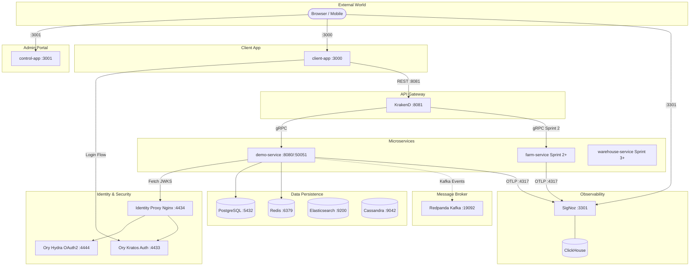
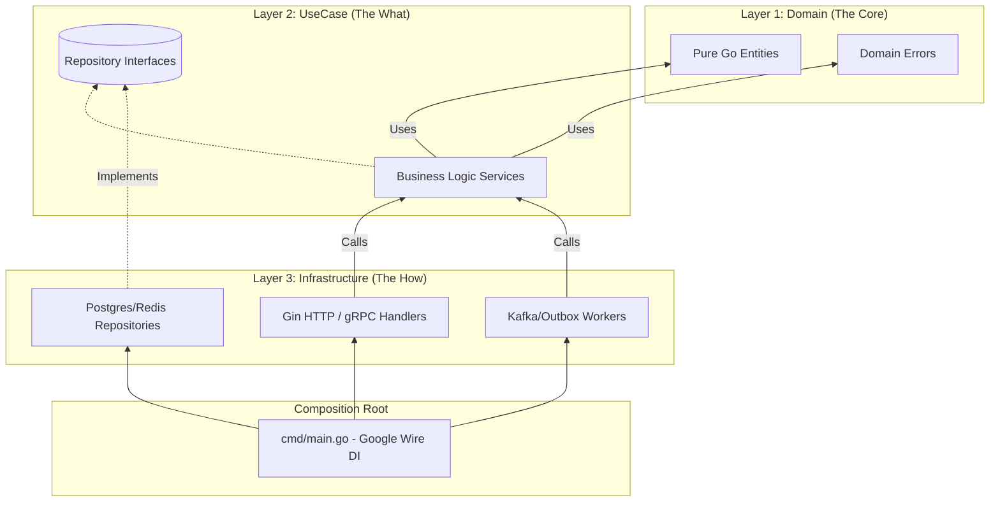

# Runtime Roasters — System Architecture Overview

Tài liệu này cung cấp cái nhìn tổng quan nhất về kiến trúc hệ thống, các nguyên tắc thiết kế và lộ trình phát triển.

---

## 1. Giới thiệu & Bối cảnh Nghiệp vụ (Business Context)

**RuntimeRoasters** là nền tảng quản lý chuỗi cung ứng và logistics mô phỏng vòng đời của hạt cà phê từ nông trại đến tách cà phê bán lẻ (**Farm-to-Cup**). Dự án được xây dựng như một bản showcase kỹ thuật hạng nặng, áp dụng DDD (Domain-Driven Design) và các mẫu thiết kế hệ thống phân tán hiện đại.

Trong văn hóa Việt, cà phê là "sợi dây" kết nối xã hội. **RuntimeRoasters** số hóa toàn bộ "mạch sống" này — mỗi hạt cà phê đều có danh tính số (Digital Identity):
1.  **Thượng nguồn (Farm):** Nông dân cập nhật diện tích vườn cây và khai báo mẻ cà phê vừa thu hoạch.
2.  **Trung nguồn (Processing & Warehouse):** Nhà máy tiếp nhận, chế biến (rang, xay), đóng gói và cấp **Batch ID**.
3.  **Vận tải (Logistics):** Tài xế nhận điều phối, vận chuyển và cập nhật GPS thời gian thực.
4.  **Hạ nguồn (Retail):** Cửa hàng theo dõi tồn kho và tiêu thụ sản phẩm.
5.  **Truy xuất (Traceability):** Người dùng quét QR Code để xem toàn bộ hành trình của tách cà phê.

---

## 2. Nguyên tắc Kiến trúc Cốt lõi (Core Principles)

Dự án tuân thủ nghiêm ngặt các triết lý thiết kế để đảm bảo tính **Mạnh mẽ - Tin cậy - Quan sát được**:

-   **Abstraction First:** Mọi thành phần hạ tầng (Database, Message Broker, Cache) đều được trừu tượng hóa qua **Interface**. Code nghiệp vụ tuyệt đối không phụ thuộc vào framework hay thư viện bên thứ ba.
-   **Clean Architecture:** Áp dụng kiến trúc sạch để tách biệt Business Logic khỏi các chi tiết thực thi (Infrastructure).
-   **Database per Service:** Mỗi microservice sở hữu cơ sở dữ liệu riêng, đảm bảo tính độc lập và khả năng mở rộng (Scalability).
-   **Standardization:** Thống nhất các tiêu chuẩn chung cho toàn bộ dự án:
    -   **Logging/Tracing:** Structured logging (JSON) và Distributed Tracing (OpenTelemetry).
    -   **Errors:** Tuân thủ chuẩn **RFC 9457** (Problem Details for HTTP APIs).
    -   **Composition Root:** Sử dụng Google Wire để quản lý Dependency Injection một cách tường minh.
-   **No Hardcoding:** Mọi tham số cấu hình đều được quản lý qua Environment Variables và nạp qua bộ khung `pkg/config`.

---

## 3. Sơ đồ Hệ thống Tổng thể (Master Architecture Diagram)

Dưới đây là mô hình vận hành tổng thể của RuntimeRoasters. Hệ thống đã bao gồm các thành phần về **Identity & Security (Ory)** để quản lý định danh và bảo vệ các Microservices bên dưới:

---

## 4. Kiến trúc bên trong Microservice (Clean Architecture)

Mỗi service trong mục `Microservices` ở trên đều được xây dựng dựa trên nguyên lý Clean Architecture cực kỳ nghiêm ngặt, đảm bảo tính độc lập của Business Logic:

**Quy tắc bất di bất dịch:** `Domain` không phụ thuộc vào ai. `UseCase` định nghĩa interface của chính nó. `Infrastructure` tuân thủ (implement) interface của UseCase. `main.go` lắp ráp mọi thứ.

---

## 5. Tài liệu Kỹ thuật Chi tiết (Deep Dive References)

Dưới đây là các tài liệu phân tích chuyên sâu cho từng mảng của hệ thống:

### 📂 Core Engineering & Framework
- [**Clean Architecture Framework**](./references/core-engineering/clean-arch-framework.md): Chi tiết về cấu trúc folder, Dependency Injection và các Layer trong code Go.
- [**GraphQL Integration**](./references/core-engineering/graphql-integration.md): Tiêu chuẩn thiết kế và tích hợp API.

### 📂 System Flows
- [**System Blueprint**](./references/system-flows/blueprint.md): Bản thiết kế chi tiết về phân vùng service và lộ trình phát triển.
- [**Identity & Auth Flow**](./references/system-flows/identity-flow.md): Luồng xác thực tập trung (SSO) sử dụng Kratos & Hydra.
- [**Detailed Data Flow**](./references/system-flows/detailed-data-flow.md): Các sơ đồ luồng dữ liệu nghiệp vụ chi tiết.

### 📂 Infrastructure, Ops & Resilience
- [**High Availability Design**](./references/infrastructure-ops/ha-design.md): Chiến lược chịu tải và mở rộng cho Cassandra, Kafka.
- [**Telemetry & Observability**](./references/infrastructure-ops/telemetry.md): Cách thức triển khai Distributed Tracing và Monitoring.
- [**Control Plane Visualization**](./references/infrastructure-ops/control-plane-visualization.md): Logic hiển thị dữ liệu giám sát hệ thống.

### 📂 Data Models
- [**Database Schema**](./references/data-models/database-schema.md): Định nghĩa cấu trúc dữ liệu các bảng chính.

---
*Cập nhật lần cuối: 2026-05-07 bởi Antigravity*
