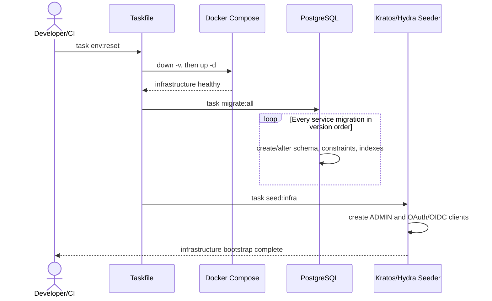
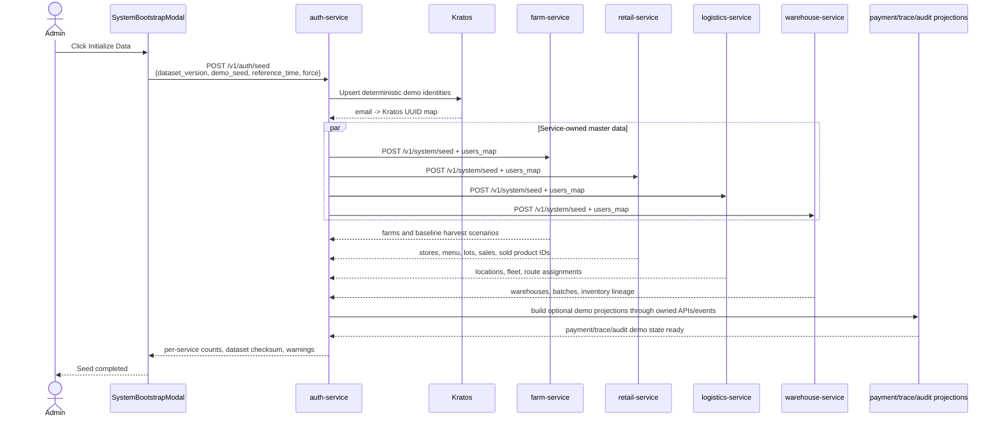

# Runtime Roasters Master Data And Seed Contract

This document is the canonical source of truth for application master data, domain enums, deterministic IDs, and demo seed behavior.

Code, migrations, seed files, UI options, tests, and API documentation must use the values defined here. A new or renamed enum/data value requires this document to be updated first or in the same approved change.

## 1. ERP Database & Entity Relationships Map

The Runtime Roasters application operates on a **Database-per-Service** architecture, where each microservice owns an independent database. Real-time business data is generated continuously through supply chain operations (Farm-to-Cup). Below is the schema layout for the distributed ERP databases and their logical relationships.

### 1.1 Operational Database Schemas

#### Farm Service (`farm_db`)
Manages raw material sourcing and input tracking at partner farms.
- **`farms` (Master Data)**:
  - `id` (BIGSERIAL PK)
  - `name` (string - farm name)
  - `location` (enum: `CAU_DAT`, `BUON_MA_THUOT`, `PLEIKU`, `GIA_NGHIA`, `KON_TUM`)
  - `latitude` (decimal), `longitude` (decimal)
  - `area` (decimal)
  - `coffee_type` (enum: `ARABICA`, `ROBUSTA`, `CHERRY`, `CULI`)
  - `owner_id` (UUID - Ory Kratos UUID of the assigned `FARM_MANAGER`)
- **`harvests` (Transactional Data)**:
  - `id` (BIGSERIAL PK)
  - `farm_id` (FK to `farms.id`)
  - `quantity` (decimal - harvest weight in kg)
  - `harvest_date` (timestamp)
  - `status` (enum: `NEW`, `PROCESSING`, `COMPLETED`)
  - `owner_id` (UUID - Kratos UUID of the manager declaring the harvest)

#### Warehouse Service (`warehouse_db`)
Manages midstream logistics: raw bean collection, sorting, roasting production, and finished goods inventory.
- **`pick_up_requests` (Transactional Data)**:
  - `id` (UUID/Text PK)
  - `harvest_id` (Cross-DB FK to `farm_db.harvests.id`)
  - `farm_id` (string - origin farm code)
  - `warehouse_id` (string - destination warehouse ID)
  - `quantity` (decimal - actual crop weight in kg)
  - `coffee_type` (string)
  - `status` (enum: `REQUESTED`, `DISPATCHED`, `IN_TRANSIT_TO_FARM`, `PICKED_UP`, `RETURNING`, `ARRIVED_WAREHOUSE`, `RECEIVED`, `CANCELLED`)
  - `shipment_id` (Cross-DB FK to `logistics_db.shipments.id`)
- **`production_batches` (Transactional Data)**:
  - `id` (PK), `batch_id` (UK string)
  - `warehouse_id` (string - managing warehouse ID)
  - `status` (enum: `DRAFT`, `PROCESSING`, `READY_TO_STOCK`, `STOCKED`)
  - `total_input_weight` (decimal), `total_output_weight` (decimal)
  - `weight_loss_percent` (decimal - quality tracking metric)
- **`intakes` (Transactional Data)**:
  - `id` (PK)
  - `harvest_id` (Cross-DB FK to `farm_db.harvests.id`)
  - `pickup_id` (Cross-DB FK to `pick_up_requests.id`)
  - `quantity` (decimal - actual received weight in kg)
  - `status` (enum: `UNASSIGNED`, `ASSIGNED`)
  - `batch_id` (FK to `production_batches.id`)
- **`roast_runs` (Transactional Data)**:
  - `id` (PK)
  - `batch_id` (FK to `production_batches.id`)
  - `run_number` (int - run index within the batch)
  - `input_weight` (decimal), `output_weight` (decimal)
  - `status` (string)
- **`inventories` (Master/Transactional Data)**:
  - `id` (PK)
  - `sku` (UK string - coffee stock SKU code)
  - `coffee_type` (enum), `origin_code` (string)
  - `warehouse_id` (string)
  - `available_quantity` (decimal - ready to be dispatched to retail stores)

#### Retail Service (`retail_db`)
Manages downstream sales, retail store profiles, and store orders.
- **`stores` (Master Data)**:
  - `id` (UUID PK)
  - `name` (string - store name)
  - `city` (string), `address` (string)
  - `manager_id` (UUID - Ory Kratos UUID of the `STORE_MGR`)
  - `manager_email` (string)
- **`orders` (Transactional Data)**:
  - `id` (UUID PK)
  - `store_id` (FK to `stores.id`)
  - `items` (JSONB - list of ordered SKUs and quantities)
  - `total_amount` (decimal), `status` (enum: `PENDING`, `PAYMENT_PENDING`, `PAYMENT_COMPLETED`, `RESERVED`, `DISPATCH_REQUESTED`, `PREPARING`, `SHIPPING`, `DELIVERED`, `COMPLETED`, `REJECTED`, `FAILED`)
  - `idempotency_key` (string - transaction de-duplication)

#### Payment Service (`payment_db`)
Manages Stripe/VNPay payment gateways and simulation callback state.
- **`payments` (Transactional Data)**:
  - `id` (UUID PK)
  - `order_id` (Cross-DB UK to `retail_db.orders.id`)
  - `store_id` (UUID)
  - `provider` (string - payment gateway: `STRIPE`, `VNPAY`)
  - `provider_ref` (UK string - transaction gateway reference ID)
  - `amount` (decimal), `status` (enum: `PENDING`, `SUCCEEDED`, `FAILED`, `REFUNDED`)
- **`webhook_events` (Audit Data)**:
  - `id` (UUID PK)
  - `provider` (string), `event_id` (string), `status` (string - webhook processing result)

#### Logistics Service (`logistics_db`)
Ties the supply chain together: schedules pickups from farms to warehouses and deliveries from warehouses to retail stores.
- **`vehicles` (Master Data)**:
  - `id` (PK - e.g. `VEHICLE-DEMO-001`)
  - `plate_number` (UK string)
  - `type` (enum: `TRUCK`, `VAN`)
  - `capacity_kg` (decimal)
  - `home_warehouse_id` (string)
  - `status` (enum: `IDLE`, `BUSY`, `MAINTENANCE`)
- **`drivers` (Master Data)**:
  - `id` (UUID PK)
  - `user_id` (UK - Ory Kratos UUID of the Driver)
  - `name` (string), `phone` (string)
  - `vehicle_id` (FK to `vehicles.id`)
  - `status` (enum: `IDLE`, `BUSY`, `OFFLINE`)
  - `is_available` (boolean)
- **`locations` (Static Master Data)**:
  - `id` (PK - matches Farm ID, Warehouse ID, or Store ID)
  - `name` (string), `type` (enum: `FARM`, `WAREHOUSE`, `RETAILER`)
  - `lat` (decimal), `lng` (decimal - GPS coordinates for routing)
- **`shipments` (Transactional Data)**:
  - `id` (UUID PK)
  - `type` (enum: `FARM_PICKUP`, `RETAIL_DELIVERY`, `RETURN_TO_BASE`)
  - `order_id` (Cross-DB FK to `retail_db.orders.id`)
  - `harvest_id` (Cross-DB FK to `farm_db.harvests.id`)
  - `driver_id` (FK to `drivers.id`)
  - `vehicle_id` (string)
  - `origin_location_id` (FK to `locations.id`), `destination_location_id` (FK to `locations.id`)
  - `status` (enum: `PENDING`, `ASSIGNED`, `PICKED_UP`, `IN_TRANSIT`, `DELIVERED`, `FAILED`, `CANCELLED` etc.)

---

### 1.2 Entity Relationship Diagram (ERD)

The logical connections across our distributed microservice databases are maintained asynchronously via **Event-Driven Saga (Kafka)** or synchronously via **API Gateway Aggregation** (represented by dashed lines):

```mermaid
erDiagram
    %% FARM SERVICE DATABASE
    FARMS ||--o{ HARVESTS : "has"
    FARMS {
        bigserial id PK
        string name
        enum location
        decimal latitude
        decimal longitude
        decimal area
        enum coffee_type
        uuid owner_id
    }
    HARVESTS {
        bigserial id PK
        bigint farm_id FK
        uuid owner_id
        enum coffee_type
        decimal quantity
        timestamp harvest_date
        enum status
    }

    %% WAREHOUSE SERVICE DATABASE
    PRODUCTION_BATCHES ||--o{ INTAKES : "processes"
    PRODUCTION_BATCHES ||--o{ ROAST_RUNS : "contains"
    PRODUCTION_BATCHES {
        string id PK
        string batch_id UK
        string warehouse_id
        string status
        decimal total_input_weight
        decimal total_output_weight
        decimal weight_loss_percent
    }
    INTAKES {
        string id PK
        string harvest_id FK "Cross-DB link"
        string pickup_id FK "Cross-DB link"
        string warehouse_id
        enum coffee_type
        decimal quantity
        string status
        string batch_id FK
    }
    ROAST_RUNS {
        string id PK
        string batch_id FK
        int run_number
        decimal input_weight
        decimal output_weight
        string status
    }
    INVENTORIES {
        string id PK
        string sku UK
        enum coffee_type
        string origin_code
        string warehouse_id
        decimal available_quantity
    }
    PICK_UP_REQUESTS {
        string id PK
        string harvest_id UK "Cross-DB link"
        string farm_id
        string warehouse_id
        string status
        string shipment_id FK "Cross-DB link"
    }

    %% RETAIL SERVICE DATABASE
    STORES ||--o{ ORDERS : "receives"
    STORES {
        uuid id PK
        string name
        string city
        string address
        string manager_email
    }
    ORDERS {
        uuid id PK
        uuid store_id FK
        jsonb items
        decimal total_amount
        string status
        string idempotency_key
    }

    %% PAYMENT SERVICE DATABASE
    PAYMENTS {
        uuid id PK
        uuid order_id UK "Cross-DB link"
        uuid store_id
        string provider
        string provider_ref UK
        decimal amount
        string status
    }

    %% LOGISTICS SERVICE DATABASE
    VEHICLES ||--o| DRIVERS : "assigned to"
    DRIVERS ||--o{ SHIPMENTS : "delivers"
    VEHICLES {
        string id PK
        string plate_number UK
        string type
        decimal capacity_kg
        string home_warehouse_id
        string status
    }
    DRIVERS {
        uuid id PK
        string user_id UK "Kratos link"
        string name
        string phone
        string vehicle_id FK
        string status
        boolean is_available
    }
    SHIPMENTS {
        uuid id PK
        string type
        string order_id FK "Cross-DB link"
        string harvest_id FK "Cross-DB link"
        uuid driver_id FK
        string vehicle_id
        string origin_location_id FK
        string destination_location_id FK
        string status
    }
    LOCATIONS {
        string id PK
        string name
        string type
        decimal lat
        decimal lng
    }

    %% CROSS SERVICE LOGICAL RELATIONSHIPS (Kafka / REST)
    HARVESTS ..> PICK_UP_REQUESTS : "Triggers pickup request"
    PICK_UP_REQUESTS ..> SHIPMENTS : "Generates logistics shipment"
    ORDERS ..> PAYMENTS : "Requires payment authorization"
    PAYMENTS ..> SHIPMENTS : "Successful payment triggers retail delivery shipment"
    INVENTORIES ..> ORDERS : "Checks and reserves SKU stock"
```

---

### 1.3 ASCII Architecture & ER Flow

```text
               +-------------------------------------------------------+
               |                    [ Ory Kratos ]                     |
               |             (Central User Identity DB)                |
               +---------------------------+---------------------------+
                                           | (authz UUIDs)
                                           v
+------------------+     (Kafka Event)     +------------------+     (REST API)     +------------------+
|   [ farm_db ]    | - - - - - - - - - - > | [ warehouse_db ] | < - - - - - - - -  |  [ retail_db ]   |
|                  |                       |                  |                    |                  |
|  +------------+  |  farm.harvest.declared|  +------------+  | inventory.reserved |  +------------+  |
|  |   farms    |  |                       |  | inventories|  |                    |  |   stores   |  |
|  +-----+------+  |                       |  +------------+  |                    |  +-----+------+  |
|        | (1)     |                       |        ^         |                    |        | (1)     |
|        |         |                       |        | updates |                    |        |         |
|        v (N)     |                       |  +-----+------+  |                    |        v (N)     |
|  +------------+  |                       |  | roast_runs |  |                    |  +------------+  |
|  |  harvests  |  |                       |  +-----+------+  |                    |  |   orders   |  |
|  +------------+  |                       |        | (N)     |                    |  +-----+------+  |
+--------|---------+                       |        v (1)     |                    +--------|---------+
         |                                 |  +------------+  |                             |
         | (Triggers Pickup)               |  | batches    |  |                             | (Requires
         v                                 |  +-----+------+  |                             v Payment)
+---------------------------------------+  |        ^ (1)     |                    +------------------+
|           [ logistics_db ]            |  |        |         |                    |  [ payment_db ]  |
|                                       |  |        v (N)     |                    |                  |
|  +------------+      +-------------+  |  |  +------------+  |                    |  +------------+  |
|  | pick_ups   |<---->|  shipments  |  |  |  |  intakes   |  |                    |  |  payments  |  |
|  +------------+      +------+------+  |  +------------------+                    |  +------------+  |
|                             |         |                                          +------------------+
|                             v (uses)  |
|  +------------+      +------+------+  |
|  |  drivers   |<---->|  vehicles   |  |
|  +------------+      +-------------+  |
+---------------------------------------+
```

---

## 2. Operational Workflows

### 2.1 Farm-to-Warehouse Flow (Upstream)
- **Harvest Declaration**: A `FARM_MANAGER` declares a new crop harvest by creating a `harvests` record (status: `NEW`) under their assigned farm `farms`. The `farm.harvest.declared` event is published to Kafka.
- **Pickup Request**: The `warehouse-service` consumes the harvest event and automatically generates a `pick_up_requests` record (status: `REQUESTED`), linking the harvest to the nearest regional `warehouse_id`.
- **Logistics Dispatch**: A `WAREHOUSE_MGR` approves the pickup. The system requests `logistics-service` to assign an available `driver_id` and `vehicle_id` from that warehouse to create a shipment `shipments` (type: `FARM_PICKUP`).
- **Intake & Roasting**: Once the vehicle arrives at the warehouse, `warehouse-service` updates `pick_up_requests` to `RECEIVED`, registers an `intakes` receipt, and groups multiple intakes into a production batch `production_batches`. The warehouse performs roasting runs `roast_runs`.
- **Inventory Update**: When a batch is finalized, the raw crop is converted into roasted coffee beans. The system increments the `available_quantity` in `inventories` for the corresponding product SKU.

### 2.2 Retail-to-Delivery Flow (Downstream)
- **Retail Order**: A customer purchases coffee at a store. The `retail-service` creates a new retail order `orders` (status: `PENDING`).
- **Payment Authorization**: A payment request `payments` linked to the `order_id` is created in `payment-service`. When payment succeeds, a `payment.completed` event is broadcasted over Kafka.
- **Stock Reservation**: The `warehouse-service` consumes the payment event and reserves or decrements the corresponding inventory `inventories` for the ordered SKU.
- **Retail Delivery**: The `logistics-service` registers a delivery request. The warehouse coordinates a shipment `shipments` (type: `RETAIL_DELIVERY`) to transport the roasted stock from the warehouse (`warehouse_id`) to the retail store (`destination_store_id`). The driver (`driver.user_id`) follows the GPS route, completes the delivery, and returns to base.

---

## 3. Seed Principles

1. Migrations create schema, constraints, indexes, and infrastructure-required rows only.
2. Migrations must not create farms, stores, fleet, menu items, inventory, sales, or historical business transactions.
3. Admin seed creates deterministic application master data and demo scenarios through service APIs.
4. Each service owns writes to its own database.
5. Cross-service identity references use the `email -> Kratos UUID` map created by `auth-service`.
6. Re-running the same dataset version and demo seed is idempotent.
7. Demo diversity is pseudo-random but reproducible. It must not use wall-clock time or unseeded randomness.
8. Runtime flows remain the source of truth after bootstrap. Seed data must not bypass normal ownership boundaries.

Canonical seed parameters:

| Parameter | Default | Meaning |
| --- | --- | --- |
| `dataset_version` | `rr-demo-v1` | Version of IDs, fixtures, enums, and generation rules. |
| `demo_seed` | `20260606` | Human-selectable seed controlling deterministic variation. |
| `reference_time` | `2026-06-01T08:00:00+07:00` | Fixed anchor used to backdate demo transactions. |
| `force` | `false` | Reconcile deterministic rows; never delete unrelated user-created rows. |

## 4. Two Seed Flows

### Flow A: Infrastructure And Migrations

Purpose: prepare empty infrastructure and database schemas. This flow does not make the application demo-ready.



Expected result:

- Service databases and tables exist.
- Kratos/Hydra infrastructure is usable.
- `admin@runtimeroasters.com` can authenticate.
- Domain master data is still unseeded.

Migration execution rule:

- `task migrate:all` must run every `*.up.sql` file for each service in lexical version order.
- Adding `000002_*.up.sql` must not require manually editing a command that only runs `000001`.
- Existing SQL inserts for stores, fleet, locations, farms, or inventory are migration debt and must move to Admin seed fixtures.

### Flow B: Admin Application Seed

Purpose: create a complete, coherent, immediately demonstrable application dataset.



Expected result:

- `dataset_version`
- `demo_seed`
- `dataset_checksum`
- per-service inserted/updated/skipped counts
- failed invariant list
- completion state: `complete`, `partial`, or `failed`

## 5. Canonical Identity And Role Data

Default local password: `Hello@123`. It is local/demo-only and must not be used in production.

Canonical roles:

| Role | Meaning | Seeded Persona |
| --- | --- | --- |
| `ADMIN` | Identity/resource administration; no daily domain operation. | 1 |
| `FARM_MANAGER` | Operates assigned farm and harvests. | 6 |
| `WAREHOUSE_MGR` | Operates assigned warehouse and dispatch. | 3 |
| `STORE_MGR` | Operates assigned retail store. | 5 |
| `DRIVER` | Operates assigned shipment and GPS device simulation. | 11 |
| `PROCESSOR` | Warehouse processing persona reserved for future dedicated assignment. | 0 initially |
| `GUEST` | Authentication fallback; never receives privileged seed assignments. | 0 |

Canonical seeded users: 26 total.

- Admin: `admin@runtimeroasters.com`.
- Farm Managers: `mgr.farm.kho`, `mgr.farm.caudat`, `mgr.farm.sonpacamara`, `mgr.farm.aeroco`, `mgr.farm.trungnguyen`, `mgr.farm.chuse` at `@runtimeroasters.com`.
- Store Managers: `mgr.hn.hoankiem`, `mgr.hn.caugiay`, `mgr.hcm.d1`, `mgr.hcm.d7`, `mgr.dn.haichau` at `@runtimeroasters.com`.
- Warehouse Managers: `mgr.wh.hn`, `mgr.wh.hcm`, `mgr.wh.dn` at `@runtimeroasters.com`.
- Drivers: `driver.hn.01..04`, `driver.hcm.01..04`, `driver.dn.01..03` at `@runtimeroasters.com`.

Every seed fixture must use these exact emails. Alias forms such as `mgr.hcm.q1`, `mgr.store.q1`, or `mgr.warehouse.hcm` are invalid.

## 6. Canonical Domain Enums

### Farm

| Enum | Values |
| --- | --- |
| `FarmLocation` | `CAU_DAT`, `BUON_MA_THUOT`, `PLEIKU`, `GIA_NGHIA`, `KON_TUM` |
| `CoffeeType` | `ARABICA`, `ROBUSTA`, `CHERRY`, `CULI` |
| `HarvestStatus` | `NEW`, `PROCESSING`, `COMPLETED` |

### Retail

| Enum | Values |
| --- | --- |
| `StoreStatus` | `ACTIVE`, `INACTIVE` |
| `OrderStatus` | `PENDING`, `PAYMENT_PENDING`, `PAYMENT_COMPLETED`, `RESERVED`, `DISPATCH_REQUESTED`, `PREPARING`, `SHIPPING`, `DELIVERED`, `COMPLETED`, `REJECTED`, `FAILED` |
| `SaleStatus` | `COMPLETED`, `VOIDED` |
| `StockMovementType` | `RECEIVED`, `SOLD`, `ADJUSTMENT` |
| `StockReferenceType` | `SEED`, `DELIVERY`, `SALE_ITEM`, `ADJUSTMENT` |

### Warehouse

| Enum | Values |
| --- | --- |
| `BatchStatus` | `DRAFT`, `PROCESSING`, `READY_TO_STOCK`, `STOCKED` |
| `IntakeStatus` | `UNASSIGNED`, `ASSIGNED` |
| `PickupRequestStatus` | `REQUESTED`, `DISPATCHED`, `IN_TRANSIT_TO_FARM`, `PICKED_UP`, `RETURNING`, `ARRIVED_WAREHOUSE`, `RECEIVED`, `CANCELLED` |
| `DispatchRequestStatus` | `PENDING`, `STOCK_RESERVED`, `DISPATCHED`, `COMPLETED`, `CANCELLED` |

### Logistics

| Enum | Values |
| --- | --- |
| `DriverStatus` | `IDLE`, `BUSY`, `OFFLINE` |
| `VehicleStatus` | `IDLE`, `BUSY`, `MAINTENANCE` |
| `VehicleType` | `TRUCK`, `VAN` |
| `LocationType` | `FARM`, `WAREHOUSE`, `RETAILER` |
| `ShipmentType` | `FARM_PICKUP`, `RETAIL_DELIVERY`, `RETURN_TO_BASE` |
| `ShipmentStatus` | `PENDING`, `ASSIGNED`, `PICKED_UP`, `IN_TRANSIT`, `DELIVERED`, `FAILED`, `CANCELLED`, `IN_TRANSIT_TO_FARM`, `ARRIVED_AT_FARM`, `RETURNING_TO_WAREHOUSE`, `ARRIVED_WAREHOUSE`, `IN_TRANSIT_TO_STORE`, `ARRIVED_AT_STORE`, `RETURNING_TO_BASE`, `RETURNED_TO_BASE`, `COMPLETED` |

### Payment And Messaging

| Enum | Values |
| --- | --- |
| `PaymentStatus` | `PENDING`, `SUCCEEDED`, `FAILED`, `REFUNDED` |
| `OutboxStatus` | `PENDING`, `PROCESSING`, `COMPLETED`, `FAILED` |

`LocationType=ROASTERY` is not canonical. Current logistics code using `ROASTERY` while fixtures use `WAREHOUSE` must be reconciled to `WAREHOUSE`.

## 7. Deterministic Master Dataset

### Locations And Organizations

| Entity | Count | Canonical IDs/Regions |
| --- | ---: | --- |
| Farms | 6 | 3 Cau Dat, 2 Buon Ma Thuot, 1 Pleiku |
| Warehouses | 3 | `WAREHOUSE-HN-001`, `WAREHOUSE-HCM-001`, `WAREHOUSE-DN-001` |
| Stores | 5 | Hoan Kiem, Cau Giay, District 1, District 7, Hai Chau |
| Vehicles | 11 | HN 4, HCM 4, DN 3 |
| Drivers | 11 | one deterministic driver per vehicle |
| Logistics locations | 14 | 6 farms + 3 warehouses + 5 stores |

Store database IDs remain deterministic UUIDs. Logistics location IDs remain readable external IDs such as `STORE-HN-01`; explicit mapping between the two is required in seed fixtures.

### RR-URG-07A Retail Dataset

Canonical catalog tables are menus and menu_items. The API contract calls
menu_items.id a menu_item_id.

docs/requirements/SAMPLE_MENU.md is the source of truth for drink names,
descriptions, available sizes, and prices. One priced drink-size cell is one
sellable menu_items row. The current dataset has:

- 1 active menu: MENU-COFFEE-DEFAULT.
- 15 product groups.
- 42 sellable drink-size items.
- PHIN, PHINDI, and FREEZE mapped to BEAN-ROBUSTA-ROASTED.
- ESPRESSO mapped to BEAN-ARABICA-ROASTED.

Planned 07A baseline:

- 42 active chain-wide menu items.
- 5 stores.
- 2 to 4 retail inventory lots per store.
- Every store has both Arabica and Robusta availability.
- At least two stores receive lots from more than one warehouse/batch lineage.
- 3 to 8 completed sales per store.
- One sale item per sold cup and QR identity.
- 25 deterministic sold items in the 07A baseline.
- Every sold item has unique UI-style `product_id`, for example `RR-PROD-HK-0001`.
- `trace_code = product_id`.
- Every sale item references exactly one menu_item_id and one inventory_lot_id.
- Stock movement history is authoritative:

```text
received_quantity = sum(RECEIVED quantity_delta)
available_quantity = sum(all quantity_delta)
```

store_menu_inventories materializes store-level availability. Reads do not run
SUM(FLOOR(...)) over lots. Stock writes and reconciliation rebuild:

```text
available_units(item, store)
= sum(floor(lot.available_quantity / item.consumption_quantity))
```

The floor is applied per lot because one sold cup must derive lineage from one
lot; remainder quantities from separate lots are not combined.

## 8. Canonical Historical Demo Scenarios

These historical scenarios enrich the demo environments when the Admin clicks **Initialize Data** (`T-0` represents the bootstrap reference time, and all historical timestamps are relative offsets to `T-0`).

### 8.1 Historical Scenario A: Completed Farm-to-Cup Trace
This is the primary scenario to demonstrate product traceability on `/dashboard/traceability`. It traces a completed cup sale at a retail store back to its farm origin.

#### Business Keys And Generated IDs
| Entity | Stable Demo Reference | ID Policy |
| --- | --- | --- |
| Trace ID | `trc-seed-caudat-songthan-hcm-q1` | Must stay stable |
| Harvest key | `seed-harvest-caudat-arabica-001` | Can map to generated `harvests.id` |
| Pickup request key | `seed-pickup-caudat-001` | Can map to generated/explicit pickup ID |
| Inbound shipment key | `seed-shipment-in-caudat-songthan-001` | Can map to generated `shipments.id` |
| Intake key | `seed-intake-caudat-001` | Can map to generated/explicit intake ID |
| Production batch code | `BATCH-CAUDAT-AR-MED-001` | Must stay stable for Traceability search |
| SKU | `SKU-AR-VN-LD-001` | Must stay stable |
| Order idempotency key | `seed-order-caudat-hcm-q1` | Can map to generated `orders.id` |
| Payment provider ref | `pi_seed_caudat_hcm_q1` | Can map to generated `payments.id` |
| Outbound shipment key | `seed-shipment-out-caudat-hcm-q1-001` | Can map to generated `shipments.id` |
| Farm location key | `FARM-CAUDAT-002` | Existing static seed ID |
| Warehouse ID | `WAREHOUSE-HCM-001` | Existing static seed ID |
| Store ID | `11111111-1111-1111-1111-111111111103` | Existing static seed ID |
| Driver ID | `22222222-2222-2222-2222-222222222203` | Existing static seed ID |
| Vehicle ID | `VEHICLE-DEMO-003` | Existing static seed ID |

#### Farm Records
- `harvests`: `seed_key = seed-harvest-caudat-arabica-001`, `farm_id = Cau Dat Arabica`, `owner_id = mgr.caudat subject`, `coffee_type = ARABICA`, `quantity = 1000.00`, `status = COMPLETED`, `harvest_date = T-7d 08:00`.
- Expected event: at `T-7d 08:00`, `farm.harvest.created` carrying harvest details and trace ID.

#### Inbound Logistics Records
- `shipments`: `seed_key = seed-shipment-in-caudat-songthan-001`, `type = FARM_PICKUP`, `farm_id = FARM-CAUDAT-002`, `harvest_id = resolved seed-harvest-caudat-arabica-001`, `warehouse_id = WAREHOUSE-HCM-001`, `driver_id = Driver Gamma`, `vehicle_id = VEHICLE-DEMO-003`, `status = DELIVERED`, `current_leg = COMPLETED`.
- Expected logistics event timeline:
  - `T-6d 08:00` | `logistics.pickup.assigned`
  - `T-6d 09:00` | `logistics.pickup.departed`
  - `T-6d 13:00` | `logistics.pickup.arrived_at_farm`
  - `T-6d 13:30` | `logistics.pickup.loading_confirmed`
  - `T-6d 14:00` | `logistics.pickup.return_started`
  - `T-6d 20:00` | `logistics.pickup.arrived_at_warehouse`
  - `T-6d 20:15` | `logistics.pickup.completed`

#### Warehouse Processing Records
- `pick_up_requests`: `seed_key = seed-pickup-caudat-001`, `status = RECEIVED`
- `intakes`: `seed_key = seed-intake-caudat-001`, `status = ASSIGNED`, `batch_id = BATCH-CAUDAT-AR-MED-001`
- `production_batches`: `id = BATCH-CAUDAT-AR-MED-001`, `status = FINALIZED`, `total_input_weight = 1000.00`, `total_output_weight = 850.00`
- `roast_runs`: `status = COMPLETED`
- `inventories`: `sku = SKU-AR-VN-LD-001`, `available_quantity = 840.00` (after order reservation)
- Expected events:
  - `T-5d 09:00` | `warehouse.pickup.received`
  - `T-5d 10:00` | `warehouse.intake.created`
  - `T-5d 16:00` | `warehouse.inventory.updated`

#### Retail Order And Payment Records
- `orders`: `store_id = HCM District 1`, `items = [{"sku":"SKU-AR-VN-LD-001","quantity":10}]`, `total_amount = 1200000.00`, `status = COMPLETED`, `idempotency_key = seed-order-caudat-hcm-q1`
- `payments`: `order_id = resolved by seed-order-caudat-hcm-q1`, `provider = STRIPE`, `provider_ref = pi_seed_caudat_hcm_q1`, `amount = 1200000.00`, `status = SUCCEEDED`, `simulated = true`
- Expected events:
  - `T-2d 09:00` | `retail.order.created`
  - `T-2d 09:01` | `payment.intent.created`
  - `T-2d 09:03` | `payment.simulated_completed`
  - `T-2d 09:04` | `warehouse.stock.reserved`
  - `T-2d 09:05` | `warehouse.dispatch.requested`

#### Outbound Delivery Records
- `shipments`: `seed_key = seed-shipment-out-caudat-hcm-q1-001`, `type = RETAIL_DELIVERY`, `order_id = resolved by seed-order-caudat-hcm-q1`, `driver_id = Driver Gamma`, `status = RETURNED_TO_BASE`, `current_leg = COMPLETED`
- Expected events:
  - `T-1d 08:00` | `logistics.delivery.assigned`
  - `T-1d 08:30` | `logistics.delivery.departed`
  - `T-1d 10:00` | `logistics.delivery.arrived_at_store`
  - `T-1d 10:10` | `logistics.delivery.driver_confirmed`
  - `T-1d 10:15` | `logistics.delivery.completed` (DELIVERED)
  - `T-1d 11:00` | `logistics.driver.return_started`
  - `T-1d 12:30` | `logistics.driver.returned_to_base`

---

### 8.2 Historical Scenario B: Active Logistics Demo
This scenario provides a shipment that is currently running (in-transit), allowing the Logistics Map to demonstrate real-time vehicle movement.

#### Business Keys And Generated IDs
| Entity | Stable Demo Reference | ID Policy |
| --- | --- | --- |
| Trace ID | `trc-seed-bmt-songthan-hcm-q7-active` | Must stay stable |
| Order idempotency key | `seed-order-bmt-hcm-q7-active` | Can map to generated `orders.id` |
| Payment provider ref | `vnpay_seed_bmt_hcm_q7_active` | Can map to generated `payments.id` |
| Shipment key | `seed-shipment-active-bmt-hcm-q7` | Can map to generated `shipments.id` |
| Store | `11111111-1111-1111-1111-111111111104` | Existing static seed ID |
| Warehouse | `WAREHOUSE-HCM-001` | Existing static seed ID |
| Driver | `22222222-2222-2222-2222-222222222203` | Existing static seed ID |
| Vehicle | `VEHICLE-DEMO-003` | Existing static seed ID |
| SKU | `SKU-RB-VN-DL-001` | Existing/static SKU |

#### Records
- `orders`: `id = generated`, `status = SHIPPING`, `total_amount = 760000.00`, `items = [{"sku":"SKU-RB-VN-DL-001","quantity":8}]`
- `payments`: `status = SUCCEEDED`, `provider = VNPAY`, `provider_ref = vnpay_seed_bmt_hcm_q7_active`, `amount = 760000.00`
- `shipments`: `seed_key = seed-shipment-active-bmt-hcm-q7`, `status = IN_TRANSIT`, `current_leg = TO_STORE`, `departed_at = T-2h`
- `drivers`: Driver Gamma `status = BUSY`, `is_available = false`, `current_shipment_id = resolved seed-shipment-active-bmt-hcm-q7`
- `vehicles`: `VEHICLE-DEMO-003 status = BUSY`, current coordinates set between Song Than and HCM Q7
- Expected events:
  - `T-3h` | `retail.order.created`
  - `T-2h 58m` | `payment.intent.created`
  - `T-2h 55m` | `payment.simulated_completed`
  - `T-2h 50m` | `warehouse.stock.reserved`
  - `T-2h 45m` | `logistics.delivery.assigned`
  - `T-2h` | `logistics.delivery.departed`
  - `T-90m` | `logistics.gps.updated`
  - `T-60m` | `logistics.gps.updated`
  - `T-30m` | `logistics.gps.updated`

---

### 8.3 Historical Scenario C: Finance Integrity Cases
These cases populate the Finance ledger to show failures and refunds.

#### Failed Payment
- Trace ID: `trc-seed-payment-failed-hn-caugiay`
- Order idempotency key: `seed-order-failed-hn-caugiay`
- Payment provider ref: `pi_seed_failed_hn_caugiay`
- Store: `11111111-1111-1111-1111-111111111102`
- Amount: `430000.00 VND`
- Provider: `STRIPE`
- Status: `FAILED`
- Order Status: `REJECTED`
- Expected events: `retail.order.created`, `payment.intent.created`, `payment.failed`

#### Refunded Payment
- Trace ID: `trc-seed-payment-refunded-hn-hoankiem`
- Order idempotency key: `seed-order-refunded-hn-hoankiem`
- Payment provider ref: `pi_seed_refunded_hn_hoankiem`
- Store: `11111111-1111-1111-1111-111111111101`
- Amount: `980000.00 VND`
- Provider: `STRIPE`
- Refund Ref: `re_seed_hn_hoankiem_quality_issue`
- Status: `REFUNDED`
- Order Status: `REJECTED`
- Expected events: `retail.order.created`, `payment.intent.created`, `payment.simulated_completed`, `payment.refunded`

---

### 8.4 Projection Projections & Dashboards Expected State

#### Trace Read Models
- `trace_events`: Each event from the historical scenarios must be inserted into `trace_db.trace_events` carrying `message_id`, `trace_id`, OTel telemetry tags, and `display_payload`.
- `trace_documents`: Tweak read projection to produce document records for `BATCH-CAUDAT-AR-MED-001`, completed orders, and active/completed shipments. Suggest `BATCH-CAUDAT-AR-MED-001` in search bars.
- `Elasticsearch`: Mirror trace documents in the `coffee_traceability` index.

#### Finance Dashboard State
After seeding, `/dashboard/finance` should report:
- 4 payments: 2 `SUCCEEDED` (total 1,960,000 VND), 1 `FAILED` (430,000 VND), and 1 `REFUNDED` (980,000 VND).
- Displays webhook pass/fail/refund status lines.

#### Logistics Dashboard State
Logistics tables and map should reflect:
- 14 locations, 3 vehicles, 3 drivers.
- Alpha and Beta drivers `status = IDLE`, Gamma driver `status = BUSY` (active HCM Q7 delivery).

#### Audit Logs
Append deterministic audit logs to Cassandra/Postgres for all main scenario events: `farm.harvest.created`, `warehouse.intake.created`, `retail.order.created`, `payment.simulated_completed`, `warehouse.stock.reserved`, `logistics.delivery.completed`. Ensure hashes link correctly.

## 9. Diverse But Reproducible Demo Algorithm

The generator must not call unseeded `rand`, `time.Now()`, or database `ORDER BY RANDOM()`.

### Stable Random Function

For each generated field:

```text
random_u64 = first_8_bytes(
  SHA256(dataset_version + "|" + demo_seed + "|" + entity_type + "|" + entity_index + "|" + field_name)
)
```

Operations:

- Uniform choice: `index = random_u64 mod option_count`.
- Integer range: `min + random_u64 mod (max - min + 1)`.
- Weighted choice: convert weights to cumulative integer ranges and select `random_u64 mod total_weight`.
- Deterministic timestamp: `reference_time - duration(random_u64 mod allowed_window)`.
- Deterministic ID: use readable fixed prefixes plus stable sequence, not random UUIDs, when IDs are referenced across services/docs.

Because each field is independently hashed, adding a new field does not change previously generated values.

### Diversity Guarantees Before Randomization

Hard quotas are created first; pseudo-random selection fills the remainder.

Required quotas:

- All 5 stores have transactions.
- All 6 menu items appear at least twice globally.
- Arabica and Robusta both appear in every store inventory.
- At least 3 farm origins appear in public trace examples.
- Every warehouse appears in at least one inventory lineage.
- Payment scenario distribution for optional history: 80% `SUCCEEDED`, 10% `PENDING`, 7% `FAILED`, 3% `REFUNDED`.
- Shipment history includes completed, in-transit, and one failed/cancelled example.
- Sale quantities never make inventory negative.

### Retail Lot Selection

For seeded sales:

1. Filter lots by `store_id`, menu item coffee type/SKU compatibility, and positive balance.
2. Sort candidates by stable lot ID.
3. Select candidate using the stable random function.
4. If the selected lot lacks upstream lineage, reject seed generation.
5. Insert sale item, `SOLD` movement, and updated lot balance in one transaction.

Production runtime may later use FIFO/FEFO. Seeded pseudo-random lot selection exists only to demonstrate multiple origins while preserving valid inventory.

## 10. Seed Ownership

| Service | Admin Seed Owns | Must Not Own |
| --- | --- | --- |
| Auth | users, roles, email-to-Kratos mapping | farm/store/fleet rows |
| Farm | farms and optional baseline harvest scenarios | warehouse inventory |
| Warehouse | warehouses, baseline upstream lots/batches/inventory | retail sales |
| Logistics | locations, vehicles, drivers, assignments | store or farm records |
| Retail | stores, menu items, retail lots, sales, sold products, stock movements | upstream batch truth |
| Payment | optional payment scenario projections | retail order truth |
| Trace | derived public/read projections | operational sale or inventory truth |
| Audit | append-only seed audit evidence | mutable operational records |
| Socket | no durable seed data | business state |

Payment, trace, and audit demo rows should be produced from owned APIs/events or an explicitly labeled projection builder. They are not part of the current four-service Admin fan-out and remain a required implementation gap.

## 11. Idempotency And Integrity

- Deterministic natural IDs or fixture IDs are mandatory.
- Upsert only rows belonging to the active `dataset_version`.
- `force=true` reconciles deterministic rows; it does not truncate databases.
- Seed writes within one service must be transactional.
- A downstream failure returns overall state `partial`; UI must not report full success.
- Dataset checksum is SHA-256 of canonical sorted fixture/generated records.
- Re-running the same parameters must produce the same checksum and record counts.
- Unknown manager email, missing upstream lineage, duplicate `product_id`, invalid enum, or negative inventory fails the affected service seed.

## 12. Required Verification

### Migration Flow

- Fresh database receives all migrations in order.
- Existing demo database receives additive migrations safely.
- No business master rows are inserted by migration.

### Admin Seed Flow

- All 26 identities exist once.
- Every farm/store/warehouse manager email resolves to Kratos UUID.
- Counts match this document.
- Same seed parameters produce identical checksum twice.
- Different `demo_seed` changes scenario distribution but not canonical master IDs.
- All enum values in DB/API/UI are members of this document's registry.
- Every public `product_id` resolves to one sold item and one valid upstream lot lineage.
- Inventory equations hold for every retail lot.

## 13. Current Implementation Drift

The following must be corrected as tickets are implemented:

- `Taskfile.yml` currently runs specific `000001` migration files instead of all migrations in order.
- Several migrations currently insert stores, farms, fleet, locations, inventory, or webhook demo rows.
- Resolved in RR-URG-07A: Retail fixtures use canonical
  `mgr.hcm.d1/d7` identities.
- Older docs list non-canonical manager aliases.
- Logistics code defines `ROASTERY`, while fixtures use `WAREHOUSE`.
- Admin seed currently fans out only to Farm, Retail, Logistics, and Warehouse.
- UI currently sends `force=true` unconditionally.
- Historical `task seed:demo` uses unseeded randomness and wall-clock time, so it is not reproducible.
- `deployments/reset-demo-state.sh` resets runtime state but does not run migrations or Admin seed.

RR-URG-07A follows this document for menus, menu items, inventory lots, sales,
sold-item `product_id`, stock movements, and materialized availability.
