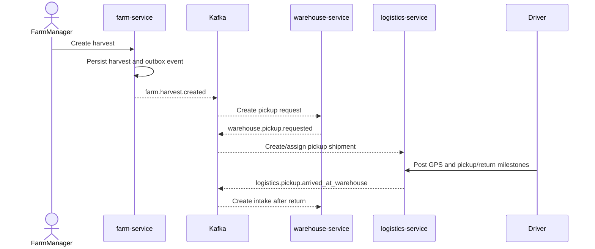
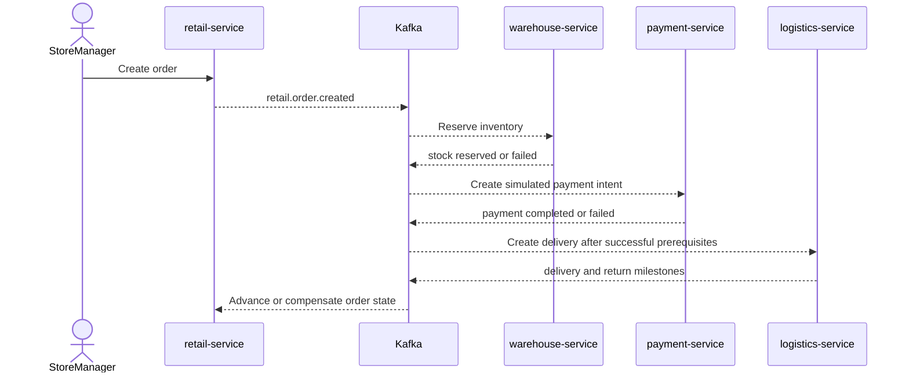

# Runtime Roasters System Design Document

## 1. Purpose

This document is the system-level design baseline for Runtime Roasters. It explains how the platform satisfies the product requirements across service boundaries, data stores, security controls, event flows, runtime infrastructure, and verification.

Use this document to understand the whole system. Use the linked master documents for contract-level detail and ticket detail designs for implementation changes.

## 2. Scope And Status

### In Scope

- Farm-to-retail coffee traceability.
- Role-scoped operational dashboards and workflows.
- Identity, authentication, and two-gate authorization.
- Event-driven coordination for inventory, payment, logistics, trace, audit, and realtime notifications.
- Local development deployment and observability topology.
- Public sanitized topology and sold-cup QR trace behavior.

### Out Of Scope

- Production cloud vendor selection and Kubernetes manifests.
- Real payment settlement; payment behavior is simulated behind backend contracts.
- Multi-region disaster recovery.
- Cross-replica WebSocket fanout guarantees.
- Detailed endpoint schemas, table columns, and seed values already owned by linked master docs.

### Delivery State

| Capability | State | Source |
| --- | --- | --- |
| Identity, OIDC, JWT, and role authorization | implemented | `docs/decisions/0006-two-gate-authz-casbin.md` |
| Farm, warehouse, retail order, payment, and logistics services | implemented | `src/apps/` |
| Kafka SAGA/event flows and transactional inbox/outbox patterns | implemented, flow-specific maturity varies | `docs/architecture/API.md` |
| Trace read model in PostgreSQL/Elasticsearch | implemented | `src/apps/trace-service/` |
| Audit persistence in Cassandra with PostgreSQL fallback | implemented | `src/apps/audit-service/` |
| Realtime WebSocket transport and Valkey notification hints | implemented | `docs/decisions/0007-socket-service-transport-only.md` |
| Valkey GEO driver tracking | implemented; broader operational validation remains active | `src/apps/logistics-service/` |
| Public sold-cup QR trace | in progress under RR-URG-07A to RR-URG-07E | `docs/work/tickets/sprint10/RR-URG-07/` |

## 3. Design Drivers

| Driver | Design Response |
| --- | --- |
| End-to-end provenance | Stable business identifiers and events connect harvest, warehouse, logistics, retail sale, and public trace views. |
| Independent domain ownership | Each service owns its operational database and exposes contracts through HTTP/gRPC or Kafka. |
| Failure isolation | Async integration, inbox deduplication, outbox publishing, idempotent handlers, and SAGA compensation limit partial failure. |
| Least-privilege access | Ory identity, gateway checks, service-local Casbin, and record scoping enforce role and entity boundaries. |
| Demo repeatability | Coordinated deterministic seeding and idempotent migrations provide repeatable local state. |
| Explainable runtime behavior | OpenTelemetry propagation, structured logs, trace read models, audit logs, and realtime events expose system activity. |

## 4. System Context

```text
+--------------------+       +--------------------------------------+
| Operational Users  |       | Public Visitors                      |
| Admin, Managers,   |       | Topology and sold-cup QR trace       |
| Driver             |       +------------------+-------------------+
+----------+---------+                          |
           | authenticated browser              | sanitized no-auth read
           v                                    v
+-------------------------------------------------------------------+
|                    Runtime Roasters Platform                      |
| Next.js client, API gateway, identity, domain services, events,  |
| operational stores, trace/audit read models, realtime transport   |
+----------------------+----------------------+---------------------+
                       |                      |
                       v                      v
              +----------------+     +-----------------------------+
              | Ory Kratos /   |     | OSRM and simulated payment |
              | Ory Hydra      |     | provider boundary           |
              +----------------+     +-----------------------------+
```

Trust boundaries:

- Browser traffic enters through the public client/gateway boundary.
- Identity administration and internal seed endpoints require internal trust credentials.
- Service databases and infrastructure are not browser-accessible application contracts.
- Public trace responses must be sanitized and must not expose private identities, internal authorization data, or unrestricted operational records.

## 5. Logical Architecture

```text
+----------------------+      +----------------------+      +------------------+
| Next.js Client App   | ---> | KrakenD API Gateway | ---> | Go Services      |
| dashboards/public UI |      | routing/JWT checks   |      | HTTP + gRPC      |
+----------------------+      +----------+-----------+      +----+-------------+
                                          |                       |
                                 +--------v---------+             |
                                 | Ory Kratos/Hydra |             |
                                 | identity/OIDC    |             |
                                 +------------------+             |
                                                                  v
 +-------------------+   events   +-------------------+   events  +------------------+
 | Domain Services   |----------->| Apache Kafka      |---------->| Projection and   |
 | farm/warehouse/   |<-----------| event backbone    |           | support services |
 | retail/logistics/ |            +-------------------+           | trace/audit/socket|
 | payment/auth      |                                             +--------+---------+
 +---------+---------+                                                      |
           |                                                                |
           v                                                                v
 +-------------------+     +-------------------+     +----------------+ +----------------+
 | PostgreSQL        |     | Valkey            |     | Elasticsearch  | | Cassandra      |
 | operational truth |     | locks/GEO/TTL     |     | trace search   | | immutable audit|
 +-------------------+     +-------------------+     +----------------+ +----------------+
```

### Architectural Style

- Microservices for domain and support-service ownership.
- Clean Architecture inside Go services, with domain/usecase code isolated from transport and infrastructure adapters.
- REST/JSON at the browser edge, with HTTP/gRPC service contracts behind the gateway.
- Kafka events for cross-service state propagation and eventual consistency.
- CQRS read models for traceability and audit use cases.
- Polyglot persistence selected by workload rather than shared-table access.

## 6. Component Responsibilities

| Component | Responsibility | Durable State |
| --- | --- | --- |
| `client-app` | Role dashboards, driver simulation UI, public topology, public QR trace UI | none as source of truth |
| KrakenD | Public routing, JWT verification, route-level policy enforcement | configuration only |
| Ory Kratos | Identities, credentials, login sessions | identity PostgreSQL schema |
| Ory Hydra | OAuth2/OIDC authorization and token issuance | Hydra PostgreSQL schema |
| `auth-service` | User administration, Casbin policy authority, login/consent bridge, coordinated seeding | auth PostgreSQL schema |
| `farm-service` | Farms, assignments, harvest declarations, origin events | `farm_db` |
| `warehouse-service` | Pickup requests, intake, processing, inventory, reservations, dispatch | `warehouse_db` plus Valkey coordination |
| `retail-service` | Stores, orders, order SAGA state, and planned sold-cup operational records | `retail_db` |
| `payment-service` | Payment intent/result simulation and compensation events | `payment_db` |
| `logistics-service` | Shipments, assignments, route milestones, driver position | `logistics_db` plus Valkey GEO |
| `trace-service` | Queryable supply-chain timeline and topology read models | trace PostgreSQL plus Elasticsearch |
| `audit-service` | Append-only business/audit event history | Cassandra, with PostgreSQL fallback |
| `socket-service` | Public/private WebSocket fanout, stream tickets, ephemeral notification hints | Valkey TTL state only |
| `demo-service` | Reference service and shared framework demonstration | demo PostgreSQL/Valkey |

Detailed ownership and schema are defined in [ERD.md](../ERD.md). Public and event contracts are defined in [API.md](../API.md).

## 7. Internal Service Design

Each Go service follows the same dependency direction:

```text
+----------------------------+
| Transport                  |
| HTTP, gRPC, Kafka consumer |
+-------------+--------------+
              |
              v
+----------------------------+
| Use Case / Application     |
| orchestration, transactions|
+-------------+--------------+
              |
              v
+----------------------------+
| Domain                     |
| entities, rules, validation|
+-------------+--------------+
              ^
              |
+-------------+--------------+
| Infrastructure Adapters    |
| GORM, Kafka, Valkey, ES    |
+----------------------------+
```

Rules:

- `context.Context` propagates from transport through repositories and publishers.
- Domain validation lives with domain entities where practical.
- Multi-record writes use database transactions.
- Raw infrastructure errors are mapped before crossing transport boundaries.
- Consumers own the interfaces they require; adapters implement those interfaces.
- Trace IDs are attached to structured logs and propagated through HTTP, gRPC, and Kafka headers.

## 8. Primary Runtime Flows

### 8.1 Authentication And Authorization

1. The browser starts an OIDC authorization flow through Hydra and Kratos.
2. The client exchanges the authorization code for tokens.
3. KrakenD verifies the JWT and applies route-level restrictions.
4. The target service applies service-local Casbin policy.
5. Repository/usecase scope restricts records to the assigned farm, warehouse, store, or shipment.

Administrative identity operations are mediated by `auth-service`; the browser does not call internal identity administration APIs directly.

### 8.2 Farm To Warehouse Intake



The canonical flow does not create warehouse intake directly from harvest creation.

### 8.3 Retail Order SAGA



Consumers must be idempotent. Failed prerequisites publish failure/compensation events so inventory and order state do not remain falsely successful.

### 8.4 Trace, Audit, And Realtime Projection

1. Domain services publish business events with stable entity IDs, message IDs, timestamps, and trace context.
2. `trace-service` deduplicates and projects queryable timeline/topology records into PostgreSQL and Elasticsearch.
3. `audit-service` stores append-only event records in Cassandra when available and falls back to PostgreSQL.
4. `socket-service` consumes selected events and broadcasts sanitized public events or role/entity-scoped private events.
5. The client combines pull-based query state with push-based updates; WebSocket state is never the durable source of truth.

### 8.5 Public Sold-Cup QR Trace

Target design under RR-URG-07:

1. Retail UI issues a unique `product_id` for one sold cup/item.
2. `retail-service` validates and persists sale, sale item, inventory lot, and stock movement data.
3. `trace-service` resolves the public token through persisted sale lineage and upstream trace data.
4. The unauthenticated trace endpoint returns a sanitized document.
5. `/trace/{product_id}` renders the API-backed journey.

The QR token is an identifier, not an encoded provenance document. `menu_item_id` identifies a chain-wide menu entry; `product_id` identifies one sold item.

## 9. Data Design

### Source-Of-Truth Rules

| Store | Purpose | Source-Of-Truth Rule |
| --- | --- | --- |
| PostgreSQL | Operational entities, workflow status, inbox/outbox, fallback audit state | Authoritative for business writes owned by each service |
| Elasticsearch | Trace and topology search/read model | Rebuildable projection, not operational write authority |
| Cassandra | Append-only audit history | Audit-oriented durable store; not workflow authority |
| Valkey | Locks, idempotency hints, GEO positions, liveness, stream tickets, TTL notifications | Ephemeral coordination state unless explicitly reconciled to PostgreSQL/events |
| Kafka | Ordered event transport by key within a partition | Integration log, not the sole query store for business state |

### Data Ownership Constraints

- Services must not join directly across another service's database.
- Cross-service references use stable identifiers and are validated through contracts or seed integrity checks.
- Cross-database foreign keys are not used.
- Workflow-critical fields such as status, owner/entity scope, and identifiers use typed/indexed columns rather than opaque JSON only.
- Migrations are reviewed schema contracts. During development, an approved
  ticket may rewrite a service's initial migration and require a fresh reset.
  GORM `AutoMigrate` remains a compatibility mechanism, not the production
  schema contract.

### Consistency And Idempotency

- Local ACID transactions protect writes within one service.
- Outbox records couple domain writes to eventual publication.
- Inbox/message IDs prevent duplicate consumer effects.
- SAGA events coordinate multi-service success and compensation.
- Deterministic seed IDs and upserts make reset/replay safe.

### Retail Availability Read Model

Retail uses three related representations:

| Representation | Role |
| --- | --- |
| `stock_movements` | Immutable inventory ledger and reconciliation authority |
| `inventory_lots.available_quantity` | Cached balance and lineage for one lot |
| `store_menu_inventories.available_units` | Materialized store-menu read model |

Availability is rebuilt when stock changes:

```text
available_units
= sum(floor(lot.available_quantity / menu_item.consumption_quantity))
```

The calculation is grouped by store and `stock_sku`, with floor applied per
lot. One sold cup therefore resolves to one inventory lot and one provenance
chain; remainders from different lots are not combined.

Public menu APIs read `store_menu_inventories` instead of aggregating lots on
every request. This shifts work to stock mutations and reconciliation. Valkey
was rejected for this phase because PostgreSQL can update lot, movement, and
availability state in one transaction, while a distributed cache introduces
invalidation and dual-write failures.

Runtime demo rows use insert-if-absent semantics. Re-running Admin seed keeps
user transactions, then rebuilds lot balances and menu availability from the
complete movement ledger.

## 10. Security And Privacy

### Authentication

- Kratos owns identities and credentials.
- Hydra owns OAuth2/OIDC authorization and token issuance.
- JWT verification happens at the edge; services still enforce local authorization.

### Authorization

- Gate 1: route or method permission through gateway/middleware policy.
- Gate 2: service-local Casbin plus record/entity scoping.
- Missing identity, role, assignment, or scope fails closed.
- `ADMIN` receives aggregate/read visibility but is not automatically an operator for farm, warehouse, retail, or driver actions.

### Internal Trust

- Internal-only endpoints require the shared internal secret or equivalent service credential.
- Identity administration and coordinated seeding remain server-side.
- The local environment uses plaintext internal networking; production transport security and secret management require a deployment-specific design.

### Public Data

- Public topology and QR endpoints expose only allowlisted fields.
- Private names, email addresses, internal IDs without public meaning, authorization policies, and unrestricted audit payloads must not be returned.
- Public WebSocket events are sanitized separately from private role-scoped events.

## 11. Reliability And Failure Handling

| Failure | Expected Behavior |
| --- | --- |
| Duplicate Kafka delivery | Inbox/idempotency check prevents duplicate state changes. |
| Kafka temporarily unavailable | Local business write remains consistent; outbox retry publishes later where the flow uses outbox. |
| Consumer dependency unavailable | Handler returns failure for retry and must avoid partial untracked writes. |
| Payment or inventory failure | SAGA publishes failure/compensation and order does not become successful. |
| Valkey unavailable | Lock/GEO/realtime-dependent operations fail or degrade explicitly; durable business history remains outside Valkey. |
| Elasticsearch unavailable | Operational writes continue; trace projection retries or falls back to PostgreSQL query paths where implemented. |
| Cassandra unavailable | Audit service uses its PostgreSQL fallback and records the degraded condition. |
| WebSocket disconnect | Client reconnects and refreshes durable state through HTTP; no business state is lost. |
| Invalid seed graph | Validation fails before writes, and transactional seed operations roll back. |

Known design gaps:

- Not every producer path has the same outbox maturity; ticket designs must verify the exact path before relying on guaranteed replay.
- Multi-replica socket fanout is not solved by Valkey session storage alone.
- Production backup, recovery objectives, TLS, secret rotation, and capacity targets require a deployment SDD before production use.

## 12. Observability

- Services emit OpenTelemetry traces through the OTLP collector to SigNoz/ClickHouse.
- W3C trace context should propagate through HTTP, gRPC, and Kafka headers.
- Structured Zap logs include trace IDs when a traced context exists.
- Service metrics expose latency, throughput, and error behavior where instrumented.
- Business trace timelines and immutable audit records complement technical telemetry; neither replaces the other.

Minimum correlation fields for cross-service events:

- message/event ID
- event type and schema/version where supported
- occurred-at timestamp
- primary business entity ID
- correlation/order/shipment ID where relevant
- trace context
- actor or role scope when safe and required

## 13. Deployment Design

The current supported runtime is local Docker Compose infrastructure plus separately run application services.

```text
+------------------------------------------------------------------+
| Local Host                                                       |
|                                                                  |
| Next.js client + Go services + KrakenD                           |
|          |                                                       |
|          +--> Postgres 16 (separate database per service)        |
|          +--> Kafka 4.3 (single-node KRaft)                      |
|          +--> Valkey 7.2                                        |
|          +--> Elasticsearch 8 / Kibana                           |
|          +--> Cassandra 4.1                                     |
|          +--> Ory Kratos 1.2 / Hydra                            |
|          +--> OTel Collector / SigNoz / ClickHouse               |
+------------------------------------------------------------------+
```

Runtime configuration follows environment variables and checked-in local configuration. Secrets in development files are non-production values. Production deployment must replace them with managed secrets and encrypted service-to-service transport.

## 14. Verification Strategy

| Layer | Required Evidence |
| --- | --- |
| Unit | Domain validation, state transitions, idempotency, error mapping, and edge cases |
| Integration | Database migrations/repositories, Kafka consumers, provider adapters, auth enforcement, and projection behavior |
| E2E | Role-scoped browser workflows, public pages, realtime updates, and negative authorization cases |
| Platform | Real local infrastructure path across gateway/services/Kafka/stores/observability where required |
| UAT | User-visible acceptance criteria or an explicit not-required reason |
| Docs review | Requirements, architecture, API, ERD, decisions, context, and validation matrix reconciled |

Runtime proof belongs in `docs/work/VALIDATION_MATRIX.md` and the active work artifact. This SDD defines the system design, not evidence that every capability is currently verified.

## 15. Design Governance

### Master Documents

- Product behavior: [REQUIREMENTS.md](../../requirements/REQUIREMENTS.md) and [SPEC.md](../../requirements/SPEC.md)
- System structure and boundaries: [ARCHITECTURE.md](../ARCHITECTURE.md)
- HTTP, gRPC, and event contracts: [API.md](../API.md)
- Persistent entities and migrations: [ERD.md](../ERD.md)
- External/runtime dependencies: [INTEGRATIONS.md](../INTEGRATIONS.md)
- Durable decisions: [decisions](../../decisions/README.md)
- Deterministic seed contract: [MASTER_DATA.md](./MASTER_DATA.md)

### Change Rules

- A ticket detail design may refine one part of this SDD but must not silently contradict it.
- API, schema, auth, runtime, ownership, or architecture-boundary changes require approval and usually an ADR.
- Reconciliation updates this SDD only when the system-level design changes; implementation-only details stay in tickets and detail designs.
- Planned behavior must remain labeled until implementation and validation evidence exist.

## 16. Reconciliation Record

- Requirements: no behavior changed; existing requirements were summarized.
- Architecture: no boundary changed; existing components and implemented gaps were consolidated.
- API: no contract changed.
- ERD/data: no schema changed.
- Security: no policy changed.
- Runtime: no configuration changed.
- ADR: not required because this document records accepted decisions without creating a new one.
- Small task exemption: yes.
- Reason: documentation-only consolidation with no API, DB, security, runtime, dependency, or standards change.
- Impact checked: API=no, DB=no, Security=no, Runtime=no, Standards=no.
