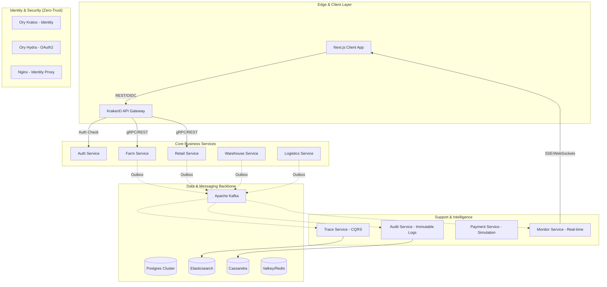
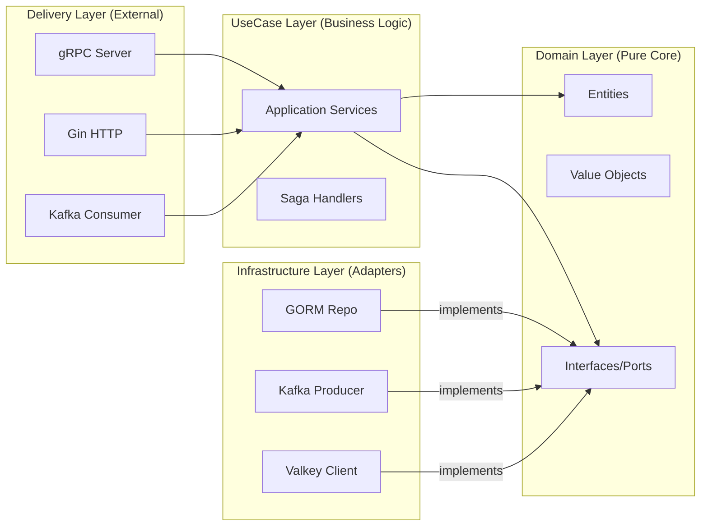
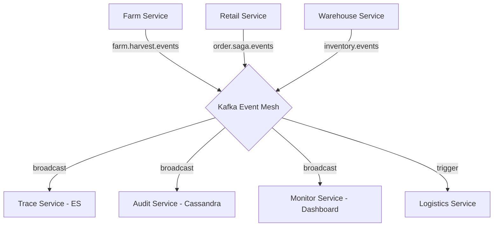
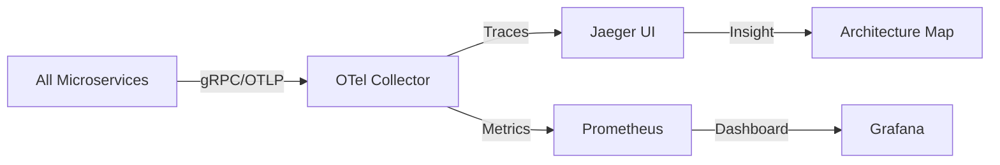

# 🏛️ Runtime Roasters — Master System Architecture Specification

This document provides the definitive technical specification for the **Runtime Roasters** ecosystem. It outlines the architectural patterns, service responsibilities, and infrastructure blueprints that enable a resilient, scalable, and observable coffee supply chain platform.

---

## 1. Architectural Strategy

Runtime Roasters is engineered using a **Microservices Architecture** combined with **Clean Architecture (Hexagonal)** at the service level. This ensures that business logic remains decoupled from infrastructure, and the system can scale horizontally with ease.

### Core Paradigms
- **Event-Driven Core:** Asynchronous communication via Apache Kafka for eventual consistency and decoupled scaling.
- **Polyglot Persistence:** Choosing the right tool for the job (Postgres for ACID, ES for Search, Cassandra for Auditing, Valkey for Real-time).
- **Stateless Services:** All backend services are stateless; session data is managed via Ory Kratos/Hydra and Valkey.
- **Observability-First:** W3C-compliant distributed tracing is a first-class citizen, not an afterthought.

---

## 2. High-Level Blueprint

The system is partitioned into several layers, from the edge to the data core.

---

## 3. Microservice Internal Blueprint (Clean Architecture)

Every Go microservice in the ecosystem follows a strict **Hexagonal / Clean Architecture** pattern to ensure testability and infrastructure independence.

---

## 4. Message Topology & Event Mesh

Kafka acts as the system's backbone, facilitating decoupled communication.

---

## 5. Observability Topology

We use a "Push-based" observability model for global request tracing.

---

## 6. Service Catalog & Responsibilities

| Service | Tech Stack | Responsibility |
| :--- | :--- | :--- |
| **Auth Service** | Go, GORM, Casbin | Centralized user management proxy and Casbin policy authority. |
| **Farm Service** | Go, GORM, Kafka | Manages plantations, coffee batches, and harvest records. |
| **Retail Service**| Go, GORM, Kafka | Handles the Order SAGA, customer profiles, and storefront logic. |
| **Warehouse** | Go, GORM, Valkey | Inventory management, real-time stock reservation, and batch tracking. |
| **Logistics** | Go, GORM, OSRM | Real-time driver GPS tracking and road-accurate route calculation. |
| **Payment** | Go, GORM, Webhooks| Simulates external payment gateways with secure webhook handling. |
| **Trace Service** | Go, ES, Kafka | The "Read Model" for supply chain traceability using CQRS. |
| **Audit Service** | Go, Cassandra | Provides an immutable append-only log of every significant system event. |
| **Monitor Service**| Go, Kafka, SSE | **Control Plane Visualization**: Broadasts real-time system events to the dashboard. |

---

## 4. Cross-Cutting Concerns

### 🔐 4.1. Security Model (Zero-Trust Architecture)
1.  **Authentication:** Ory Kratos manages users. Ory Hydra issues RS256-signed JWTs.
2.  **Edge Protection:** KrakenD verifies JWT signatures via Hydra's JWKS and checks `scope` claims.
3.  **Authorization (Two-Gate AuthZ):** 
    - **Gate 1:** KrakenD (RBAC at the route level).
    - **Gate 2:** Service-local **Casbin Enforcer**. Policies are hot-reloaded from `auth-service` via Kafka.
4.  **Internal Trust:** Services communicate via gRPC. Future-ready for mTLS via Service Mesh (Istio/Linkerd).

### 🔄 4.2. Data Consistency (Saga & Outbox)
- **Transactional Outbox:** Prevents data loss between DB updates and Kafka publishing. Events are written to a local `outbox_events` table in the same transaction as business data.
- **Transactional Inbox:** Ensures "Exactly-Once" processing at the consumer side by recording processed `Message_ID`s.
- **Choreographed Sagas:** Complex transactions (like Orders) are managed via a sequence of events. No centralized orchestrator, allowing for higher decoupling.

### 📊 4.3. Observability & Telemetry
- **Tracing:** OpenTelemetry (OTel) instrumentation across all services. Trace IDs propagate from Gateway ➔ gRPC ➔ Kafka.
- **Logging:** Structured JSON logging (Zap) with automatic `trace_id` injection for easy log correlation.
- **Metrics:** Prometheus endpoints in every service for monitoring latency, throughput, and error rates.

---

## 5. Integration Matrix

| Pattern | Usage | Protocol |
| :--- | :--- | :--- |
| **Client-to-Gateway** | Browser to Backend | REST / JSON |
| **Gateway-to-Service**| External to Internal | gRPC (via Gateway Mux) |
| **Service-to-Service**| Sync Communication | gRPC (Protobuf) |
| **Service-to-Service**| Async Communication | Apache Kafka (CloudEvents) |
| **Real-time Updates** | Live GPS/Status | SSE / WebSockets (via Gateway) |

---

## 6. Infrastructure Blueprint

The system is designed to be **Cloud-Native**:
- **Deployment:** Containerized via Docker. Production-ready for Kubernetes (K8s).
- **Service Discovery:** Handled by K8s Service/DNS or static mapping in Docker Compose.
- **Configuration:** Environment-based (12-Factor App) using `.env` or K8s ConfigMaps/Secrets.
- **Storage:** Managed instances for Postgres (RDS), Kafka (MSK), and Elasticsearch (Elastic Cloud) are recommended for production.

---
*Last Updated: May 2026*
