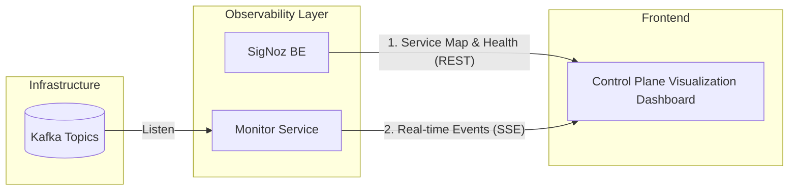

# Control Plane Visualization Strategy

This document outlines the technical implementation for the "Control Plane Visualization" dashboard, which visualizes the system's architecture, patterns (Saga), and real-time data flow.

## 1. Architectural Overview

The Control Plane Visualization dashboard is a React-based interactive map that consumes data from two primary sources to provide both high-level health metrics and low-latency event visualization.

## 2. Component 1: SigNoz API (The Static View)
**Purpose:** To provide the "Service Map" and long-term health metrics (Error Rate, Latency).

- **Implementation:** The Client App queries the SigNoz Query Service API directly (or via a proxy).
- **Data Points:** 
  - Service dependencies (automatically inferred from OTel traces).
  - P99 latency per service.
  - Error counts.
- **Why:** Leverages existing OpenTelemetry data without building a new metrics engine.

## 3. Component 2: Monitor Service (The Dynamic View)
**Purpose:** To provide zero-latency visualization of distributed patterns (Saga, Outbox).

- **Implementation:** A lightweight Go service that acts as a bridge between Kafka and the Web.
- **Protocol:** **Server-Sent Events (SSE)**. SSE is preferred over WebSockets for its simplicity and automatic reconnection features for unidirectional data flow.
- **Workflow:**
    1. `Monitor Service` consumes events from all business topics (`retail.order.*`, `payment.*`, etc.).
    2. Events are filtered and pushed to the `Client App` via SSE.
    3. UI (React Flow) animates a pulse or "flying packet" between service nodes when an event is received.

## 4. Visualization Tech Stack
- **React Flow:** For rendering the interactive node-link diagram of microservices.
- **Framer Motion:** For smooth animations of data packets and status transitions.
- **Zustand:** To manage the real-time state of the system map.

## 5. Security Note
- The Monitor Service must validate the `X-User-Role` to ensure only users with `admin` or `architect` roles can access the real-time system-wide event stream.
