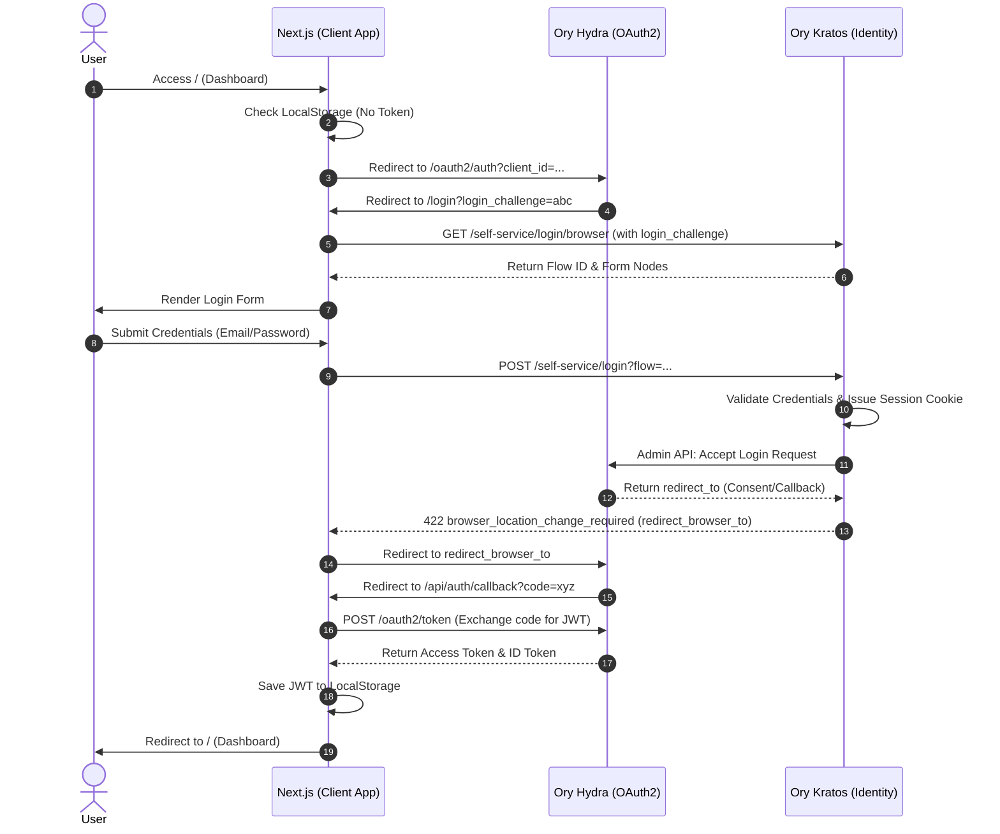

# Identity & Auth Flow Architecture

This diagram illustrates the interactions between the Next.js Client App, Ory Kratos (Identity Provider), and Ory Hydra (OAuth2 Provider) during a standard SSO login cycle.

## Components & Endpoints
- **Client App (Next.js)**
  - Home/Dashboard: `/`
  - Login Page: `/login`
  - Callback Handler: `/api/auth/callback`
- **Ory Hydra (OIDC Provider)**
  - Auth Endpoint: `http://localhost:4444/oauth2/auth`
  - Token Endpoint: `http://localhost:4444/oauth2/token`
  - Admin API: `http://hydra:4445`
- **Ory Kratos (Identity Provider)**
  - Browser Login Flow: `http://localhost:4433/self-service/login/browser`
  - Browser Logout Flow: `http://localhost:4433/self-service/logout/browser`

## Standard Login Sequence Diagram

