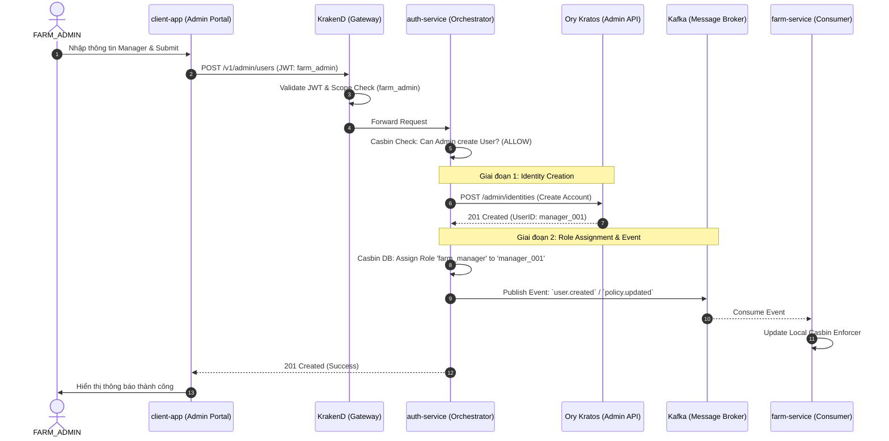

# User Management & Admin-Only Creation Flow

Tài liệu này mô tả luồng quản lý người dùng tập trung, đảm bảo tính bảo mật "Admin-only" và cơ chế đồng bộ sự kiện qua Kafka.

## 1. Nguyên tắc thiết kế (Principles)
- **Privileged Proxy**: Chỉ Admin mới có quyền tạo User. Client không bao giờ gọi trực tiếp vào Ory Kratos Admin API.
- **Event-Driven Propagation**: Mọi thay đổi về Identity hoặc Role đều được phát tán qua Kafka để các service khác cập nhật trạng thái/quyền.
- **Hardcoded Roles**: Hệ thống chấp nhận các Role cố định trong giai đoạn này:
    - `farm_admin`: Quản trị viên hệ thống nông nghiệp.
    - `farm_manager`: Người quản lý nông trại cụ thể.

## 2. Sequence Diagram: Admin Creates Manager



## 3. Vai trò của Kafka trong luồng này
Kafka đóng vai trò là "Xương sống" đảm bảo tính nhất quán cuối cùng (Eventual Consistency):
1. **Real-time AuthZ Sync**: Đảm bảo Manager mới có quyền truy cập ngay lập tức vào Farm Service mà không cần khởi động lại service.
2. **User Profile Sync**: Nếu Farm Service cần lưu trữ thông tin meta của Manager (Tên, Email) để hiển thị, nó sẽ nghe event `user.created` để upsert vào DB cục bộ của nó.
3. **Audit Logging**: Các service Audit có thể nghe event này để ghi lại nhật ký quản trị.

## 4. Schemas (Dự thảo)

### 4.1. API Request: `POST /v1/admin/users`
```json
{
  "email": "manager@runtimeroasters.com",
  "password": "temporary_password_123",
  "name": "Nguyen Van A",
  "role": "farm_manager" 
}
```

### 4.2. Kafka Event: `user.created` (Topic: `auth.user.events`)
```json
{
  "event_id": "uuid",
  "event_type": "USER_CREATED",
  "payload": {
    "user_id": "manager_001",
    "email": "manager@runtimeroasters.com",
    "name": "Nguyen Van A",
    "role": "farm_manager"
  },
  "occurred_at": "2026-05-10T..."
}
```
