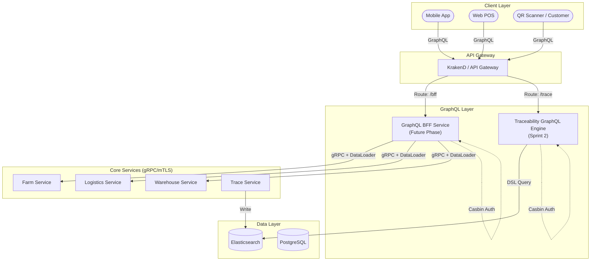

# 📐 KIẾN TRÚC TÍCH HỢP GRAPHQL: BFF & TRACEABILITY ENGINE

Việc kết hợp đồng thời **Phương án B (GraphQL BFF)** và **Phương án C (Traceability Graph Engine)** sẽ tạo ra một lớp giao diện dữ liệu cực kỳ mạnh mẽ cho RuntimeRoasters, tách biệt hoàn toàn giữa luồng nghiệp vụ phức tạp của ứng dụng và luồng truy xuất dữ liệu lịch sử.

> **Lộ trình thực thi:**
> - **Phương án C — Traceability Graph Engine:** Triển khai trong **Sprint 2** (giai đoạn hiện tại).
> - **Phương án B — GraphQL BFF Service:** Lên kế hoạch cho **giai đoạn tiếp theo** (Future Phase).

---

## 1. Phân Tầng Trách Nhiệm (Component Responsibility)

### A. GraphQL BFF Service (Backend-For-Frontend) — *Future Phase*

- **Vị trí:** Đứng sau API Gateway, đóng vai trò là lớp điều phối (Orchestrator) cho Mobile App và Web POS.
- **Cơ chế:** Tiếp nhận GraphQL Query ➔ Phân rã (Resolve) ➔ Gọi đồng thời các gRPC nội bộ đến Farm, Logistics, Warehouse ➔ Tổng hợp dữ liệu ➔ Trả về JSON duy nhất.
- **Nhiệm vụ:** Giải quyết bài toán tổng hợp thông tin Dashboard (ví dụ: hiển thị Đơn hàng kèm thông tin Nông trại và Tọa độ xe tải trên cùng một màn hình).

### B. Traceability GraphQL Engine — *Sprint 2 (Current Phase)*

- **Vị trí:** Một phần của Traceability Service, giao tiếp trực tiếp với Elasticsearch.
- **Cơ chế:** Expose một GraphQL Endpoint chuyên biệt cho việc truy vấn đồ thị vòng đời sản phẩm.
- **Nhiệm vụ:** Phục vụ khách hàng quét mã QR. Cho phép truy vấn sâu vào các tầng dữ liệu lịch sử (ví dụ: từ Ly cà phê ➔ Chuyến xe ➔ Mẻ rang ➔ Lô thu hoạch) theo cấu hình tùy biến của UI.

---

## 2. Luồng Dữ Liệu & Giao Tiếp (Interaction Flow)

### Client Request Routing

```
Client
 ├── Thao tác nghiệp vụ (Đặt hàng, Xem Dashboard)
 │    └── ➔ BFF Service  [Future Phase]
 │
 └── Truy xuất nguồn gốc (Quét mã QR)
      └── ➔ Traceability Service / GraphQL Endpoint  [Sprint 2]
```

### Internal Processing

| Layer | Cơ chế |
| :--- | :--- |
| **BFF** | Sử dụng `DataLoader` để gộp các yêu cầu gRPC, tránh gọi hàng trăm request lẻ tẻ đến các service lõi (N+1 Problem). |
| **Traceability** | Chuyển đổi GraphQL Query thành Elasticsearch DSL (Domain Specific Language) để tìm kiếm các document lồng nhau. |
| **Security** | Cả hai đều tích hợp `Casbin Middleware` tại tầng Resolver để kiểm tra quyền truy cập dựa trên Role và Trace-ID. |

---

## 3. Các Pattern Áp Dụng Cho GraphQL

### DataLoader Pattern
Triển khai tại lớp `UseCase` của BFF để xử lý bài toán **N+1** khi tổng hợp dữ liệu từ nhiều Microservices qua gRPC. Mỗi resolver không gọi gRPC trực tiếp — thay vào đó, nó đăng ký key vào DataLoader batch. Sau khi resolver tree hoàn thành, DataLoader thực hiện một lần gọi gRPC duy nhất cho toàn bộ batch.

### Schema-First Development
Sử dụng `gqlgen` để định nghĩa Schema trước, đảm bảo tính nhất quán (contract) giữa Frontend và Backend ngay từ đầu. Schema `.graphql` được commit vào repo và là nguồn sự thật (source of truth) cho cả hai phía.

### Query Complexity Mapping
Gán trọng số (`cost`) cho các field để ngăn chặn các câu query lồng nhau quá sâu làm cạn kiệt tài nguyên hệ thống. Ví dụ:

```graphql
# Query này bị giới hạn complexity = 15 (cup=1, shipment=3, batch=5, harvest=6)
query TraceProduct($qrCode: String!) {
  traceByQR(qrCode: $qrCode) {       # cost: 1
    cup { ... }
    shipment {                        # cost: 3
      batch {                         # cost: 5
        harvestLot { ... }            # cost: 6
      }
    }
  }
}
```

---

## 4. Sơ Đồ Kiến Trúc (Architecture Diagram)



---

## 5. Elasticsearch DSL Mapping (Traceability Engine)

GraphQL Query được dịch sang Elasticsearch DSL thông qua một lớp `QueryBuilder`:

```go
// Ví dụ: GraphQL resolver dịch thành ES query
func (r *queryResolver) TraceByQR(ctx context.Context, qrCode string) (*model.TraceResult, error) {
    query := elastic.NewBoolQuery().
        Must(elastic.NewTermQuery("qr_code", qrCode)).
        Must(elastic.NewExistsQuery("harvest_lot_id"))

    result, err := r.esClient.Search().
        Index("product-lifecycle-*").
        Query(query).
        Sort("timestamp", false). // Descending — newest first
        Size(1).
        Do(ctx)
    // ...
}
```

---

## 6. Định Nghĩa Schema GraphQL (Traceability Engine)

```graphql
# schema/traceability.graphql

type Query {
  traceByQR(qrCode: String!): TraceResult
  traceByBatchID(batchID: ID!): TraceResult
}

type TraceResult {
  qrCode:     String!
  product:    ProductInfo!
  lifecycle:  [LifecycleEvent!]!
  shipment:   ShipmentInfo
  roastBatch: RoastBatch
  harvestLot: HarvestLot
}

type LifecycleEvent {
  stage:     String!        # "HARVEST" | "PROCESS" | "ROAST" | "SHIP" | "RETAIL"
  timestamp: String!
  location:  GeoPoint
  actor:     String
  metadata:  Map
}

type HarvestLot {
  id:         ID!
  farmName:   String!
  region:     String!
  variety:    String!
  harvestedAt: String!
}

type RoastBatch {
  id:          ID!
  roastLevel:  String!
  roastedAt:   String!
  roastMaster: String
}

type ShipmentInfo {
  trackingID: ID!
  origin:     String!
  destination: String!
  departedAt: String!
  arrivedAt:  String
  vehicle:    VehicleInfo
}
```
