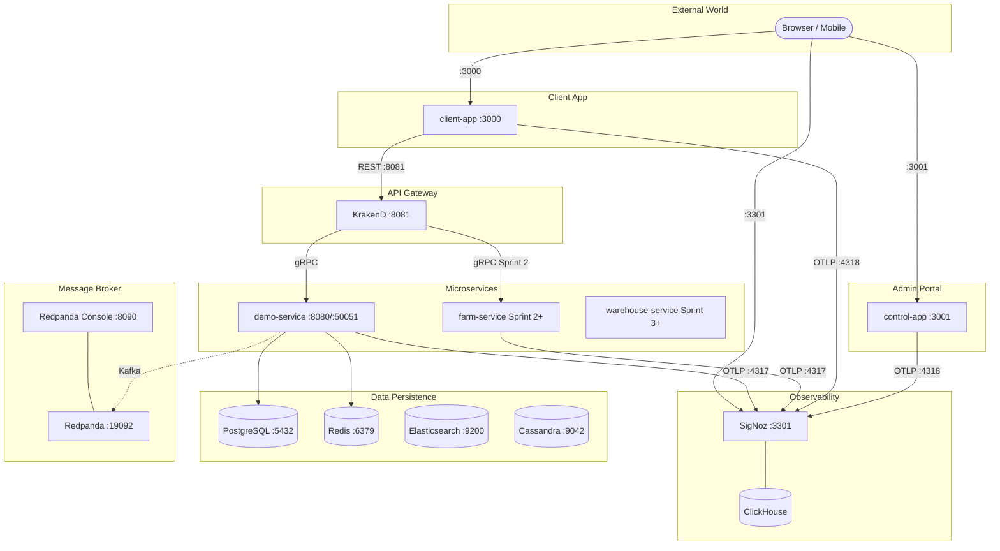

# RuntimeRoasters — System Architecture & Development Blueprint

Tài liệu này định nghĩa kiến trúc tổng thể, các tiêu chuẩn kỹ thuật và lộ trình thực thi cho dự án **RuntimeRoasters**. Đây là bản cam kết về chất lượng kỹ thuật (Production-grade) và tư duy hệ thống phân tán.

---

## 1. Tầm nhìn Kiến trúc (Architectural Vision)

Mục tiêu là xây dựng một hệ thống Microservices **"Mạnh mẽ - Tin cậy - Quan sát được"**. Hệ thống không chỉ giải quyết bài toán nghiệp vụ Chuỗi cung ứng cà phê mà còn là một bản showcase về các mẫu thiết kế (Design Patterns) hiện đại nhất trong hệ sinh thái Go.

### Nguyên tắc cốt lõi (Core Principles):
- **Abstraction First:** Không phụ thuộc vào framework. Mọi thành phần hạ tầng (DB, Queue, Cache) đều được trừu tượng hóa qua Interface.
- **No Hardcoding:** Tuyệt đối không hardcode. Sử dụng cấu hình đa môi trường qua Viper & Environment Variables.
- **Database per Service:** Đảm bảo tính độc lập và khả năng mở rộng riêng biệt cho từng service.
- **Standardization:** Thống nhất format Log, Error (RFC 9457), và cách khởi tạo Service thông qua bộ khung `pkg/` dùng chung.
- **Sprint Discipline:** Sprint 1 = infrastructure only. Sprint 2+ = business logic only. Không setup infra trong sprint nghiệp vụ.

---

## 2. App Architecture

### Hai codebase riêng biệt

#### `apps/client-app/` (Next.js 15 — Business UI)
- **Pattern:** Direct Pattern.
- **Role:** Dành cho người dùng cuối (Nông dân, Nhà máy, Retailer).
- **Flow:** Browser → KrakenD :8081 → Microservices.
- **Routes:**
    - `/app/farms`: Quản lý nông hộ (Sprint 2).
    - `/app/batches`: Theo dõi mẻ hàng (Sprint 2).
    - `/app/logistics`: Theo dõi vận chuyển (Sprint 3).

#### `apps/control-app/` (Next.js 15 — Control Plane)
- **Role:** Dành cho Admin hệ thống.
- **Routes:**
    - `/control/services`: Giám sát sức khỏe services.
    - `/control/api-explorer`: Swagger UI.

---

## 3. Sơ đồ Hạ tầng Tổng thể



---

## 4. Port Map (Final — no conflicts)

| Service | Port | Note |
| :--- | :--- | :--- |
| client-app | 3000 | Business UI |
| control-app | 3001 | Control Plane (Admin) |
| KrakenD | 8081 | API Gateway |
| demo-service HTTP | 8080 | grpc-gateway (Sprint 1) |
| demo-service gRPC | 50051 | |
| farm-service HTTP | 8080 | grpc-gateway (Sprint 2) |
| farm-service gRPC | 50051 | |
| PostgreSQL | 5432 | |
| Redis | 6379 | |
| Elasticsearch | 9200 | |
| Cassandra | 9042 | |
| Redpanda Kafka | 19092 | external |
| Redpanda Console | 8090 | conflict-free (moved from 8080) |
| SigNoz OTLP gRPC | 4317 | Go services → SigNoz |
| SigNoz OTLP HTTP | 4318 | browser → SigNoz |
| SigNoz UI | 3301 | **NOT exposed** — proxy via /signoz/* |

---

## 5. Thiết kế Framework nội bộ (`pkg/`)

| Package | Vai trò |
| :--- | :--- |
| `pkg/config` | Viper: load từ `.env`, YAML, env vars. `BaseConfig` embed vào mọi service config. |
| `pkg/logger` | Zap: JSON cho prod, console cho dev. `FromContext(ctx)` tự inject trace_id. |
| `pkg/base` | Application lifecycle: gRPC/HTTP server, health checks, graceful shutdown, OTel init. |
| `pkg/errs` | RFC 9457 Problem Details. `GinErrorHandler()` middleware. `SubProblem[]` support. |
| `pkg/database` | sqlx wrapper: connection pool, otelsql auto-instrumentation, migration scaffold. |
| `pkg/redis` | go-redis wrapper: redisotel tracing + metrics. |
| `pkg/telemetry` | OTel TracerProvider + MeterProvider + W3C propagator. `InjectKafkaHeaders` / `ExtractKafkaHeaders`. |

---

## 6. Các Mẫu Thiết kế Kỹ thuật Nâng cao

1. **Saga Pattern & Distributed Transactions:**
   - Phase 1 (Choreography): Outbox Pattern + Kafka. Compensating Actions tự động.
   - Phase 2 (Orchestration): Temporal.io — loại bỏ phức tạp quản lý trạng thái.

2. **Transactional Outbox & Inbox:**
   - Outbox: Atomicity giữa DB write và event publish.
   - Inbox: Idempotency bằng `Message_ID` — chống duplicate event.

3. **CQRS & Real-time Traceability:**
   - Write: PostgreSQL (ACID transactions).
   - Read: Elasticsearch (full-text search, hành trình sản phẩm).
   - Sync: Trace Service consume Kafka → upsert Elasticsearch.

4. **Standardized API Response (RFC 9457):**
   - `type`, `title`, `status`, `detail`, `instance`, `trace_id`, `errors[]`.
   - `application/problem+json` Content-Type.

5. **Decentralized Authorization:** Mỗi service giữ bộ Casbin rules riêng.

6. **Hash Chaining (Cassandra):** Audit log chống gian lận nội bộ.

---

## 7. Quan sát (Observability)

**SigNoz** thay thế toàn bộ stack cũ (OTel Collector + Jaeger + Prometheus + Loki + Grafana). Xem chi tiết: [docs/architecture/telemetry.md](./telemetry.md).

Auto-instrumentation qua `pkg/base.NewApp()`:
- HTTP spans (otelgin)
- gRPC spans (otelgrpc)
- SQL spans (otelsql)
- Redis spans (redisotel)
- Kafka trace propagation (W3C headers)
- Log correlation (trace_id + span_id in every log line)

---

## 8. Bảo mật & Xác thực

- **Identity:** Ory Kratos (JWT cấp phát + JWKS).
- **Gateway:** KrakenD forward JWT, không validate — services tự validate in-memory.
- **In-service auth:** Services load JWKS khi startup, verify JWT không cần network call.
- **mTLS:** gRPC nội bộ bắt buộc mutual TLS.
- **Webhook:** HMAC signature verify tại Webhook Ingress Service.
- **Control Plane:** `middleware.ts` trong client-app gate tất cả `/control/*` và `/signoz/*`.

---

## 9. Cấu trúc Monorepo

```text
RuntimeRoasters/
├── api/                    # Proto definitions + buf toolchain (Shared)
│   └── runtime/
│       └── farm/v1/
├── apps/
│   ├── client-app/         # Business UI (port 3000)
│   ├── control-app/        # Admin Dashboard (port 3001)
│   ├── demo-service/       # Sprint 1: boilerplate template
│   └── farm-service/       # Sprint 2+
├── src/
│   └── pkg/                # Go Workspaces shared packages
│       ├── base/
│       ├── config/
│       ├── database/
│       ├── errs/
│       ├── logger/
│       ├── redis/
│       └── telemetry/
├── deployments/
│   ├── docker-compose.yaml
│   ├── krakend/
│   │   └── krakend.json
│   └── init-db.sql
└── docs/
    ├── architecture/
    └── business/
```

---

## 10. Sprint Roadmap

| Sprint | Goal | Key Deliverable |
| :--- | :--- | :--- |
| **Sprint 1** | Complete Infrastructure | docker-compose, demo-service, client-app shell |
| **Sprint 2** | Farm Service Business Logic | Farm CRUD, copy demo-service template |
| **Sprint 3** | Distributed Transactions | Saga, Warehouse, Retail |
| **Sprint 4** | Security | mTLS, Ory Kratos, Casbin |

**Nguyên tắc:** Sprint 1 hoàn tất toàn bộ infra. Sprint 2+ chỉ viết business logic — không setup thêm bất kỳ infrastructure nào.
 hoàn tất toàn bộ infra. Sprint 2+ chỉ viết business logic — không setup thêm bất kỳ infrastructure nào.
