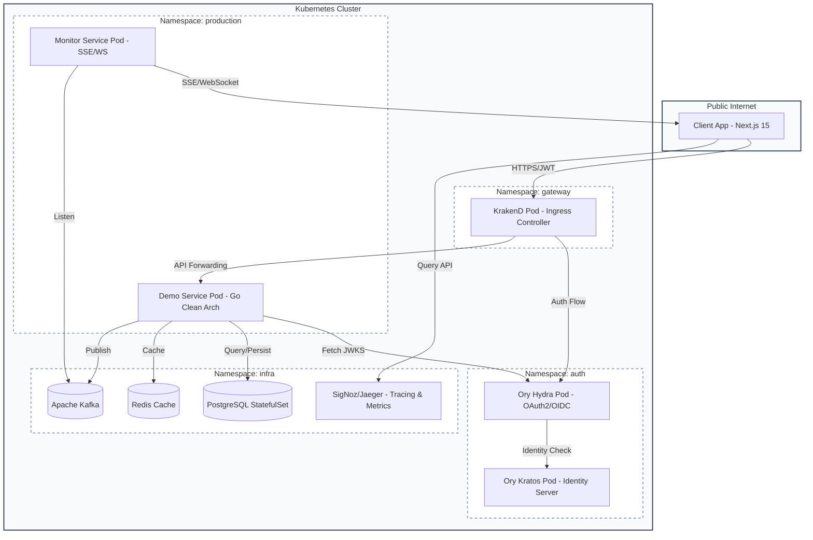
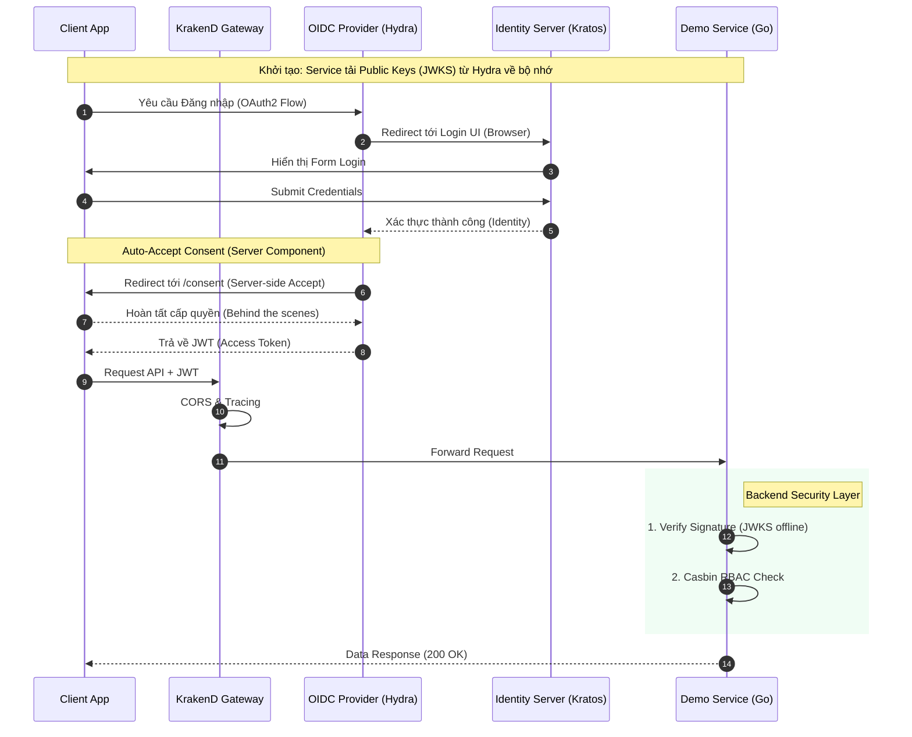

# System Architecture Diagrams

Tài liệu này chứa các sơ đồ kiến trúc và luồng dữ liệu của Runtime Roasters, được vẽ bằng Mermaid.

## 1. High-Level Infrastructure (Kubernetes)
Sơ đồ mô phỏng cấu trúc phân lớp trong K8s Cluster.

> [!NOTE]
> **Visual View (Excalidraw):** 

## 2. Sprint 2: Distributed Security Flow
Quy trình xác thực JWT và phân quyền Casbin tại từng service.

