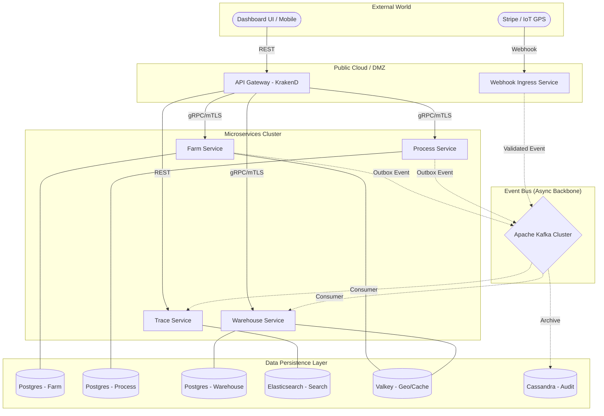

# 🏟️ RuntimeRoasters (OriginFlow) - System Architecture & Development Blueprint

Tài liệu này định nghĩa kiến trúc tổng thể, các tiêu chuẩn kỹ thuật và lộ trình thực thi cho dự án **RuntimeRoasters**. Đây là bản cam kết về chất lượng kỹ thuật (Production-grade) và tư duy hệ thống phân tán.

---

## 1. Tầm nhìn Kiến trúc (Architectural Vision)

Mục tiêu là xây dựng một hệ thống Microservices **"Mạnh mẽ - Tin cậy - Quan sát được"**. Hệ thống không chỉ giải quyết bài toán nghiệp vụ Chuỗi cung ứng cà phê mà còn là một bản showcase về các mẫu thiết kế (Design Patterns) hiện đại nhất trong hệ sinh thái Go.

### Nguyên tắc cốt lõi (Core Principles):
*   **Abstraction First:** Không phụ thuộc vào framework. Mọi thành phần hạ tầng (DB, Queue, Cache) đều được trừu tượng hóa qua Interface.
*   **No Hardcoding:** Tuyệt đối không hardcode. Sử dụng cấu hình đa môi trường qua Viper & Environment Variables.
*   **Database per Service:** Đảm bảo tính độc lập và khả năng mở rộng riêng biệt cho từng service.
*   **Standardization:** Thống nhất format Log, Error (RFC 7807), và cách khởi tạo Service thông qua bộ khung `pkg/` dùng chung.

---

## 2. Sơ đồ Hạ tầng Tổng thể (Infrastructure Diagram)



---

## 3. Các Thử thách Kỹ thuật & Giải pháp (Technical Challenges)

| Thử thách | Giải pháp | Tại sao lựa chọn? |
| :--- | :--- | :--- |
| **Dual-Write Consistency** | **Transactional Outbox** | Đảm bảo DB và Kafka luôn đồng bộ, không mất mát dữ liệu khi crash. |
| **Distributed Transaction** | **Saga Choreography** | Quản lý luồng nghiệp vụ liên dịch vụ (Order -> Warehouse -> Payment) một cách phi tập trung. |
| **Search Performance** | **CQRS + Elasticsearch** | Tách biệt luồng ghi và đọc. Cung cấp tính năng tìm kiếm full-text hành trình cà phê siêu tốc. |
| **Data Integrity** | **Hash Chaining (Cassandra)** | Lưu trữ Audit log với chuỗi băm để chống gian lận dữ liệu từ bên trong. |
| **High Load GPS** | **Valkey (GEO commands)** | Sử dụng bộ nhớ đệm tốc độ cao để lưu tọa độ GPS thời gian thực của các xe vận tải. |
| **Standardized Error** | **RFC 7807** | UI luôn nhận được format lỗi đồng nhất, dễ dàng xử lý và hiển thị thông báo. |

---

## 4. Thiết kế Chi tiết Framework nội bộ (`pkg/`)

Đây là phần "Móng" gánh toàn bộ hệ thống, đảm bảo tính tái sử dụng cực cao:

1.  **`pkg/config`**: Dùng **Viper** để load config. Hỗ trợ `.env`, YAML và biến môi trường.
2.  **`pkg/logger`**: Dựng trên **Uber Zap**. Log ra JSON cho Production, Console cho Dev. Tự động inject Trace-ID.
3.  **`pkg/base`**: Định nghĩa Application Lifecycle. Quản lý việc khởi tạo gRPC/HTTP server, Health Checks (`/health/live`, `/health/ready`), và Graceful Shutdown.
4.  **`pkg/errs`**: Chuyển đổi Go Errors thành chuẩn RFC 7807 (Problem Details).
5.  **`pkg/database`**: Wrapper cho SQL (GORM/sqlx) hỗ trợ Transaction, Connection Pool và Migration tự động.

---

## 5. Quy hoạch Sprints (Scope-based)

### 🏗️ Sprint 1: The Interactive Core (Móng & UI Farm)
*   Dựng hạ tầng cơ bản (Postgres, Valkey).
*   Xây dựng `pkg/` (Config, Logger, Base, Errs).
*   **Farm Service:** CRUD Nông trại & Mẻ thu hoạch.
*   **UI Dashboard (Phase 1):** Giao diện quản lý Farm/Batch (Next.js + React Query).

### 📡 Sprint 2: The Distributed Pulse (Kafka, Trace Service & Traceability GraphQL Engine)
*   Bổ sung Kafka & Elasticsearch.
*   Implement **Transactional Outbox** pattern tại Farm Service.
*   **Trace Service:** Consumer Kafka → Lưu Elasticsearch (CQRS Read Model).
*   **Traceability GraphQL Engine (Phương án C):** Expose GraphQL endpoint chuyên biệt trong Trace Service để truy vấn đồ thị vòng đời sản phẩm (Quét mã QR). Sử dụng `gqlgen`, Schema-First, Query Complexity Limit, Casbin Resolver Auth.
*   **UI Update:** Timeline hành trình mẻ cà phê thời gian thực + QR Trace page.
*   *Phương án B (GraphQL BFF Service) sẽ được lên kế hoạch ở giai đoạn sau.*
*   Tham khảo: [`docs/architecture/graphql-integration.md`](../architecture/graphql-integration.md)

### 🔄 Sprint 3: The Complex Business (Saga & Warehouse)
*   **Retail Service** (Đặt hàng) & **Warehouse Service** (Quản lý kho).
*   Implement **Saga Choreography** (Order -> Reserve stock).
*   Xử lý logic Rollback/Compensation.

### 🛡️ Sprint 4: God Mode (Security & Observability)
*   **mTLS** cho gRPC nội bộ.
*   **Ory Kratos** cho Identity & Auth.
*   **Distributed Tracing** (OpenTelemetry + Jaeger) soi sáng toàn bộ request flow.

---

## 6. Cấu trúc thư mục Monorepo

```text
/RuntimeRoasters (OriginFlow)
├── api/             # gRPC Proto & Generated code
├── apps/            # Các Microservices
│   ├── farm-service/
│   ├── warehouse-service/
│   ├── dashboard-ui/ # Next.js App
│   └── gateway/      # KrakenD / Nginx
├── pkg/             # Thư viện dùng chung (The Foundation)
├── deployments/     # Docker Compose & K8s configs
└── docs/            # Architecture & Sprint docs
```
