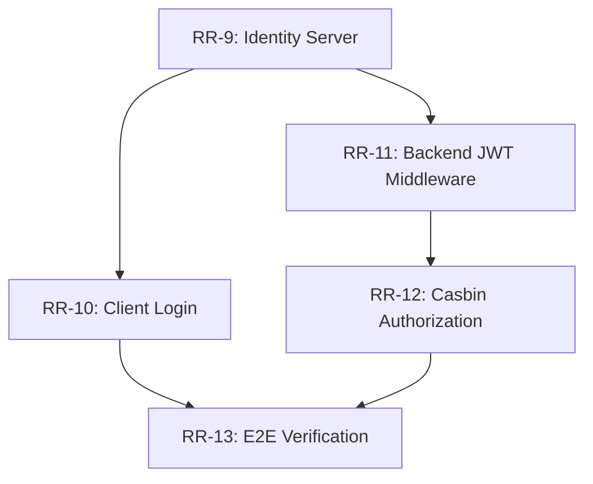

# Sprint 2: Security & Access Control — Kanban Board

**Status:** `PLANNING` | **Goal:** Thiết lập nền tảng AuthN/AuthZ toàn diện theo mô hình Decentralized Validation.

---

## 🎯 Sprint Goal

> **Người dùng có thể đăng nhập qua Identity Server, nhận JWT và các Microservices có thể tự động xác thực/phân quyền (AuthN/AuthZ) độc lập bằng Casbin mà không làm tăng độ trễ hệ thống.**

---

## 📋 Kanban Board

| 🕒 To Do                                                    | 🚧 In Progress | ✅ Done |
| :---------------------------------------------------------- | :------------- | :------ |
| [RR-9: Identity Server Infrastructure](./RR-9.md)           |                |         |
| [RR-10: Client-Side Auth & Login Flow](./RR-10.md)          |                |         |
| [RR-11: Backend Security Core - JWT Validation](./RR-11.md) |                |         |
| [RR-12: Fine-grained Authorization (Casbin)](./RR-12.md)    |                |         |
| [RR-13: End-to-End Secure Integration](./RR-13.md)          |                |         |

---

## 🛤️ Dependency Flow

---

## 🛠️ Technical Stack

- **Identity Server:** Ory Kratos / Keycloak / Custom Identity (TBD).
- **Format:** JSON Web Token (JWT).
- **Validation:** In-memory signature verification via JWKS.
- **Authorization:** Casbin (RBAC Model).
- **Communication:** KrakenD headers propagation.
