# Implementation Plan: Architecture Diagram Layout

## 1. Expected Changes
Currently, the diagram uses `dagre` for auto-layout, but it doesn't explicitly group nodes into logical architectural layers (Frontend, Backend, Database), causing nodes to float freely.

We will replace the pure `dagre` layout with a **Column-based Swimlane Layout** using React Flow's `parentNode` (Group Nodes) feature.

- **Create Layer/Group Nodes**: We will introduce 4 invisible or lightly styled container nodes:
  - `layer-frontend`: Leftmost column.
  - `layer-gateway`: Center-left column.
  - `layer-services`: Center-right column.
  - `layer-infra`: Rightmost column.
- **Assign Nodes to Layers**: Modify `fallbackConfig.nodes` and `topologyService` nodes so each node specifies its `parentNode` (e.g., `client.web` belongs to `layer-frontend`).
- **Responsive "Fit View"**: Use React Flow's `<ReactFlow fitView fitViewOptions={{ padding: 0.2 }} />` so the diagram always fits the screen perfectly without the user having to scroll initially.

## 2. Wireframe (Target Layout)

Here is a Mermaid wireframe illustrating the rigid, standard architecture layout we will enforce:

```mermaid
block-beta
  columns 4
  
  block:Frontend["Frontend (Left)"]
    ClientApp["Client App (Next.js)"]
  end
  
  block:Gateway["API Gateway (Middle)"]
    KrakenD["KrakenD Gateway"]
  end
  
  block:Backend["Backend Services (Middle-Right)"]
    TraceService["Trace Service"]
    SocketService["Socket Service"]
    AuthService["Auth Service"]
    FarmService["Farm Service"]
  end
  
  block:Database["Infra & Databases (Right)"]
    Kafka["Apache Kafka"]
    Postgres["PostgreSQL"]
    Elasticsearch["Elasticsearch"]
    Cassandra["Cassandra"]
  end
  
  %% Implicit relations for layout
  ClientApp --> KrakenD
  KrakenD --> TraceService
  TraceService --> Postgres
  SocketService --> Kafka
```

## 3. Edge Cases & Handling
1. **Too many services in the Backend column**:
   - *Issue*: The Backend column might grow extremely tall vertically, causing the diagram to zoom out too much.
   - *Handling*: We will implement a grid layout *inside* the `layer-services` group (e.g., max 2 or 3 nodes per row), wrapping them so the group expands horizontally instead of vertically.
2. **Long Node Labels**:
   - *Issue*: A service with a very long name might break the fixed width of the node.
   - *Handling*: Set a strict `min-width` and `max-width` (e.g., `180px`) on the `ArchitectureNode` component, using `truncate` (`text-ellipsis`) and providing a native `title` attribute for tooltip hover.
3. **Responsive Mobile/Small Screens**:
   - *Issue*: The 4-column layout might be illegible on mobile.
   - *Handling*: The `fitView` will auto-shrink it, but users can pan/zoom. We will ensure the React Flow `<Controls />` are clearly visible on mobile so users can navigate the large canvas.
4. **Dynamic Nodes (from WebSocket)**:
   - *Issue*: If the topology service pushes a new node dynamically via WS, it might not have a pre-assigned column.
   - *Handling*: We will use a fallback logic in `buildGraph`. If a node's `tone` is `db`, it goes to `layer-infra`. If `touchpoint`, `layer-frontend`. If unknown, `layer-services`.
5. **Inactive Nodes Visibility**:
   - *Issue*: Displaying all nodes can clutter the diagram if the selected flow only uses a subset of services.
   - *Handling*: Implement a filter in `buildGraph`. Nodes that are not in `activeNodes` (i.e., not participating in the currently selected flow) will be hidden entirely (`hidden: true`) rather than just visually dimmed, making the active flow much cleaner.

## 4. Impacted Scope
- `src/apps/client-app/src/components/features/architecture-topology/ArchitectureTopology.tsx`
- Related types in `src/apps/client-app/src/types/topology.ts`.

## 5. Required Validation
- [ ] Open the root page `/`.
- [ ] Verify Frontend is on the left, Gateway in the middle, Infra/DB on the right.
- [ ] Resize the browser window aggressively to ensure `fitView` scales the diagram gracefully without breaking the layout.
