# 🏛️ Runtime Roasters — Master System Architecture Specification

This document provides the definitive technical specification for the **Runtime Roasters** ecosystem. It outlines the architectural patterns, service responsibilities, and infrastructure blueprints that enable a resilient, scalable, and observable coffee supply chain platform.

---

## 1. Architectural Strategy

Runtime Roasters is engineered using a **Microservices Architecture** combined with **Clean Architecture (Hexagonal)** at the service level. This ensures that business logic remains decoupled from infrastructure, and the system can scale horizontally with ease.

### Core Paradigms
- **Event-Driven Core:** Asynchronous communication via Apache Kafka for eventual consistency and decoupled scaling.
- **Polyglot Persistence:** Choosing the right tool for the job (Postgres for ACID, ES for Search, Cassandra for Auditing, Valkey for Real-time).
- **Stateless Services:** All backend services are stateless; session data is managed via Ory Kratos/Hydra and Valkey.
- **Observability-First:** W3C-compliant distributed tracing is a first-class citizen, not an afterthought.

---

## 2. High-Level Blueprint

The system is partitioned into several layers, from the edge to the data core.

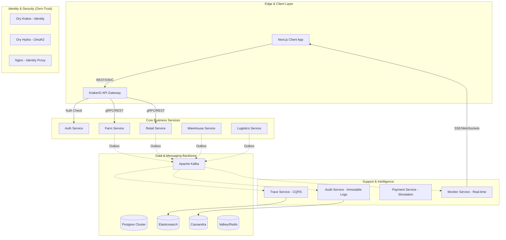
```mermaid
graph TB
    subgraph "Edge & Client Layer"
        CA[Next.js Client App]
        GW[KrakenD API Gateway]
    end

    subgraph "Identity & Security (Zero-Trust)"
        KR[Ory Kratos - Identity]
        HY[Ory Hydra - OAuth2]
        NG[Nginx - Identity Proxy]
    end

    subgraph "Core Business Services"
        AS[Auth Service]
        FS[Farm Service]
        RS[Retail Service]
        WS[Warehouse Service]
        LS[Logistics Service]
    end

    subgraph "Support & Intelligence"
        TS[Trace Service - CQRS]
        AUS[Audit Service - Immutable Logs]
        PMS[Payment Service - Simulation]
        MS[Monitor Service - Real-time]
    end

    subgraph "Data & Messaging Backbone"
        KF[Apache Kafka]
        PG[(Postgres Cluster)]
        ES[(Elasticsearch)]
        CS[(Cassandra)]
        VK[(Valkey/Redis)]
    end

    CA -->|REST/OIDC| GW
    GW -->|Auth Check| AS
    GW -->|gRPC/REST| FS
    GW -->|gRPC/REST| RS
    
    FS -.->|Outbox| KF
    RS -.->|Outbox| KF
    WS -.->|Outbox| KF
    LS -.->|Outbox| KF
    
    KF -.-> TS
    KF -.-> AUS
    KF -.-> MS
    
    TS --> ES
    AUS --> CS
    MS -->|SSE/WebSockets| CA
```

---

## 3. Microservice Internal Blueprint (Clean Architecture)

Every Go microservice in the ecosystem follows a strict **Hexagonal / Clean Architecture** pattern to ensure testability and infrastructure independence.

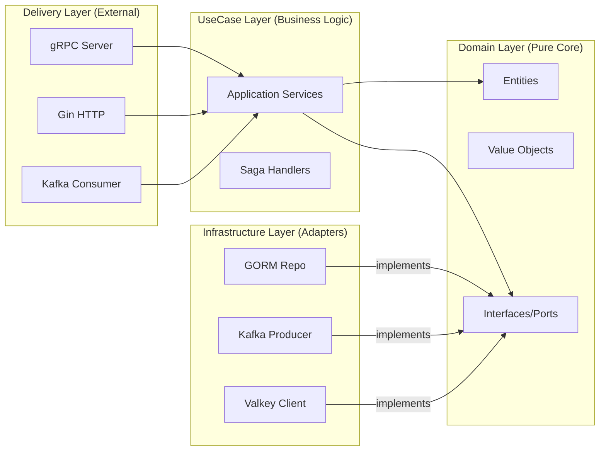
```mermaid
graph LR
    subgraph "Delivery Layer (External)"
        GRPC[gRPC Server]
        GIN[Gin HTTP]
        SUB[Kafka Consumer]
    end

    subgraph "UseCase Layer (Business Logic)"
        UC[Application Services]
        SA[Saga Handlers]
    end

    subgraph "Domain Layer (Pure Core)"
        ENT[Entities]
        VAL[Value Objects]
        IF[Interfaces/Ports]
    end

    subgraph "Infrastructure Layer (Adapters)"
        GORM[GORM Repo]
        PUB[Kafka Producer]
        RED[Valkey Client]
    end

    GRPC --> UC
    GIN --> UC
    SUB --> UC
    UC --> ENT
    UC --> IF
    GORM -- implements --> IF
    PUB -- implements --> IF
    RED -- implements --> IF
```

---

## 4. Message Topology & Event Mesh

Kafka acts as the system's backbone, facilitating decoupled communication.

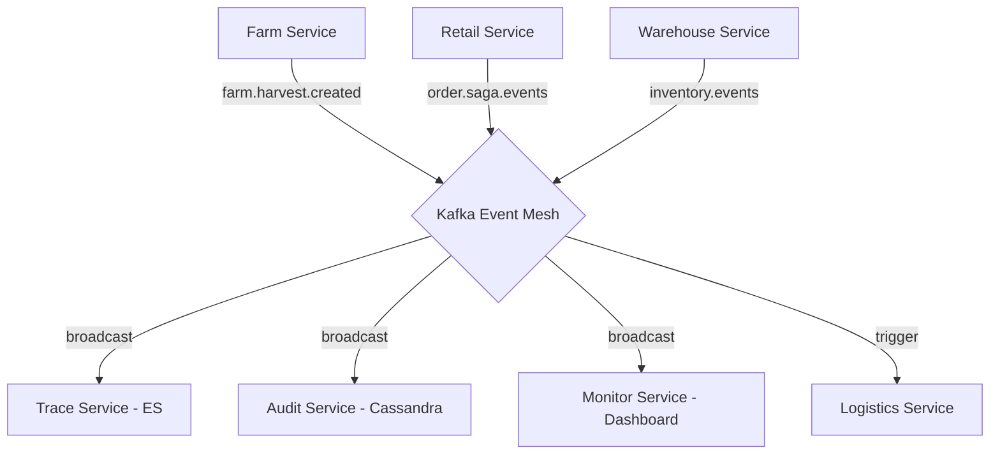
```mermaid
graph TD
    FARM[Farm Service] -->|farm.harvest.created| KAFKA{Kafka Event Mesh}
    RETAIL[Retail Service] -->|order.saga.events| KAFKA
    WH[Warehouse Service] -->|inventory.events| KAFKA
    KAFKA -->|broadcast| TRACE[Trace Service - ES]
    KAFKA -->|broadcast| AUDIT[Audit Service - Cassandra]
    KAFKA -->|broadcast| MON[Monitor Service - Dashboard]
    KAFKA -->|trigger| LOGI[Logistics Service]
```

---

## 5. Observability Topology

We use a "Push-based" observability model for global request tracing.

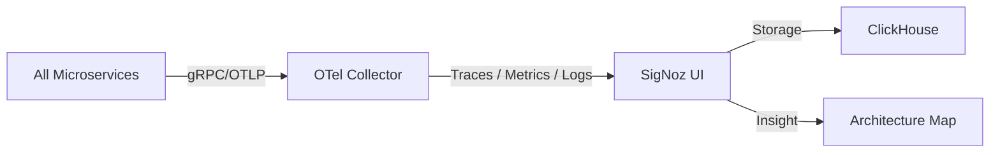
```mermaid
graph LR
    SERVICES[All Microservices] -->|gRPC/OTLP| OEL[OTel Collector]
    OEL -->|Traces / Metrics / Logs| SIGNOZ[SigNoz UI]
    SIGNOZ -->|Storage| CLICKHOUSE[ClickHouse]
    SIGNOZ -->|Insight| ARCH[Architecture Map]
```

---

## 6. Service Catalog & Responsibilities

| Service | Tech Stack | Responsibility |
| :--- | :--- | :--- |
| **Auth Service** | Go, GORM, Casbin | Centralized user management proxy and Casbin policy authority. |
| **Farm Service** | Go, GORM, Kafka | Manages plantations, coffee batches, and harvest records. |
| **Retail Service**| Go, GORM, Kafka | Handles the Order SAGA, customer profiles, and storefront logic. |
| **Warehouse** | Go, GORM, Valkey | Inventory management, real-time stock reservation, and batch tracking. |
| **Logistics** | Go, GORM, OSRM | Real-time driver GPS tracking and road-accurate route calculation. |
| **Payment** | Go, GORM, Webhooks| Simulates external payment gateways with secure webhook handling. |
| **Trace Service** | Go, ES, Kafka | The "Read Model" for supply chain traceability using CQRS. |
| **Audit Service** | Go, Cassandra | Provides an immutable append-only log of every significant system event. |
| **Monitor Service**| Go, Kafka, SSE | **Control Plane Visualization**: Broadasts real-time system events to the dashboard. |

---

## 4. Cross-Cutting Concerns

### 🔐 4.1. Security Model (Zero-Trust Architecture)
1.  **Authentication:** Ory Kratos manages users. Ory Hydra issues RS256-signed JWTs.
2.  **Edge Protection:** KrakenD verifies JWT signatures via Hydra's JWKS and checks `scope` claims.
3.  **Authorization (Two-Gate AuthZ):** 
    - **Gate 1:** KrakenD (RBAC at the route level).
    - **Gate 2:** Service-local **Casbin Enforcer**. Policies are hot-reloaded from `auth-service` via Kafka.
4.  **Internal Trust:** Services communicate via gRPC. Future-ready for mTLS via Service Mesh (Istio/Linkerd).

### 🔄 4.2. Data Consistency (Saga & Outbox)
- **Transactional Outbox:** Prevents data loss between DB updates and Kafka publishing. Events are written to a local `outbox_events` table in the same transaction as business data.
- **Transactional Inbox:** Ensures "Exactly-Once" processing at the consumer side by recording processed `Message_ID`s.
- **Choreographed Sagas:** Complex transactions (like Orders) are managed via a sequence of events. No centralized orchestrator, allowing for higher decoupling.

### 📊 4.3. Observability & Telemetry
- **Tracing:** OpenTelemetry (OTel) instrumentation across all services. Trace IDs propagate from Gateway ➔ gRPC ➔ Kafka.
- **Logging:** Structured JSON logging (Zap) with automatic `trace_id` injection for easy log correlation.
- **Metrics:** Prometheus endpoints in every service for monitoring latency, throughput, and error rates.

---

## 5. Integration Matrix

| Pattern | Usage | Protocol |
| :--- | :--- | :--- |
| **Client-to-Gateway** | Browser to Backend | REST / JSON |
| **Gateway-to-Service**| External to Internal | gRPC (via Gateway Mux) |
| **Service-to-Service**| Sync Communication | gRPC (Protobuf) |
| **Service-to-Service**| Async Communication | Apache Kafka (CloudEvents) |
| **Real-time Updates** | Live GPS/Status | SSE / WebSockets (via Gateway) |

---

## 6. Infrastructure Blueprint

The system is designed to be **Cloud-Native**:
- **Deployment:** Containerized via Docker. Production-ready for Kubernetes (K8s).
- **Service Discovery:** Handled by K8s Service/DNS or static mapping in Docker Compose.
- **Configuration:** Environment-based (12-Factor App) using `.env` or K8s ConfigMaps/Secrets.
- **Storage:** Managed instances for Postgres (RDS), Kafka (MSK), and Elasticsearch (Elastic Cloud) are recommended for production.

---
*Last Updated: May 2026*
# 🌊 Runtime Roasters Architecture Flows

This document consolidates the key architectural flows of the **Runtime Roasters** platform, covering Identity, Data Consistency (CQRS/Saga), and User Management.

---

## 🔐 1. Identity & Authentication Flow

This diagram illustrates the interactions between the **Client App**, **Ory Kratos** (Identity), and **Ory Hydra** (OAuth2) during a standard SSO login cycle.

### Standard Login Sequence

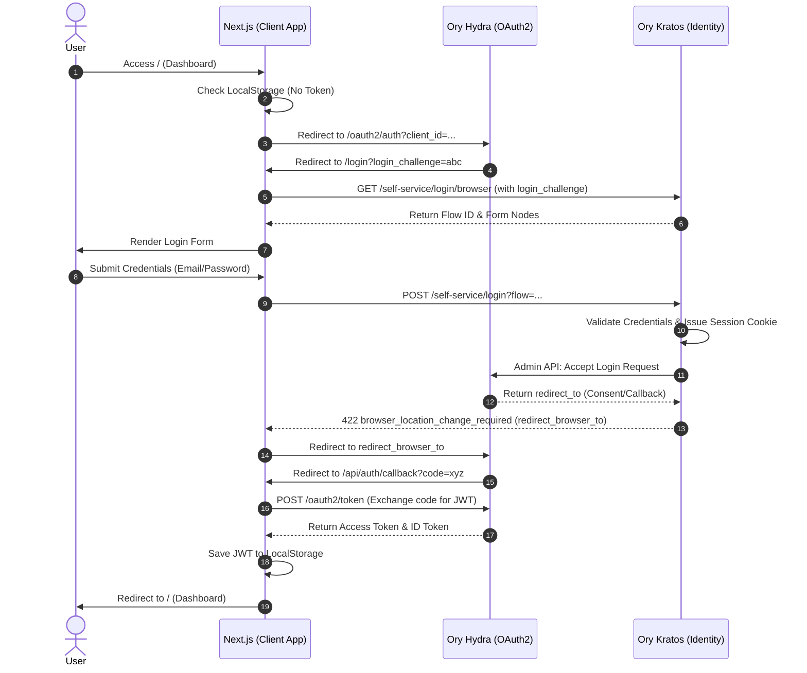
```mermaid
sequenceDiagram
    autonumber
    actor User
    participant NextJS as Next.js (Client App)
    participant Hydra as Ory Hydra (OAuth2)
    participant Kratos as Ory Kratos (Identity)

    User->>NextJS: Access / (Dashboard)
    NextJS->>NextJS: Check LocalStorage (No Token)
    NextJS->>Hydra: Redirect to /oauth2/auth?client_id=...
    Hydra->>NextJS: Redirect to /login?login_challenge=abc
    NextJS->>Kratos: GET /self-service/login/browser (with login_challenge)
    Kratos-->>NextJS: Return Flow ID & Form Nodes
    NextJS->>User: Render Login Form
    User->>NextJS: Submit Credentials (Email/Password)
    NextJS->>Kratos: POST /self-service/login?flow=...
    Kratos->>Kratos: Validate Credentials & Issue Session Cookie
    Kratos->>Hydra: Admin API: Accept Login Request
    Hydra-->>Kratos: Return redirect_to (Consent/Callback)
    Kratos-->>NextJS: 422 browser_location_change_required (redirect_browser_to)
    NextJS->>Hydra: Redirect to redirect_browser_to
    Hydra->>NextJS: Redirect to /api/auth/callback?code=xyz
    NextJS->>Hydra: POST /oauth2/token (Exchange code for JWT)
    Hydra-->>NextJS: Return Access Token & ID Token
    NextJS->>NextJS: Save JWT to LocalStorage
    NextJS->>User: Redirect to / (Dashboard)
```

---

## 📦 2. Core Business Flows (Saga & CQRS)

These flows demonstrate how the system handles high-volume transactions and data consistency across microservices.

### A. Farm to Trace (CQRS & Outbox)
1.  **Write Side (Farm Service):**
    - Receives `POST /v1/harvests`.
    - Opens a **Database Transaction**.
    - Inserts Harvest record and an **Outbox Event**.
    - Commit Transaction.
2.  **Relay Worker:**
    - Scans the Outbox table for `PENDING` events.
    - Publishes to Kafka topic `farm.harvest.created`.
    - Marks Outbox as `COMPLETED`.
3.  **Read Side (Trace Service):**
    - Consumes from Kafka.
    - Checks for duplicate messages (**Inbox Pattern**).
    - Upserts data into **Elasticsearch** for fast traceability lookups.

### B. Order SAGA (Choreography)
1.  **Retail Service:** Initiates Order (Pending) ➔ Publishes `OrderCreated`.
2.  **Warehouse Service:** Reserves stock using **Valkey Distributed Locks** ➔ Publishes `StockReserved`.
3.  **Payment Service:** Processes payment via simulated provider ➔ Publishes `PaymentCompleted`.
4.  **Retail Service:** Receives all success events ➔ Updates Order to `SUCCESS`.
5.  *Compensation:* If any step fails (e.g., Payment Declined), services publish rollback events to release reserved stock.

---

## 👥 3. User Management & Admin Flow

This flow ensures secure account creation, where only **ADMIN** users can provision new accounts through a centralized proxy.

### Admin Creates Manager Sequence

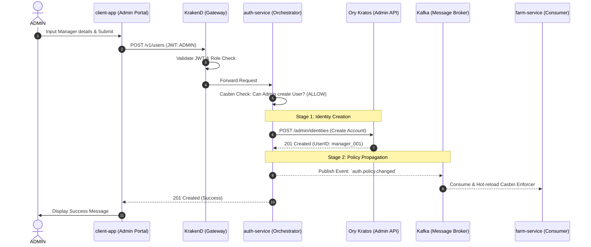
```mermaid
sequenceDiagram
    autonumber
    actor Admin as ADMIN
    participant App as client-app (Admin Portal)
    participant GW as KrakenD (Gateway)
    participant Auth as auth-service (Orchestrator)
    participant Kratos as Ory Kratos (Admin API)
    participant KF as Kafka (Message Broker)
    participant Farm as farm-service (Consumer)

    Admin->>App: Input Manager details & Submit
    App->>GW: POST /v1/users (JWT: ADMIN)
    GW->>GW: Validate JWT & Role Check
    GW->>Auth: Forward Request
    Auth->>Auth: Casbin Check: Can Admin create User? (ALLOW)
    
    Note over Auth, Kratos: Stage 1: Identity Creation
    Auth->>Kratos: POST /admin/identities (Create Account)
    Kratos-->>Auth: 201 Created (UserID: manager_001)
    
    Note over Auth, KF: Stage 2: Policy Propagation
    Auth-->>KF: Publish Event: `auth.policy.changed`
    KF-->>Farm: Consume & Hot-reload Casbin Enforcer
    
    Auth-->>App: 201 Created (Success)
    App->>Admin: Display Success Message
```

### Kafka's Role in Identity
- **Policy Sync:** Ensures new users have immediate access rights across the cluster.
- **Profile Sync:** Propagates metadata (Name, Email) to downstream services for local display.
- **Audit Logging:** Provides a permanent record of administrative actions.

---

## 🎨 4. System Visualization Flow (Control Plane)

This "Showcase-only" flow enables the **Real-time Architecture Map** on the dashboard, allowing observers to see data moving through the system as it happens.

### The Life of a Visualization Event
1.  **Event Generation**: A microservice (e.g., Payment) performs a task and publishes an event to Kafka.
2.  **Monitor Consumption**: The **Monitor Service** listens to all core business topics.
3.  **Real-time Broadcast**: The Monitor Service extracts the `Trace-ID` and event type, then pushes a lightweight JSON payload to the Frontend via **Server-Sent Events (SSE)**.
4.  **Frontend Animation**: The Dashboard receives the event and triggers an animation (e.g., a glowing pulse) along the edge connecting the participating services on the system map.

**Business Value**: Provides immediate operational visibility and a "live heartbeat" of the entire supply chain, making the complex microservices architecture tangible and easy to audit.

---
*Documented for Runtime Roasters Technical Showcase.*
# 🌊 Technical Reference: Core Sequences & Rationale

This document provides a deep dive into the most complex technical flows of the **Runtime Roasters** platform. It explains not only *how* data moves but *why* specific distributed patterns were chosen.

---

## 1. The Distributed Order SAGA (Choreography)

We use **Choreographed Sagas** for order fulfillment. Unlike Orchestrated Sagas, there is no central "master" service; instead, each service knows what to do when it hears a specific event.

### Sequence Diagram
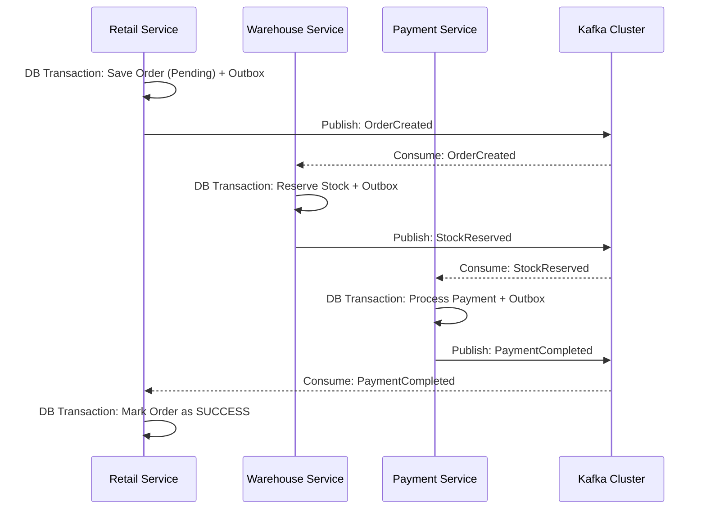
```mermaid
sequenceDiagram
    participant Retail as Retail Service
    participant WH as Warehouse Service
    participant Payment as Payment Service
    participant Kafka as Kafka Cluster

    Retail->>Retail: DB Transaction: Save Order (Pending) + Outbox
    Retail->>Kafka: Publish: OrderCreated
    Kafka-->>WH: Consume: OrderCreated
    WH->>WH: DB Transaction: Reserve Stock + Outbox
    WH->>Kafka: Publish: StockReserved
    Kafka-->>Payment: Consume: StockReserved
    Payment->>Payment: DB Transaction: Process Payment + Outbox
    Payment->>Kafka: Publish: PaymentCompleted
    Kafka-->>Retail: Consume: PaymentCompleted
    Retail->>Retail: DB Transaction: Mark Order as SUCCESS
```

### Technical Rationale: Why Choreography?
- **Decoupling**: The Retail service doesn't need to know that the Warehouse or Payment services even exist. It only cares about publishing and consuming events.
- **Scalability**: Services can be scaled independently based on their load (e.g., the Warehouse service might need more replicas during a harvest season).

---

## 2. Distributed Authorization Sync

To achieve **Zero-Trust** security with high performance, we use a distributed Casbin model.

### Sequence Diagram
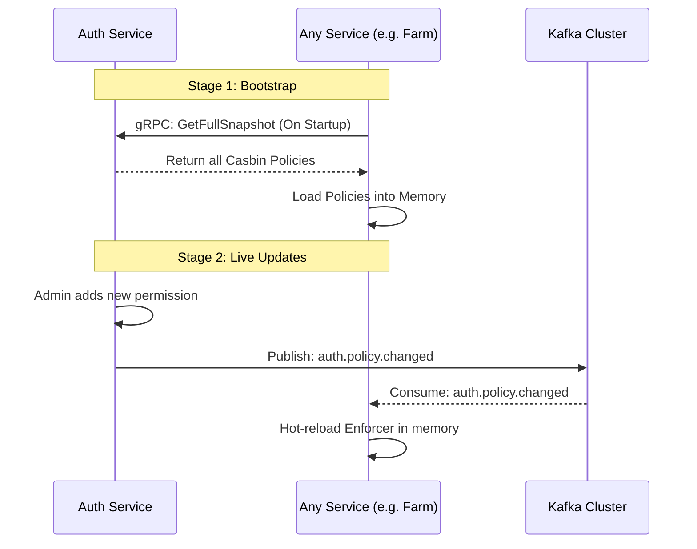
```mermaid
sequenceDiagram
    participant Auth as Auth Service
    participant Service as Any Service (e.g. Farm)
    participant Kafka as Kafka Cluster

    Note over Auth, Service: Stage 1: Bootstrap
    Service->>Auth: gRPC: GetFullSnapshot (On Startup)
    Auth-->>Service: Return all Casbin Policies
    Service->>Service: Load Policies into Memory

    Note over Auth, Service: Stage 2: Live Updates
    Auth->>Auth: Admin adds new permission
    Auth->>Kafka: Publish: auth.policy.changed
    Kafka-->>Service: Consume: auth.policy.changed
    Service->>Service: Hot-reload Enforcer in memory
```

### Technical Rationale: Why Distributed Auth?
- **Low Latency**: Authorization checks are performed locally in memory at the service level (ns vs ms). No gRPC round-trip is required for every request.
- **Resilience**: If the Auth Service or Kafka is temporarily down, the services can still function using their cached policies.

---

## 3. CQRS Read-Model Projection

The **Trace Service** provides a fast, searchable view of the supply chain history by projecting data into Elasticsearch.

### Sequence Diagram
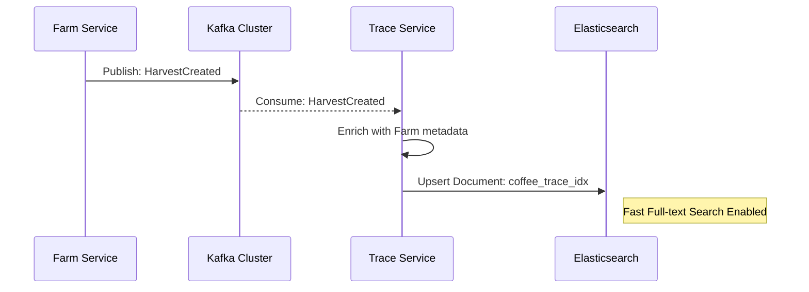
```mermaid
sequenceDiagram
    participant Farm as Farm Service
    participant Kafka as Kafka Cluster
    participant Trace as Trace Service
    participant ES as Elasticsearch

    Farm->>Kafka: Publish: HarvestCreated
    Kafka-->>Trace: Consume: HarvestCreated
    Trace->>Trace: Enrich with Farm metadata
    Trace->>ES: Upsert Document: coffee_trace_idx
    Note right of ES: Fast Full-text Search Enabled
```

### Technical Rationale: Why CQRS?
- **Performance**: Relational databases (Postgres) are great for ACID transactions but slow for complex traceability joins. ES is optimized for high-speed retrieval.
- **Isolation**: Heavy search queries on the Dashboard don't impact the performance of the core business services.

---

## 4. The Journey of a Bean (End-to-End Lifecycle)

This diagram tracks the production-demo lifecycle of a coffee batch across the entire supply chain. The important change from earlier sprint shortcuts is that harvest does not become warehouse intake immediately; it must pass through logistics pickup first.

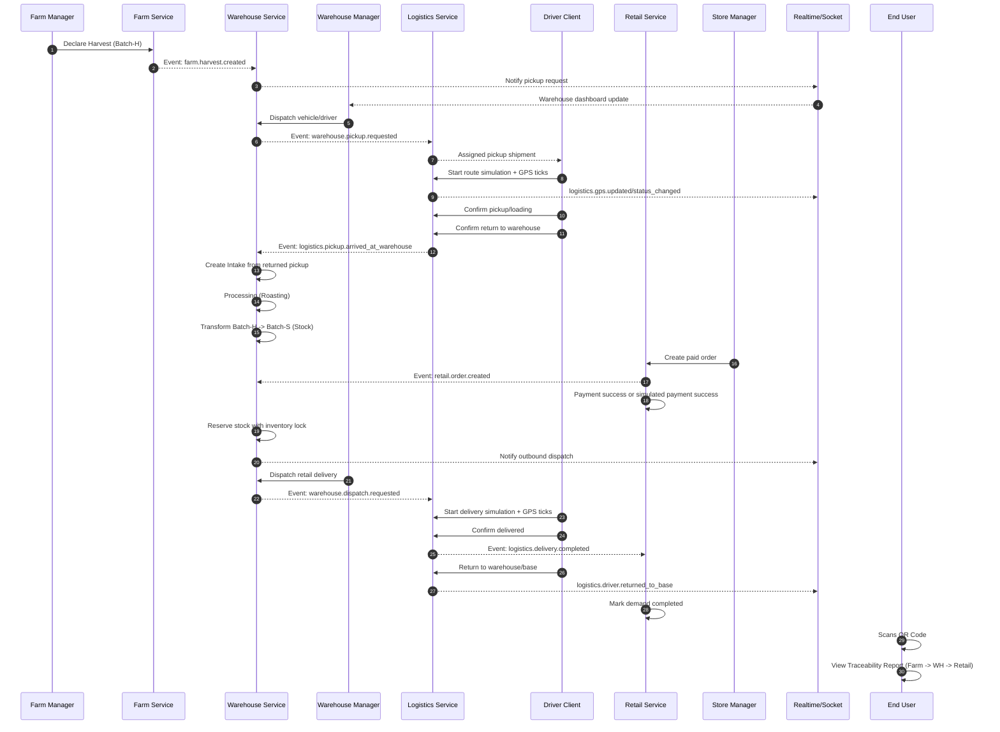
```mermaid
sequenceDiagram
    autonumber
    participant FM as Farm Manager
    participant FS as Farm Service
    participant WH as Warehouse Service
    participant WM as Warehouse Manager
    participant LG as Logistics Service
    participant DR as Driver Client
    participant RS as Retail Service
    participant SM as Store Manager
    participant RT as Realtime/Socket
    participant EU as End User

    FM->>FS: Declare Harvest (Batch-H)
    FS-->>WH: Event: farm.harvest.created
    WH-->>RT: Notify pickup request
    RT-->>WM: Warehouse dashboard update
    WM->>WH: Dispatch vehicle/driver
    WH-->>LG: Event: warehouse.pickup.requested
    LG-->>DR: Assigned pickup shipment
    DR->>LG: Start route simulation + GPS ticks
    LG-->>RT: logistics.gps.updated/status_changed
    DR->>LG: Confirm pickup/loading
    DR->>LG: Confirm return to warehouse
    LG-->>WH: Event: logistics.pickup.arrived_at_warehouse
    WH->>WH: Create Intake from returned pickup
    WH->>WH: Processing (Roasting)
    WH->>WH: Transform Batch-H -> Batch-S (Stock)
    SM->>RS: Create paid order
    RS-->>WH: Event: retail.order.created
    RS->>RS: Payment success or simulated payment success
    WH->>WH: Reserve stock with inventory lock
    WH-->>RT: Notify outbound dispatch
    WM->>WH: Dispatch retail delivery
    WH-->>LG: Event: warehouse.dispatch.requested
    DR->>LG: Start delivery simulation + GPS ticks
    DR->>LG: Confirm delivered
    LG-->>RS: Event: logistics.delivery.completed
    DR->>LG: Return to warehouse/base
    LG-->>RT: logistics.driver.returned_to_base
    RS->>RS: Mark demand completed
    EU->>EU: Scans QR Code
    EU->>EU: View Traceability Report (Farm -> WH -> Retail)
```

### UI/Role Notes

- `FARM_MANAGER` creates harvest and watches pickup status.
- `WAREHOUSE_MGR` dispatches vehicles/drivers and controls warehouse receipt/processing.
- `DRIVER` owns route simulation and milestone confirmation in the main demo flow.
- `STORE_MGR` creates paid retail orders and watches incoming delivery status.
- Root Client App `ArchitectureTopology` may be public/no-auth with sanitized topology/demo data.
- Private realtime dashboard streams should be authenticated and role-scoped.

---

## 5. Realtime Demo Stream

The production-demo UI should have enough delay/pacing for viewers to understand the flow.

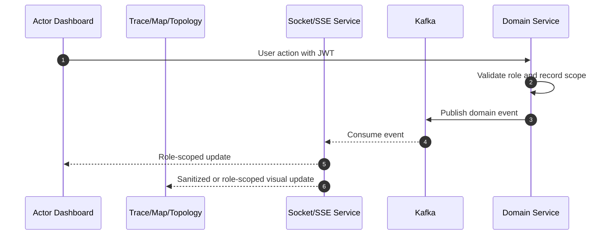
```mermaid
sequenceDiagram
    autonumber
    participant UIA as Actor Dashboard
    participant UIB as Trace/Map/Topology
    participant Sock as Socket/SSE Service
    participant Kafka as Kafka
    participant Svc as Domain Service

    UIA->>Svc: User action with JWT
    Svc->>Svc: Validate role and record scope
    Svc->>Kafka: Publish domain event
    Kafka-->>Sock: Consume event
    Sock-->>UIA: Role-scoped update
    Sock-->>UIB: Sanitized or role-scoped visual update
```

The socket service is display transport only. Persisted backend state and domain events remain source of truth.

---

## 6. Zero-Consent Identity Flow (Seamless SSO)

To optimize internal operations, we implement a **Zero-Consent** OIDC flow for trusted internal dashboard clients.

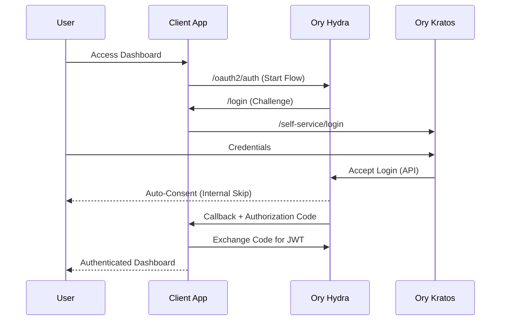
```mermaid
sequenceDiagram
    participant User
    participant NextJS as Client App
    participant Hydra as Ory Hydra
    participant Kratos as Ory Kratos

    User->>NextJS: Access Dashboard
    NextJS->>Hydra: /oauth2/auth (Start Flow)
    Hydra->>NextJS: /login (Challenge)
    NextJS->>Kratos: /self-service/login
    User->>Kratos: Credentials
    Kratos->>Hydra: Accept Login (API)
    Hydra-->>User: Auto-Consent (Internal Skip)
    Hydra->>NextJS: Callback + Authorization Code
    NextJS->>Hydra: Exchange Code for JWT
    NextJS-->>User: Authenticated Dashboard
```

### Technical Rationale: Why Zero-Consent?
- **User Experience**: Removes redundant "Allow access" screens for internal employees.
- **Security**: The "skip" logic is only applied to **Trusted Client IDs** verified by the Monitor/Auth service.

---
*Technical reference for Runtime Roasters Architectural Decision Patterns.*
# Observability

Runtime Roasters uses OpenTelemetry for runtime tracing and SigNoz/ClickHouse for local demo observability.

## Local Stack

- SigNoz UI: `http://localhost:3301`
- OTLP gRPC: `localhost:4317`
- OTLP HTTP: `localhost:4318`
- Collector config: `deployments/otel-collector-config.yaml`
- Compose services:
  - `signoz`
  - `signoz-clickhouse`
  - `otel-collector`
  - `signoz-telemetrystore-migrator`
  - `signoz-zookeeper-1`

`signoz-zookeeper-1` is only for ClickHouse/SigNoz coordination. Kafka remains the official Apache Kafka broker and does not use ZooKeeper.

## Setup Notes For Agents

Use this exact order when bringing up observability:

```bash
docker compose -f deployments/docker-compose.dev.yaml up -d signoz-zookeeper-1 signoz-init-clickhouse signoz-clickhouse signoz-telemetrystore-migrator otel-collector signoz
```

The service dependencies are intentional:

- `signoz-zookeeper-1`: ClickHouse/SigNoz coordination only. Never connect Kafka to it.
- `signoz-init-clickhouse`: downloads and installs the `histogramQuantile` executable function used by SigNoz queries.
- `signoz-clickhouse`: telemetry store for traces, metrics, logs, metadata, and meter data.
- `signoz-telemetrystore-migrator`: runs bootstrap, sync, and async ClickHouse migrations before the collector starts.
- `otel-collector`: SigNoz OTel collector listening on `4317/4318`.
- `signoz`: UI/query service exposed at `localhost:3301`.

Files to update together:

- `deployments/docker-compose.dev.yaml`
- `deployments/otel-collector-config.yaml`
- `deployments/signoz/clickhouse/cluster.xml`
- `deployments/signoz/clickhouse/custom-function.xml`

Common failure points:

- ClickHouse starts before `signoz-init-clickhouse` completes: the custom `histogramQuantile` function may be missing.
- Collector starts before `signoz-telemetrystore-migrator` exits successfully: trace tables may be missing.
- Collector starts with OpAMP manager mode before SigNoz org/agent enrollment exists: the runtime config can be replaced by `nop` receivers/exporters. In local dev, run collector directly with `--config=/etc/otel-collector-config.yaml`.
- Services log `connection refused localhost:4317`: `otel-collector` is not running or host port `4317` is occupied.
- SigNoz UI is healthy but traces are missing: verify service env uses `OTEL_EXPORTER_OTLP_ENDPOINT=localhost:4317` for host-local services, then check `docker logs rr-otel-collector`.
- Kafka references any ZooKeeper/coordinator service: this is wrong. Kafka remains independent Apache Kafka.

## Trace Evidence Rule

RR-URG-01 is only fully closed when one live demo flow shows the same `trace_id` in:

- service logs,
- Kafka propagated `traceparent`,
- trace-service Postgres/Elasticsearch documents,
- SigNoz traces.

## Service Endpoint

Host-local Go services should export OTLP to:

```text
OTEL_EXPORTER_OTLP_ENDPOINT=localhost:4317
```

If a service later runs inside Docker, use:

```text
OTEL_EXPORTER_OTLP_ENDPOINT=otel-collector:4317
```
# 🔗 Technical Reference: API Contracts & Messaging

Runtime Roasters uses a combination of **Synchronous gRPC** for command/query and **Asynchronous Kafka** for state propagation. This document specifies the contracts that bind the microservices together.

---

## 1. Internal Communication (gRPC)

All internal calls between services use gRPC with **Protobuf** serialization.

### Core Service Interfaces
| Service | Protobuf Definition | Key Methods |
| :--- | :--- | :--- |
| **Auth** | `api/runtime/auth/v1/auth.proto` | `GetFullSnapshot`, `VerifyToken`, `ListUsers` |
| **Farm** | `api/runtime/farm/v1/farm.proto` | `CreateHarvest`, `GetFarm`, `ListFarms` |
| **Warehouse**| `api/runtime/warehouse/v1/wh.proto` | `ReserveStock`, `ReleaseStock`, `GetInventory` |

### Rationale: Why gRPC?
- **Type Safety**: Strict contracts prevent runtime errors due to missing fields.
- **Performance**: High-speed binary protocol with lower overhead than JSON.
- **Code Generation**: Modern tooling (**Buf**) allows for automatic client/server stub generation.

---

## 2. Edge API (REST/JSON)

External clients (Frontend/Mobile) communicate via the **KrakenD API Gateway** using REST.

| Method | Endpoint | Internal gRPC Mapping | Auth Required |
| :--- | :--- | :--- | :--- |
| `POST` | `/v1/auth/login` | `AuthService.Login` | No |
| `GET` | `/v1/stores` | `RetailService.ListStores` | Yes |
| `POST` | `/v1/orders` | `RetailService.CreateOrder` | Yes |
| `GET` | `/v1/harvests` | `FarmService.ListHarvests` | Yes |

---

## 3. Asynchronous Messaging (Kafka)

Kafka is the "central nervous system" of the platform, used for Sagas and CQRS.

### Key Kafka Topics & Events
| Topic | Event Type | Description |
| :--- | :--- | :--- |
| `order.saga.events` | `OrderCreated` | Triggers stock reservation in Warehouse. |
| `auth.policy.changed`| `PolicyUpdated` | Notifies services to reload Casbin rules. |
| `farm.harvest.created`| `HarvestCreated`| Propagates data to Warehouse, Trace, and Audit. |
| `logistics.gps.updated` | `DriverLocation` | High-frequency GPS updates for tracking. |

### Event Schema Standard
Every event follows the **CloudEvents** specification to ensure metadata consistency across the ecosystem.

The detailed event contract is maintained in [`CLOUDEVENTS_CONTRACT.md`](./CLOUDEVENTS_CONTRACT.md).

CloudEvents are emitted in JSON format. Required metadata:
- `id`, `type`, `source`, `subject`, `time`, `datacontenttype=application/json`.
- Extensions: `correlationid`, optional `causationid`, `traceid` when an OTel span exists, and relevant business IDs such as `orderid`, `storeid`, `shipmentid`, `harvestid`, `batchid`, `farmid`, `warehouseid`, `driverid`, `vehicleid`.
- `data` contains the typed business payload only.

OpenTelemetry `trace_id` is not a business identifier. It is used for SigNoz/ClickHouse observability and request/event correlation only.

---

## 4. System Constants & Enums

To maintain consistency, all services share these core domain values:

| Enum Group | Values | Description |
| :--- | :--- | :--- |
| **Order Status** | `PENDING`, `PREPARING`, `SHIPPING`, `COMPLETED`, `REJECTED` | Lifecycle of a retail transaction. |
| **Outbox Status** | `PENDING`, `COMPLETED`, `FAILED` | Reliability state of a Kafka message. |
| **Coffee Type** | `ARABICA`, `ROBUSTA`, `CHERRY`, `CULI` | Core product catalog. |

---
*Technical reference for Runtime Roasters Integration Standards.*
# gRPC Contracts

Runtime Roasters uses **Protocol Buffers (Protobuf)** as the source of truth for all internal service-to-service communication.

## 📁 Source of Truth
All `.proto` definitions are located in the root `/api/` directory:
- `api/runtime/auth/v1/`: Identity and Authorization.
- `api/runtime/farm/v1/`: Plantation and Harvest logic.
- `api/runtime/warehouse/v1/`: Inventory management.
- `api/runtime/retail/v1/`: Order and Transaction logic.
- ...and so on.

## 🛠️ Code Generation
We use **Buf** to manage plugins and generate Go code.
- Configuration: `api/buf.yaml`, `api/buf.gen.yaml`
- Command: `task proto` (generates code into `src/pkg/api/` or directly into service folders depending on config).

## 🛡️ Best Practices
- **Breaking Changes:** Never remove or rename fields; use `reserved` if necessary.
- **Documentation:** Use comments in `.proto` files to document RPCs and fields; they will be extracted into the generated code and Swagger specs.
# REST API Specifications

Runtime Roasters exposes a unified RESTful interface via the **KrakenD API Gateway**.

## 🚪 API Gateway (KrakenD)
- **Host:** `http://localhost:8081`
- **Configuration:** `deployments/krakend/krakend.json`
- **Features:** JWT Validation, Rate Limiting, Request Transformation, Aggregation.

## 📑 Interactive Documentation (Swagger/OpenAPI)
Each service generates its own Swagger specification. The Gateway can also export a consolidated OpenAPI spec.

### How to view:
1.  Start the services: `task dev`
2.  The Frontend Portal (Client App) includes an embedded Swagger UI at `/dashboard/api-docs`.
3.  Alternatively, you can import the raw JSON specs from `src/apps/{service}/docs/swagger.json` into Postman or Insomnia.

## 🔐 Authentication
Most endpoints require a **Bearer JWT**.
- **Header:** `Authorization: Bearer <token>`
- **Obtaining a token:** Use the `/v1/auth/login` flow via the Frontend or call the Kratos/Hydra APIs directly.
# Kafka Engineering Conventions (HA & Scalability)

Goal: Ensure the system achieves High Availability (HA) and safe Scale-out capabilities in a multi-pod environment.

---

## 1. Triple-Shield Architecture

### Shield 1: Partition Keys (Stream Consistency)
- **Rule:** Every event belonging to the same entity (Aggregate) **MUST** have the same Partition Key.
- **Implementation:** 
    - Producer (Farm): `msg.Key = []byte(harvest_id)`.
    - Result: All events for a single batch will always land in the same Partition and be processed sequentially by the same Pod.

### Shield 2: Inbox Pattern (Idempotency - Anti-duplication)
- **Rule:** Every received message must be checked for uniqueness before processing business logic.
- **Implementation:**
    - Use an `inbox_events` table (UNIQUE `message_id`).
    - Store the `message_id` and execute Business Logic within the same Database Transaction.
    - Derive `message_id` using the shared helper, not raw offsets:
        1. `topic:event_id` when the payload has `event_id`.
        2. `topic:key` when Kafka key is present.
        3. `topic-partition-offset` only as a legacy fallback.

**Important:** Kafka offsets are not stable across local broker recreation, topic resets, or demo-state resets. Consumers must not use only `topic-partition-offset` for business idempotency. Use `pkg/kafka.MessageID(msg)` unless there is a documented reason not to.

### Shield 2.5: Trace Context Across Async Boundaries
- **Rule:** Every Kafka message produced inside an active request/SAGA must carry W3C `traceparent`.
- **Implementation:**
    - Producers use `pkg/kafka.NewProducer`, which injects the current OTel context.
    - Consumers use `pkg/kafka.NewConsumer`, which extracts `traceparent` before invoking handlers.
    - Transactional outbox rows must persist `traceparent`/`tracestate` because the relay runs later and cannot rely on the original request context.

**Important:** A relay publishing from `context.Background()` without restoring outbox trace metadata breaks the distributed trace.

### Shield 3: Distributed Locking (Shared Resource Protection)
- **Rule:** When updating shared resources (e.g., Total SKU Inventory), a distributed lock must be used.
- **Implementation:**
    - Tool: **Valkey Redlock** (`github.com/go-redsync/redsync`).
    - Key format: `lock:inventory:{sku}`.

---

## 2. Infrastructure Configuration (Production-ready)
- **Replication Factor:** 3.
- **Min In-sync Replicas:** 2.
- **Acks:** `all` (Ensure absolute data safety for the supply chain).
- **Consumer Group:** Each service uses a unique `group.id` (e.g., `warehouse-service-group`).
# CloudEvents Contract

Date: 2026-05-24

## Purpose

Runtime Roasters uses Kafka for domain events between services. All new domain events must be published as CloudEvents JSON using CloudEvents `specversion: "1.0"`.

This contract exists to keep SAGA, trace, audit, UI timeline, and demo evidence consistent across services.

## Envelope

Every Kafka domain message value must be a CloudEvent JSON object:

```json
{
  "specversion": "1.0",
  "id": "evt_01HY...",
  "type": "retail.order.created",
  "source": "/services/retail-service",
  "subject": "orders/ORDER-001",
  "time": "2026-05-24T10:00:00Z",
  "datacontenttype": "application/json",
  "correlationid": "ORDER-001",
  "causationid": "evt_previous",
  "traceid": "8991cbb271c04df9b233ef5f98d58a8c",
  "orderid": "ORDER-001",
  "storeid": "STORE-HCM-01",
  "data": {
    "order_id": "ORDER-001",
    "store_id": "STORE-HCM-01",
    "items": []
  }
}
```

Required CloudEvents attributes:
- `id`: event ID, globally unique enough for idempotency.
- `type`: canonical event type. In this project it matches the Kafka topic.
- `source`: service URI, for example `/services/payment-service`.
- `subject`: primary business entity path, for example `orders/{order_id}`.
- `time`: event occurrence time.
- `datacontenttype`: must be `application/json`.
- `data`: typed business payload.

Required extension:
- `correlationid`: durable business flow ID used to group related events.

Optional extensions:
- `causationid`: previous CloudEvent `id` that caused this event.
- `traceid`: OpenTelemetry trace ID, when a span exists.
- Business IDs: `orderid`, `paymentid`, `storeid`, `shipmentid`, `harvestid`, `batchid`, `farmid`, `warehouseid`, `driverid`, `vehicleid`, `orgid`.

Extension names must stay lowercase alphanumeric because CloudEvents extension names are intentionally constrained.

## ID Rules

Business IDs and OpenTelemetry trace IDs are different concepts:

- Business IDs are durable product/domain IDs: `order_id`, `shipment_id`, `harvest_id`, `batch_id`, `store_id`, `farm_id`, `warehouse_id`, `driver_id`, `vehicle_id`.
- `traceid` is a technical observability ID used to find spans in SigNoz/ClickHouse.
- Never use `traceid` as a business identifier.
- Trace-service and audit-service must query business history by business IDs, not by `traceid`.
- `traceid` may be stored alongside events for debugging and UI correlation links.
- Derived CloudEvents must preserve the incoming `traceid` extension when one exists. This keeps demo flows readable even when a direct Kafka/client simulator does not provide W3C `traceparent` transport headers.

Recommended `correlationid`:
- Retail paid-order flow: `order_id`.
- Farm harvest flow: `harvest_id`.
- Logistics-only location flow: `shipment_id` when present, otherwise `driver_id`.

Recommended `causationid`:
- Root events omit it.
- Derived events use the incoming CloudEvent `id`.

## Canonical Topics

Canonical topics:

| Event type / Kafka topic | Producer | Primary consumers |
| --- | --- | --- |
| `farm.harvest.created` | Farm | Warehouse, Trace, Audit |
| `retail.order.created` | Retail | Payment, Trace, Audit |
| `payment.intent.created` | Payment | Retail, Trace, Audit |
| `payment.simulated_completed` | Payment | Warehouse, Retail, Trace, Audit |
| `payment.completed` | Payment webhook/provider | Warehouse, Retail, Trace, Audit |
| `payment.failed` | Payment | Retail, Trace, Audit |
| `payment.refunded` | Payment | Retail, Trace, Audit |
| `warehouse.stock.reserved` | Warehouse | Logistics, Retail, Trace, Audit |
| `warehouse.stock.reservation_failed` | Warehouse | Payment, Retail, Trace, Audit |
| `warehouse.inventory.updated` | Warehouse | Logistics, Trace, Audit |
| `warehouse.pickup.requested` | Warehouse | Logistics, Farm UI, Trace, Audit |
| `warehouse.pickup.received` | Warehouse | Farm UI, Trace, Audit |
| `warehouse.dispatch.requested` | Warehouse | Logistics, Warehouse UI, Trace, Audit |
| `warehouse.intake.created` | Warehouse | Farm UI, Trace, Audit |
| `logistics.delivery.assigned` | Logistics | Retail, Trace, Audit |
| `logistics.delivery.departed` | Logistics | Retail, Warehouse UI, Trace, Audit |
| `logistics.delivery.arrived_at_store` | Logistics | Retail, Warehouse UI, Trace, Audit |
| `logistics.delivery.driver_confirmed` | Logistics | Retail, Warehouse UI, Trace, Audit |
| `logistics.delivery.completed` | Logistics | Retail, Trace, Audit |
| `logistics.pickup.assigned` | Logistics | Farm UI, Warehouse UI, Trace, Audit |
| `logistics.pickup.departed` | Logistics | Farm UI, Warehouse UI, Trace, Audit |
| `logistics.pickup.arrived_at_farm` | Logistics | Farm UI, Warehouse UI, Trace, Audit |
| `logistics.pickup.loading_confirmed` | Logistics | Farm UI, Warehouse UI, Trace, Audit |
| `logistics.pickup.return_started` | Logistics | Farm UI, Warehouse UI, Trace, Audit |
| `logistics.pickup.arrived_at_warehouse` | Logistics | Warehouse, Farm UI, Trace, Audit |
| `logistics.pickup.completed` | Logistics | Warehouse, Farm UI, Trace, Audit |
| `logistics.driver.return_started` | Logistics | Warehouse UI, Retail/Farm UI, Trace, Audit |
| `logistics.driver.return_completed` | Logistics | Warehouse UI, Retail/Farm UI, Trace, Audit |

Current demo contract: paid orders stay `PENDING` after
`payment.intent.created`. The Finance UI obtains the seeded demo Stripe signing
key from `GET /v1/payments/demo/stripe-webhook-key`, signs a Stripe-compatible
payload, and posts it to authenticated `POST /v1/webhooks/stripe`. A successful
webhook emits `payment.completed`; a failed webhook emits `payment.failed`.
Warehouse stock reservation starts only from `payment.completed` in this branch.
| `logistics.driver.returned_to_base` | Logistics | Warehouse UI, Retail UI, Trace, Audit |
| `logistics.gps.updated` | Logistics | Trace, Audit |
| `logistics.shipment.status_changed` | Logistics | Trace, Audit, UI |
| `notification.created` | Notification | UI, Trace, Audit |
| `notification.acknowledged` | Notification | UI, Trace, Audit |
| `socket.broadcast.requested` | Backend services | Socket service, Trace, Audit |

## Socket Service And Topology Runtime

`socket-service` is a DB-free realtime transport service. It uses Gorilla
WebSocket, consumes Kafka traceable topics, accepts internal API-key pushes at
`POST /internal/v1/socket/events`, and stores only ephemeral session/presence
state in Valkey. Durable history and topology query ownership stay in
`trace-service`.

Trace-service exposes canonical topology pull APIs:

- `GET /v1/traces/public/topology/config`
- `GET /v1/traces/public/topology/history`
- `GET /v1/traces/topology/config`
- `GET /v1/traces/topology/history`

The UI builds `ArchitectureTopology` from those backend contracts and connects
to WebSocket for live updates. If WebSocket fails, the UI keeps polling
trace-service history.

RR-URG-02 defines the contract for all canonical topics above. Some producers/state machines are implemented by later urgent tickets, but trace/audit must already accept the full list.

Legacy topics must not be used by runtime code:
- `farm.harvest.events`
- `warehouse.stock.updated`
- `logistics.shipment.assigned`
- `logistics.shipment.delivered`

These legacy names may appear only in documentation sections that explicitly mark them as deprecated or forbidden. They must not appear in runtime code, service config, `.env.example`, seed scripts, tests, or demo evidence expectations.

## Payload Rules

`data` contains business payload only. Do not duplicate generic envelope fields in `data` unless an existing typed payload already uses them for compatibility.

Allowed examples:
- `order_id`, `store_id`, `items`, `total_amount`
- `payment_id`, `provider`, `provider_ref`, `amount`, `currency`
- `shipment_id`, `driver_id`, `lat`, `long`
- `harvest_id`, `coffee_type`, `origin_code`, `quantity`

Do not place authorization scope only inside JSONB payload. Services that need durable query or scoping must store typed columns such as `store_id`, `order_id`, or `shipment_id`.

## Service Responsibilities

Producers:
- Build events through `pkg/events.NewCloudEvent`.
- Set canonical `type` and publish to the same Kafka topic.
- Set all known business ID extensions.
- Preserve OTel propagation through Kafka headers.
- When producing a derived event from an incoming CloudEvent, pass through the incoming `traceid` extension as event metadata.

Consumers:
- Parse with `pkg/events.ParseCloudEvent`.
- Reject invalid CloudEvents instead of silently accepting legacy JSON.
- Use `DataAs[T]` for typed payloads.
- Use CloudEvents extensions for idempotency, trace, audit, and read model IDs.

Trace-service:
- Stores raw CloudEvent JSON.
- Uses CloudEvent `type` for timeline state.
- Stores typed business IDs into queryable columns.
- Stores `traceid` for observability correlation only.

Audit-service:
- Stores raw CloudEvent JSON immutably.
- Partitions by business ID extension, in priority order: `orderid`, `shipmentid`, `harvestid`, `batchid`, `storeid`, `farmid`, then event `id`.
- Hashes the raw CloudEvent payload plus Kafka metadata.

## Examples

Retail order:

```json
{
  "specversion": "1.0",
  "id": "evt-order-1",
  "type": "retail.order.created",
  "source": "/services/retail-service",
  "subject": "orders/order-1",
  "time": "2026-05-24T10:00:00Z",
  "datacontenttype": "application/json",
  "correlationid": "order-1",
  "traceid": "8991cbb271c04df9b233ef5f98d58a8c",
  "orderid": "order-1",
  "storeid": "store-1",
  "data": {
    "event_id": "evt-order-1",
    "order_id": "order-1",
    "store_id": "store-1",
    "items": [{ "sku": "SL-ARABICA-ROASTED", "quantity": 1 }],
    "total_amount": 100,
    "payment_method": "STRIPE",
    "occurred_at": "2026-05-24T10:00:00Z"
  }
}
```

Stripe webhook payment completion:

```json
{
  "specversion": "1.0",
  "id": "evt-payment-1",
  "type": "payment.completed",
  "source": "/services/payment-service",
  "subject": "orders/order-1",
  "time": "2026-05-24T10:00:05Z",
  "datacontenttype": "application/json",
  "correlationid": "order-1",
  "causationid": "evt-order-1",
  "traceid": "8991cbb271c04df9b233ef5f98d58a8c",
  "orderid": "order-1",
  "paymentid": "payment-1",
  "storeid": "store-1",
  "data": {
    "event_id": "evt-payment-1",
    "payment_id": "payment-1",
    "order_id": "order-1",
    "store_id": "store-1",
    "provider": "STRIPE",
    "amount": 100,
    "currency": "USD",
    "occurred_at": "2026-05-24T10:00:05Z"
  }
}
```

Logistics GPS:

```json
{
  "specversion": "1.0",
  "id": "evt-gps-1",
  "type": "logistics.gps.updated",
  "source": "/services/logistics-service",
  "subject": "drivers/driver-1",
  "time": "2026-05-24T10:00:20Z",
  "datacontenttype": "application/json",
  "correlationid": "shipment-1",
  "traceid": "8991cbb271c04df9b233ef5f98d58a8c",
  "shipmentid": "shipment-1",
  "driverid": "driver-1",
  "storeid": "store-1",
  "data": {
    "event_id": "evt-gps-1",
    "driver_id": "driver-1",
    "shipment_id": "shipment-1",
    "store_id": "store-1",
    "lat": 10.7769,
    "long": 106.7009,
    "occurred_at": "2026-05-24T10:00:20Z"
  }
}
```

## Agent Checklist

When adding or changing an event:
- Use `pkg/events.NewCloudEvent`; do not hand-build the envelope.
- Add or reuse a canonical topic constant in `pkg/events/contracts.go`.
- Update producer, consumer, trace, audit, `.env.example`, and docs together.
- Include `correlationid` and all relevant business ID extensions.
- Keep OTel `traceid` separate from business IDs.
- Preserve incoming `traceid` on derived CloudEvents; do not replace it with a business ID.
- Add or update tests proving the event parses as CloudEvent and the consumer uses typed `data`.
# 🗄️ Technical Reference: Data Models & Persistence

Runtime Roasters uses **PostgreSQL** as the primary source of truth for microservices, managed via the **GORM** ORM. This document details the data structures and the critical consistency mechanisms implemented at the database layer.

---

## 1. Persistence Responsibility Matrix

Runtime Roasters uses polyglot persistence, but each datastore has a strict responsibility boundary.

| Storage | Responsibility | Good For | Not For |
| :--- | :--- | :--- | :--- |
| **PostgreSQL** | Transactional source of truth per service | Orders, harvests, shipments, inventory, assignments, state machines, outbox/inbox | High-volume telemetry history, full-text journey search at scale |
| **PostgreSQL JSONB** | Flexible metadata inside transactional rows | Event payloads, identity traits, request snapshots, small extension fields, idempotency metadata | Replacing normalized business columns, replacing Elasticsearch document search, replacing Cassandra append-only logs |
| **Elasticsearch** | CQRS/read-model for traceability and fast search | Denormalized journey documents, business trace lookup by batch/order/shipment/store, dashboard search/filter | Source-of-truth writes, financial/order state, immutable audit |
| **Cassandra** | Append-only high-write history | Immutable audit logs, optional short-lived trace-service history, high-volume event/span history | Transactional state, ad-hoc joins, primary business query API |
| **Valkey** | Realtime/coordination cache | GEO driver locations, TTL liveness keys, idempotency cache, distributed locks | Durable business state, audit history |

Decision rules:

- Business state is written to PostgreSQL first.
- Events are emitted through outbox/inbox patterns, not by writing directly to read models.
- Elasticsearch is rebuilt from Kafka/domain events when needed.
- Cassandra is append-only and optimized for writes/history, not operational editing.
- JSONB is allowed for flexible payloads and metadata, but important query/scope fields must remain typed columns.

## 2. PostgreSQL JSONB Rules

Use JSONB intentionally:

- `outbox_events.payload`: event payload snapshot published to Kafka.
- `identity.traits`: flexible Ory/Kratos traits such as email, role, org, and store scopes.
- `orders.items`: small embedded order item list if the service does not need item-level joins.
- `span/event attributes`: only when stored as secondary metadata, not as primary query contract.

Do not hide core authorization or business state only inside JSONB:

- `store_id`, `farm_id`, `warehouse_id`, `driver_id`, `shipment_id`, `order_id`, `status`, and timestamps should be typed/indexed columns where they drive authorization, filtering, or workflow transitions.
- If a JSONB key becomes required for filtering, scoping, or dashboard performance, promote it to a real column or a dedicated read model.

## 3. Trace And Audit Storage Boundaries

The final demo has three related but different data products:

| Data Product | Primary Store | Source | Purpose |
| :--- | :--- | :--- | :--- |
| **Business traceability document** | Elasticsearch | Domain events projected by Trace Service | Fast user-facing search and timeline: Farm -> Warehouse -> Retail |
| **Immutable audit log** | Cassandra | Significant domain/security/admin events | Compliance-style append-only history and tamper-evidence |
| **Trace-service live history** | Cassandra table owned by trace-service | OTel spans + selected domain events | Short-lived live visualization/replay for architecture/topology demo |

Elasticsearch and Cassandra should not compete:

- Elasticsearch answers "show me the business journey quickly".
- Cassandra answers "what immutable facts/events/spans were recorded over time".
- Postgres answers "what is the current authoritative state".

Trace-service live history, if implemented, should use short TTL and remain separate from immutable audit logs unless the schema and retention policy are intentionally shared.

---

## 4. Reliability Patterns: Outbox & Inbox

To ensure "Exactly-Once" semantics and prevent data loss in a distributed system, every state-changing service implements the following tables:

### A. Transactional Outbox (`outbox_events`)
When a service saves business data (e.g., creating an order), it also saves an event to this table in the **same transaction**.
- **`id` (UUID)**: Unique identifier for the event.
- **`event_type`**: Name of the event (e.g., `OrderCreated`).
- **`payload` (JSONB)**: The full event data.
- **`status`**: `PENDING`, `COMPLETED`, or `FAILED`.
- **`topic`**: The Kafka topic where this event will be published.

### B. Transactional Inbox (`inbox_events`)
Used by consumers to ensure idempotency. Before processing a message from Kafka, the consumer checks this table.
- **`message_id` (Unique)**: The unique ID from the Kafka message header.
- **`processed_at`**: Timestamp of processing.

## 5. Core Service ER Diagrams

### 🔐 Auth & Identity (PostgreSQL + Kratos)
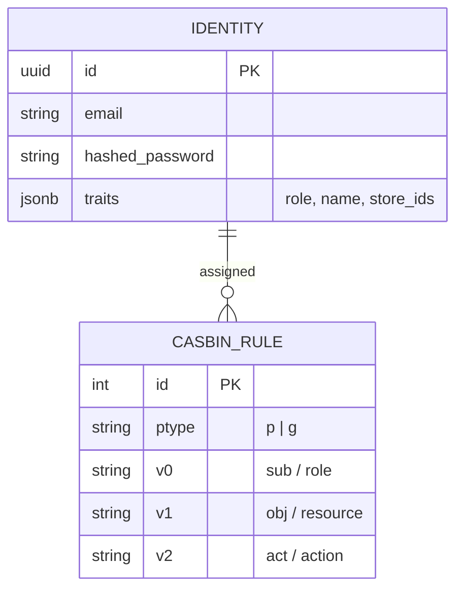
```mermaid
erDiagram
    IDENTITY {
        uuid id PK
        string email
        string hashed_password
        jsonb traits "role, name, store_ids"
    }
    CASBIN_RULE {
        int id PK
        string ptype "p | g"
        string v0 "sub / role"
        string v1 "obj / resource"
        string v2 "act / action"
    }
    IDENTITY ||--o{ CASBIN_RULE : "assigned"
```

### ☕ Farm & Origin (PostgreSQL)
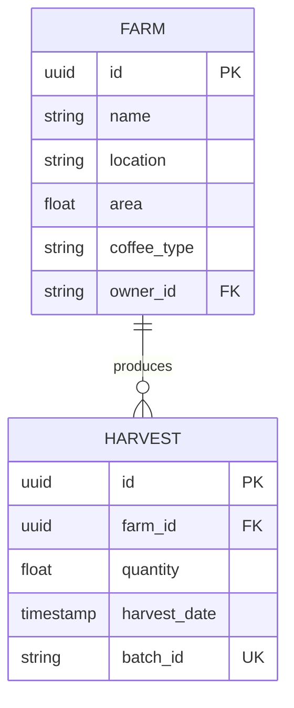
```mermaid
erDiagram
    FARM {
        uuid id PK
        string name
        string location
        float area
        string coffee_type
        string owner_id FK
    }
    HARVEST {
        uuid id PK
        uuid farm_id FK
        float quantity
        timestamp harvest_date
        string batch_id UK
    }
    FARM ||--o{ HARVEST : "produces"
```

### 🛒 Retail & Orders (PostgreSQL)
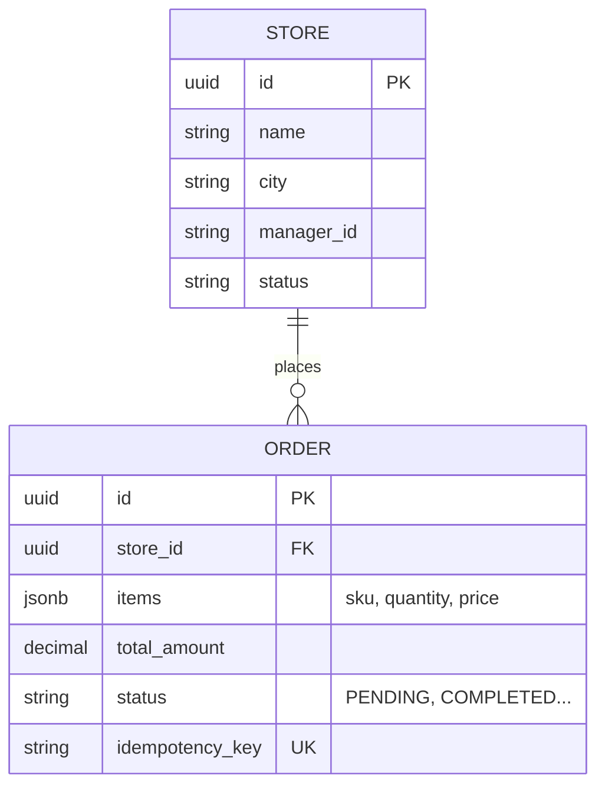
```mermaid
erDiagram
    STORE {
        uuid id PK
        string name
        string city
        string manager_id
        string status
    }
    ORDER {
        uuid id PK
        uuid store_id FK
        jsonb items "sku, quantity, price"
        decimal total_amount
        string status "PENDING, COMPLETED..."
        string idempotency_key UK
    }
    STORE ||--o{ ORDER : "places"
```

### 📦 Warehouse & Inventory (PostgreSQL + Valkey)
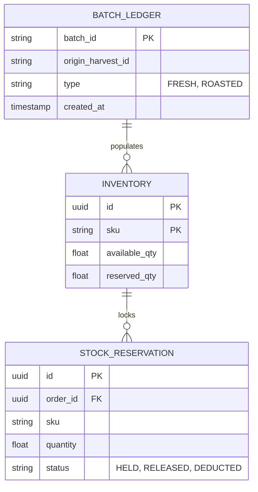
```mermaid
erDiagram
    INVENTORY {
        uuid id PK
        string sku PK
        float available_qty
        float reserved_qty
    }
    STOCK_RESERVATION {
        uuid id PK
        uuid order_id FK
        string sku
        float quantity
        string status "HELD, RELEASED, DEDUCTED"
    }
    BATCH_LEDGER {
        string batch_id PK
        string origin_harvest_id
        string type "FRESH, ROASTED"
        timestamp created_at
    }
    INVENTORY ||--o{ STOCK_RESERVATION : "locks"
    BATCH_LEDGER ||--o{ INVENTORY : "populates"
```

### 🚛 Logistics & Tracking (Valkey GEO)
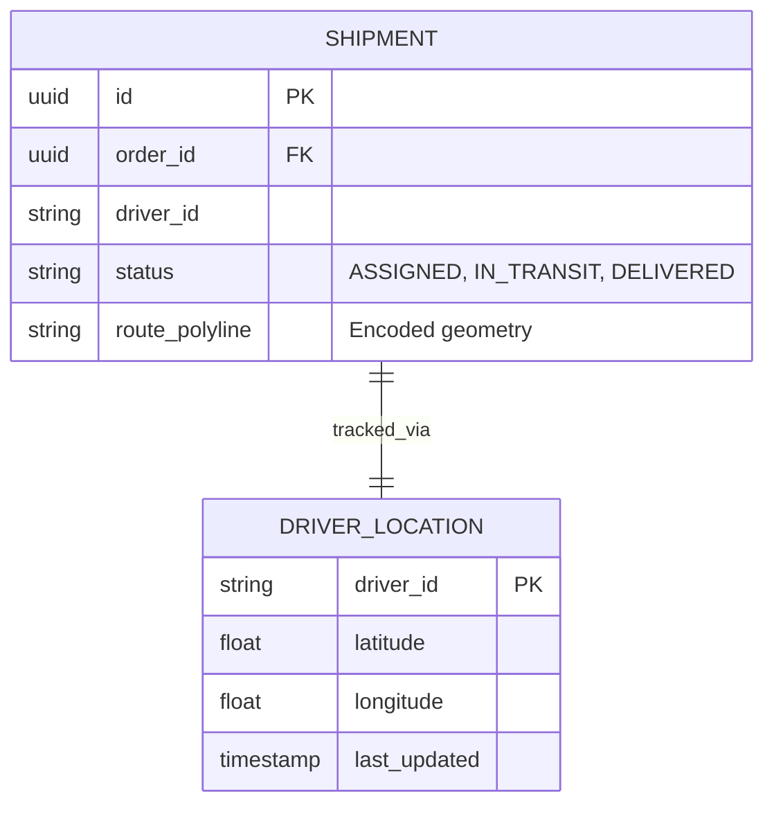
```mermaid
erDiagram
    SHIPMENT {
        uuid id PK
        uuid order_id FK
        string driver_id
        string status "ASSIGNED, IN_TRANSIT, DELIVERED"
        string route_polyline "Encoded geometry"
    }
    DRIVER_LOCATION {
        string driver_id PK
        float latitude
        float longitude
        timestamp last_updated
    }
    SHIPMENT ||--|| DRIVER_LOCATION : "tracked_via"
```

---

## 6. Relationship Diagram (High-Level ER)

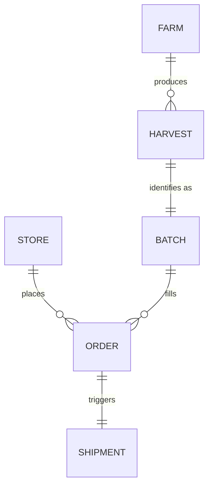
```mermaid
erDiagram
    STORE ||--o{ ORDER : "places"
    FARM ||--o{ HARVEST : "produces"
    HARVEST ||--|| BATCH : "identifies as"
    ORDER ||--|| SHIPMENT : "triggers"
    BATCH ||--o{ ORDER : "fills"
```

---

## 7. Persistence Strategy by Service

| Service | Primary DB | Role |
| :--- | :--- | :--- |
| **Auth** | Postgres | Identity traits and Casbin policies. |
| **Retail** | Postgres | Orders and store metadata. |
| **Farm** | Postgres | Farms, harvests, ownership, outbox/inbox. |
| **Warehouse** | Postgres + Valkey | Intakes, batches, inventory, reservations; Valkey locks for concurrent stock guard. |
| **Logistics** | Postgres + Valkey | Shipments, vehicles, assignments in Postgres; realtime GPS/liveness in Valkey GEO. |
| **Trace** | Elasticsearch | High-speed CQRS read model for business traceability search and timeline. |
| **Audit** | Cassandra | Immutable, append-only system/security logs. |
| **Trace live stream** | Trace Service + Cassandra or memory + SSE | Optional short-lived OTel/domain-event history for live topology replay. |

---
*Technical reference for Runtime Roasters Database Architecture.*
# Danh mục Enums (Domain Enums)

Tài liệu này liệt kê các hằng số (Enums) được sử dụng trong toàn bộ hệ thống Runtime Roasters để đảm bảo tính nhất quán giữa Backend và Frontend.

## 1. Vùng nguyên liệu (Farm Locations)

Được sử dụng khi khai báo Nông trại (`Farm`). Khi gửi request, hãy sử dụng **Code**.

| Code | Tên hiển thị (Name) | Ghi chú |
| :--- | :--- | :--- |
| `CAU_DAT` | Cầu Đất, Đà Lạt | |
| `BUON_MA_THUOT` | Buôn Ma Thuột, Đắk Lắk | |
| `PLEIKU` | Pleiku, Gia Lai | |
| `GIA_NGHIA` | Đắk Nông | |
| `KON_TUM` | Kon Tum | |

## 2. Loại cà phê (Coffee Types)

| Code | Tên hiển thị (Name) |
| :--- | :--- |
| `ARABICA` | Arabica |
| `ROBUSTA` | Robusta |
| `CHERRY` | Cherry |
| `CULI` | Culi |
# ⚙️ Technical Reference: Configuration & Environment

Runtime Roasters follows the **12-Factor App** methodology for configuration. The system is designed to be **Fail-Fast**: if a required environment variable is missing or invalid, the service will panic immediately during the bootstrap phase.

---

## 1. Core Configuration Mechanism (`pkg/config`)

All services use a centralized configuration loader located in `src/pkg/config`. This loader leverages **Viper** and **Reflect** to provide:
- **Type-safe mapping**: Environment variables are mapped directly to Go structs.
- **Fail-fast validation**: Every field in the `Config` struct is validated. String fields cannot be empty, and integers cannot be zero.
- **Multi-path loading**: Services search for `.env` files in parent directories (up to 4 levels) to support both local development and Docker environments.

### The "No Fallback" Rule
We intentionally avoid setting default values in the code. This ensures that the environment (Docker Compose, K8s, or Local) is the absolute **Source of Truth**. If a variable like `DATABASE_URL` is missing, the app will not start.

---

## 2. Global Environment Variables (`.env`)

These variables are typically shared across the entire infrastructure.

| Variable | Description | Example |
| :--- | :--- | :--- |
| `APP_ENV` | Environment name (dev, staging, prod) | `dev` |
| `POSTGRES_PORT` | Port for the shared Postgres instance | `54321` |
| `VALKEY_ADDR` | Host and port for Valkey/Redis | `localhost:6379` |
| `KAFKA_BROKERS` | List of Kafka brokers (comma-separated) | `localhost:9094` |
| `INTERNAL_SECRET` | Shared secret for internal service auth | `dev-secret-xxxx` |
| `OTEL_EXPORTER_OTLP_ENDPOINT` | OpenTelemetry collector endpoint | `localhost:4317` |
| `NEXT_PUBLIC_SIGNOZ_URL` | Public SigNoz UI URL for demo/ops links | `http://localhost:3301` |

---

## 3. Service-Specific Variables

Each service extends the `BaseConfig` with its own specific needs (mostly Kafka topics and third-party keys).

### Example: Retail Service
- `KAFKA_ORDER_CREATED_TOPIC`: Topic for publishing new orders.
- `AUTH_SERVICE_ADDR`: gRPC address of the Auth service for policy checks.
- `JWKS_URL`: URL to fetch Hydra's public keys for JWT validation.

---

## 4. Development Startup Sequence

To ensure all dependencies are ready, services should be started in this order:

1.  **Infrastructure (`task infra`)**: Starts Postgres, Kafka, Valkey, Kratos, Hydra, SigNoz, ClickHouse, and the OTel Collector.
2.  **Seeding (`task seed`)**: Provisions the Admin user and OAuth2 clients.
3.  **Auth Service**: Must be up first as it provides Casbin policies to others.
4.  **Core Business Services**: Farm, Warehouse, Retail, etc.
5.  **Intelligence Services**: Trace, Audit (these are purely consumers).
6.  **Frontend (`task fe`)**: The final entry point.

---
*Technical reference for Runtime Roasters System Administration.*
# Frontend Coding Guidelines — Runtime Roasters

This document aggregates the frontend development rules and patterns based on project feedback and requirements. All future code changes must strictly adhere to these rules.

## 1. Service Architecture (OOP Class)
All service logic (Auth, Storage, API) must be implemented as **OOP Classes**.
- Do not use discrete exported functions for complex logic.
- Export a single instance of the class (Singleton pattern).

**Example:**
```typescript
class AuthService {
  async login(...) { ... }
}
export const authService = new AuthService();
```

## 2. Constant Management (No Magic Strings)
The use of magic strings in code is strictly prohibited. All static values must be defined in the `src/constants/` directory.

- **ENV**: Environment variables (`constants/env.ts`).
- **API_ENDPOINTS**: All API URLs (`constants/api.ts`).
- **STORAGE_KEYS**: LocalStorage/SessionStorage keys (`constants/storage.ts`).
- **APP_ROUTES**: Page routes within the application (`constants/routes.ts`).
- **AUTH_PARAMS**: Query parameters related to Auth (`constants/auth.ts`).

## 3. Libraries & State Management
- **API Client**: Always use `Axios`. Avoid using `fetch` directly except in extremely special cases.
- **Data Fetching**: Use `TanStack Query` (React Query) for all server interactions to manage cache and loading states.
- **Styling**: Vanilla CSS or TailwindCSS v4 (as per requirements).

## 4. Utilities & Helpers
- **Environment**: Use the `isBrowser` utility instead of `typeof window !== 'undefined'`.
- **URL Handling**: Use the `joinPaths` function to concatenate URL components, avoiding errors from extra or missing slashes (`/`).
- **Type Safety**: Avoid using `any`. Always define clear interfaces/types.

## 5. Aesthetics (Industrial Premium)
- The interface must embody an **Industrial Premium** style:
    - Use Glassmorphism (backdrop-blur).
    - Harmonious colors, high contrast but elegant (slate, emerald, primary).
    - Subtle animation effects with `framer-motion`.
    - Modern typography (Google Fonts).

## 6. Lints & Types
- Code must pass `npm run lint` and `npx tsc --noEmit` checks.
- Do not suppress lint errors with comments unless absolutely necessary.

## 7. Auth Patterns (Seamless Identity)
The project uses the standard OIDC model but optimizes the user experience (Zero-Consent flow for internal apps).

- **Auto-Accept Consent**: The `/consent` page is implemented as a **Server Component**.
    - It automatically checks the `client_id` against a `TRUSTED_CLIENTS` list.
    - It executes the `acceptOAuth2ConsentRequest` command directly from the server-side.
    - Users never see the authorization screen, providing a smooth SSO-like feel.
- **Hydra Admin Access**: Always perform Admin tasks (Accept Login/Consent) from the server-side via API routes or Server Components to secure tokens.

---
> [!TIP]
> Use the **Master Checklist** in `docs/master_checklist.md` to verify system-wide security and integration points after making changes.

> [!IMPORTANT]
> When reviewing code or performing new tasks, Antigravity must automatically check if the code violates the above rules (especially magic strings and OOP services).
