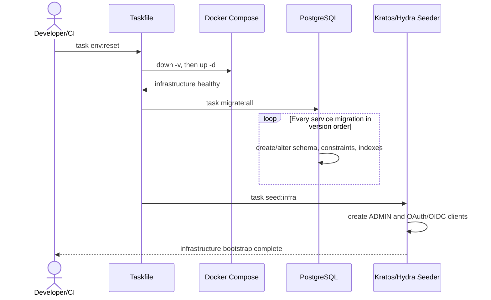
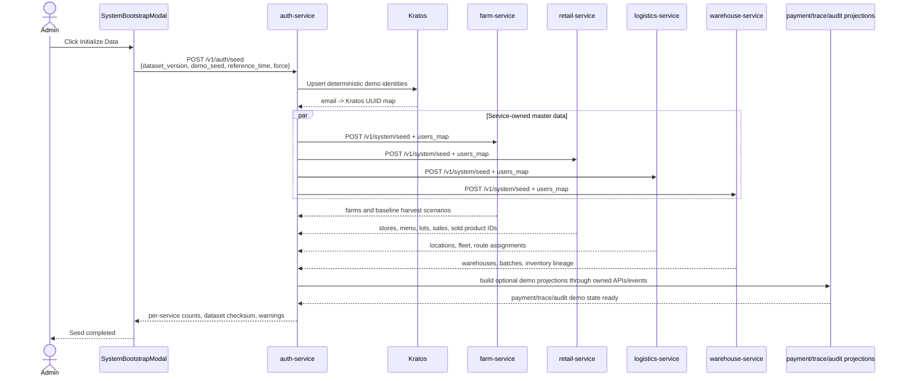

# Runtime Roasters Master Data And Seed Contract

This document is the canonical source of truth for application master data, domain enums, deterministic IDs, and demo seed behavior.

Code, migrations, seed files, UI options, tests, and API documentation must use the values defined here. A new or renamed enum/data value requires this document to be updated first or in the same approved change.

## 1. Seed Principles

1. Migrations create schema, constraints, indexes, and infrastructure-required rows only.
2. Migrations must not create farms, stores, fleet, menu items, inventory, sales, or historical business transactions.
3. Admin seed creates deterministic application master data and demo scenarios through service APIs.
4. Each service owns writes to its own database.
5. Cross-service identity references use the `email -> Kratos UUID` map created by `auth-service`.
6. Re-running the same dataset version and demo seed is idempotent.
7. Demo diversity is pseudo-random but reproducible. It must not use wall-clock time or unseeded randomness.
8. Runtime flows remain the source of truth after bootstrap. Seed data must not bypass normal ownership boundaries.

Canonical seed parameters:

| Parameter | Default | Meaning |
| --- | --- | --- |
| `dataset_version` | `rr-demo-v1` | Version of IDs, fixtures, enums, and generation rules. |
| `demo_seed` | `20260606` | Human-selectable seed controlling deterministic variation. |
| `reference_time` | `2026-06-01T08:00:00+07:00` | Fixed anchor used to backdate demo transactions. |
| `force` | `false` | Reconcile deterministic rows; never delete unrelated user-created rows. |

## 2. Two Seed Flows

### Flow A: Infrastructure And Migrations

Purpose: prepare empty infrastructure and database schemas. This flow does not make the application demo-ready.



Expected result:

- Service databases and tables exist.
- Kratos/Hydra infrastructure is usable.
- `admin@runtimeroasters.com` can authenticate.
- Domain master data is still unseeded.

Migration execution rule:

- `task migrate:all` must run every `*.up.sql` file for each service in lexical version order.
- Adding `000002_*.up.sql` must not require manually editing a command that only runs `000001`.
- Existing SQL inserts for stores, fleet, locations, farms, or inventory are migration debt and must move to Admin seed fixtures.

### Flow B: Admin Application Seed

Purpose: create a complete, coherent, immediately demonstrable application dataset.



Admin seed response must include:

- `dataset_version`
- `demo_seed`
- `dataset_checksum`
- per-service inserted/updated/skipped counts
- failed invariant list
- completion state: `complete`, `partial`, or `failed`

## 3. Canonical Identity And Role Data

Default local password: `Hello@123`. It is local/demo-only and must not be used in production.

Canonical roles:

| Role | Meaning | Seeded Persona |
| --- | --- | --- |
| `ADMIN` | Identity/resource administration; no daily domain operation. | 1 |
| `FARM_ADMIN` | Farm-domain administration role retained by authorization policy. | 0 initially |
| `FARM_MANAGER` | Operates assigned farm and harvests. | 6 |
| `WAREHOUSE_MGR` | Operates assigned warehouse and dispatch. | 3 |
| `STORE_MGR` | Operates assigned retail store. | 5 |
| `DRIVER` | Operates assigned shipment and GPS device simulation. | 11 |
| `PROCESSOR` | Warehouse processing persona reserved for future dedicated assignment. | 0 initially |
| `GUEST` | Authentication fallback; never receives privileged seed assignments. | 0 |

Canonical seeded users: 26 total.

- Admin: `admin@runtimeroasters.com`.
- Farm Managers: `mgr.farm.kho`, `mgr.farm.caudat`, `mgr.farm.sonpacamara`, `mgr.farm.aeroco`, `mgr.farm.trungnguyen`, `mgr.farm.chuse` at `@runtimeroasters.com`.
- Store Managers: `mgr.hn.hoankiem`, `mgr.hn.caugiay`, `mgr.hcm.d1`, `mgr.hcm.d7`, `mgr.dn.haichau` at `@runtimeroasters.com`.
- Warehouse Managers: `mgr.wh.hn`, `mgr.wh.hcm`, `mgr.wh.dn` at `@runtimeroasters.com`.
- Drivers: `driver.hn.01..04`, `driver.hcm.01..04`, `driver.dn.01..03` at `@runtimeroasters.com`.

Every seed fixture must use these exact emails. Alias forms such as `mgr.hcm.q1`, `mgr.store.q1`, or `mgr.warehouse.hcm` are invalid.

## 4. Canonical Domain Enums

### Farm

| Enum | Values |
| --- | --- |
| `FarmLocation` | `CAU_DAT`, `BUON_MA_THUOT`, `PLEIKU`, `GIA_NGHIA`, `KON_TUM` |
| `CoffeeType` | `ARABICA`, `ROBUSTA`, `CHERRY`, `CULI` |
| `HarvestStatus` | `NEW`, `PROCESSING`, `COMPLETED` |

### Retail

| Enum | Values |
| --- | --- |
| `StoreStatus` | `ACTIVE`, `INACTIVE` |
| `OrderStatus` | `PENDING`, `PAYMENT_PENDING`, `PAYMENT_COMPLETED`, `RESERVED`, `DISPATCH_REQUESTED`, `PREPARING`, `SHIPPING`, `DELIVERED`, `COMPLETED`, `REJECTED`, `FAILED` |
| `SaleStatus` | `COMPLETED`, `VOIDED` |
| `StockMovementType` | `RECEIVED`, `SOLD`, `ADJUSTMENT` |
| `StockReferenceType` | `SEED`, `DELIVERY`, `SALE_ITEM`, `ADJUSTMENT` |

### Warehouse

| Enum | Values |
| --- | --- |
| `BatchStatus` | `DRAFT`, `PROCESSING`, `READY_TO_STOCK`, `STOCKED` |
| `IntakeStatus` | `UNASSIGNED`, `ASSIGNED` |
| `PickupRequestStatus` | `REQUESTED`, `DISPATCHED`, `IN_TRANSIT_TO_FARM`, `PICKED_UP`, `RETURNING`, `ARRIVED_WAREHOUSE`, `RECEIVED`, `CANCELLED` |
| `DispatchRequestStatus` | `PENDING`, `STOCK_RESERVED`, `DISPATCHED`, `COMPLETED`, `CANCELLED` |

### Logistics

| Enum | Values |
| --- | --- |
| `DriverStatus` | `IDLE`, `BUSY`, `OFFLINE` |
| `VehicleStatus` | `IDLE`, `BUSY`, `MAINTENANCE` |
| `VehicleType` | `TRUCK`, `VAN` |
| `LocationType` | `FARM`, `WAREHOUSE`, `RETAILER` |
| `ShipmentType` | `FARM_PICKUP`, `RETAIL_DELIVERY`, `RETURN_TO_BASE` |
| `ShipmentStatus` | `PENDING`, `ASSIGNED`, `PICKED_UP`, `IN_TRANSIT`, `DELIVERED`, `FAILED`, `CANCELLED`, `IN_TRANSIT_TO_FARM`, `ARRIVED_AT_FARM`, `RETURNING_TO_WAREHOUSE`, `ARRIVED_WAREHOUSE`, `IN_TRANSIT_TO_STORE`, `ARRIVED_AT_STORE`, `RETURNING_TO_BASE`, `RETURNED_TO_BASE`, `COMPLETED` |

### Payment And Messaging

| Enum | Values |
| --- | --- |
| `PaymentStatus` | `PENDING`, `SUCCEEDED`, `FAILED`, `REFUNDED` |
| `OutboxStatus` | `PENDING`, `PROCESSING`, `COMPLETED`, `FAILED` |

`LocationType=ROASTERY` is not canonical. Current logistics code using `ROASTERY` while fixtures use `WAREHOUSE` must be reconciled to `WAREHOUSE`.

## 5. Deterministic Master Dataset

### Locations And Organizations

| Entity | Count | Canonical IDs/Regions |
| --- | ---: | --- |
| Farms | 6 | 3 Cau Dat, 2 Buon Ma Thuot, 1 Pleiku |
| Warehouses | 3 | `WAREHOUSE-HN-001`, `WAREHOUSE-HCM-001`, `WAREHOUSE-DN-001` |
| Stores | 5 | Hoan Kiem, Cau Giay, District 1, District 7, Hai Chau |
| Vehicles | 11 | HN 4, HCM 4, DN 3 |
| Drivers | 11 | one deterministic driver per vehicle |
| Logistics locations | 14 | 6 farms + 3 warehouses + 5 stores |

Store database IDs remain deterministic UUIDs. Logistics location IDs remain readable external IDs such as `STORE-HN-01`; explicit mapping between the two is required in seed fixtures.

### RR-URG-07A Retail Dataset

Canonical menu table: `retail_menu_items`. Contract identifier: `menu_item_id`.

Planned menu:

| Menu Item ID | SKU | Name | Coffee Type | Price |
| --- | --- | --- | --- | ---: |
| `MENU-ESPRESSO-001` | `CUP-ESPRESSO` | Espresso | `ARABICA` | 45000 |
| `MENU-AMERICANO-001` | `CUP-AMERICANO` | Americano | `ARABICA` | 50000 |
| `MENU-LATTE-001` | `CUP-LATTE` | Cafe Latte | `ARABICA` | 65000 |
| `MENU-CAPPUCCINO-001` | `CUP-CAPPUCCINO` | Cappuccino | `ARABICA` | 65000 |
| `MENU-PHIN-ROBUSTA-001` | `CUP-PHIN-RB` | Vietnamese Phin | `ROBUSTA` | 40000 |
| `MENU-MILK-COFFEE-001` | `CUP-MILK-RB` | Vietnamese Milk Coffee | `ROBUSTA` | 48000 |

Planned 07A baseline:

- 6 active chain-wide menu items.
- 5 stores.
- 2 to 4 retail inventory lots per store.
- Every store has both Arabica and Robusta availability.
- At least two stores receive lots from more than one warehouse/batch lineage.
- 3 to 8 completed sales per store.
- 1 to 3 sale items per invoice.
- 20 to 40 sold items system-wide.
- Every sold item has unique UI-style `product_id`, for example `RR-PROD-HK-0001`.
- `trace_code = product_id`.
- Every sale item references exactly one `menu_item_id` and one `retail_inventory_lot_id`.
- Stock movement history is authoritative:

```text
received_quantity = sum(RECEIVED quantity_delta)
available_quantity = sum(all quantity_delta)
```

## 6. Diverse But Reproducible Demo Algorithm

The generator must not call unseeded `rand`, `time.Now()`, or database `ORDER BY RANDOM()`.

### Stable Random Function

For each generated field:

```text
random_u64 = first_8_bytes(
  SHA256(dataset_version + "|" + demo_seed + "|" + entity_type + "|" + entity_index + "|" + field_name)
)
```

Operations:

- Uniform choice: `index = random_u64 mod option_count`.
- Integer range: `min + random_u64 mod (max - min + 1)`.
- Weighted choice: convert weights to cumulative integer ranges and select `random_u64 mod total_weight`.
- Deterministic timestamp: `reference_time - duration(random_u64 mod allowed_window)`.
- Deterministic ID: use readable fixed prefixes plus stable sequence, not random UUIDs, when IDs are referenced across services/docs.

Because each field is independently hashed, adding a new field does not change previously generated values.

### Diversity Guarantees Before Randomization

Hard quotas are created first; pseudo-random selection fills the remainder.

Required quotas:

- All 5 stores have transactions.
- All 6 menu items appear at least twice globally.
- Arabica and Robusta both appear in every store inventory.
- At least 3 farm origins appear in public trace examples.
- Every warehouse appears in at least one inventory lineage.
- Payment scenario distribution for optional history: 80% `SUCCEEDED`, 10% `PENDING`, 7% `FAILED`, 3% `REFUNDED`.
- Shipment history includes completed, in-transit, and one failed/cancelled example.
- Sale quantities never make inventory negative.

### Retail Lot Selection

For seeded sales:

1. Filter lots by `store_id`, menu item coffee type/SKU compatibility, and positive balance.
2. Sort candidates by stable lot ID.
3. Select candidate using the stable random function.
4. If the selected lot lacks upstream lineage, reject seed generation.
5. Insert sale item, `SOLD` movement, and updated lot balance in one transaction.

Production runtime may later use FIFO/FEFO. Seeded pseudo-random lot selection exists only to demonstrate multiple origins while preserving valid inventory.

## 7. Seed Ownership

| Service | Admin Seed Owns | Must Not Own |
| --- | --- | --- |
| Auth | users, roles, email-to-Kratos mapping | farm/store/fleet rows |
| Farm | farms and optional baseline harvest scenarios | warehouse inventory |
| Warehouse | warehouses, baseline upstream lots/batches/inventory | retail sales |
| Logistics | locations, vehicles, drivers, assignments | store or farm records |
| Retail | stores, menu items, retail lots, sales, sold products, stock movements | upstream batch truth |
| Payment | optional payment scenario projections | retail order truth |
| Trace | derived public/read projections | operational sale or inventory truth |
| Audit | append-only seed audit evidence | mutable operational records |
| Socket | no durable seed data | business state |

Payment, trace, and audit demo rows should be produced from owned APIs/events or an explicitly labeled projection builder. They are not part of the current four-service Admin fan-out and remain a required implementation gap.

## 8. Idempotency And Integrity

- Deterministic natural IDs or fixture IDs are mandatory.
- Upsert only rows belonging to the active `dataset_version`.
- `force=true` reconciles deterministic rows; it does not truncate databases.
- Seed writes within one service must be transactional.
- A downstream failure returns overall state `partial`; UI must not report full success.
- Dataset checksum is SHA-256 of canonical sorted fixture/generated records.
- Re-running the same parameters must produce the same checksum and record counts.
- Unknown manager email, missing upstream lineage, duplicate `product_id`, invalid enum, or negative inventory fails the affected service seed.

## 9. Required Verification

### Migration Flow

- Fresh database receives all migrations in order.
- Existing demo database receives additive migrations safely.
- No business master rows are inserted by migration.

### Admin Seed Flow

- All 26 identities exist once.
- Every farm/store/warehouse manager email resolves to a Kratos UUID.
- Counts match this document.
- Same seed parameters produce identical checksum twice.
- Different `demo_seed` changes scenario distribution but not canonical master IDs.
- All enum values in DB/API/UI are members of this document's registry.
- Every public `product_id` resolves to one sold item and one valid upstream lot lineage.
- Inventory equations hold for every retail lot.

## 10. Current Implementation Drift

The following must be corrected as tickets are implemented:

- `Taskfile.yml` currently runs specific `000001` migration files instead of all migrations in order.
- Several migrations currently insert stores, farms, fleet, locations, inventory, or webhook demo rows.
- Retail fixtures use `mgr.hcm.q1/q7`, while auth creates `mgr.hcm.d1/d7`.
- Older docs list non-canonical manager aliases.
- Logistics code defines `ROASTERY`, while fixtures use `WAREHOUSE`.
- Admin seed currently fans out only to Farm, Retail, Logistics, and Warehouse.
- UI currently sends `force=true` unconditionally.
- Historical `task seed:demo` uses unseeded randomness and wall-clock time, so it is not reproducible.
- `deployments/reset-demo-state.sh` resets runtime state but does not run migrations or Admin seed.

RR-URG-07A must follow this document for `retail_menu_items`, inventory lots, sales, sold-item `product_id`, and stock movements.
