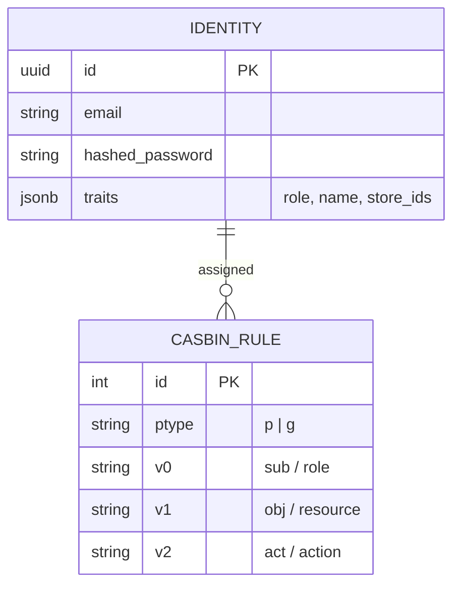
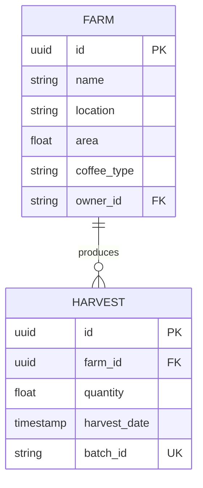
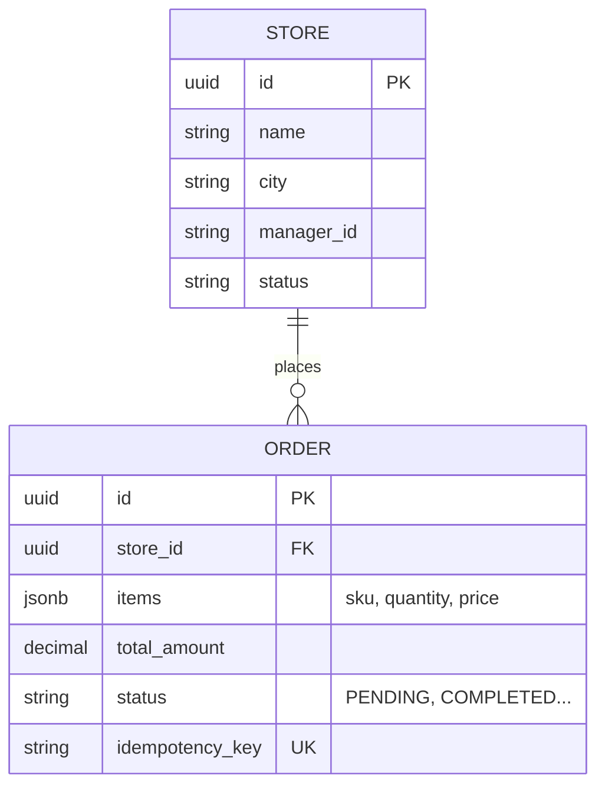
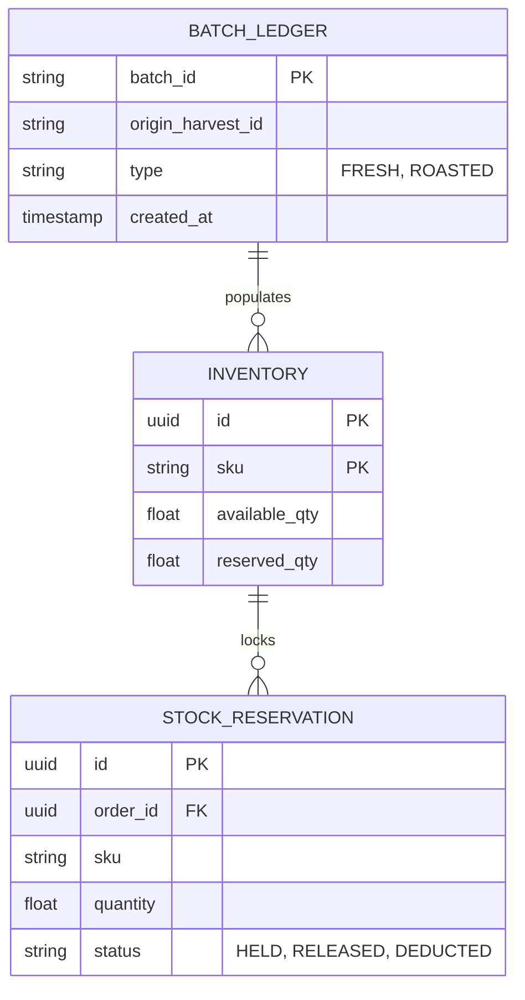
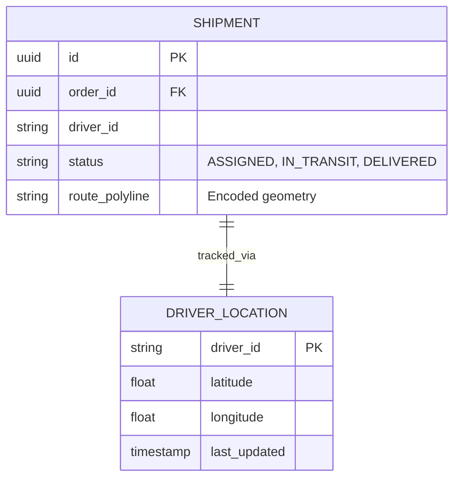
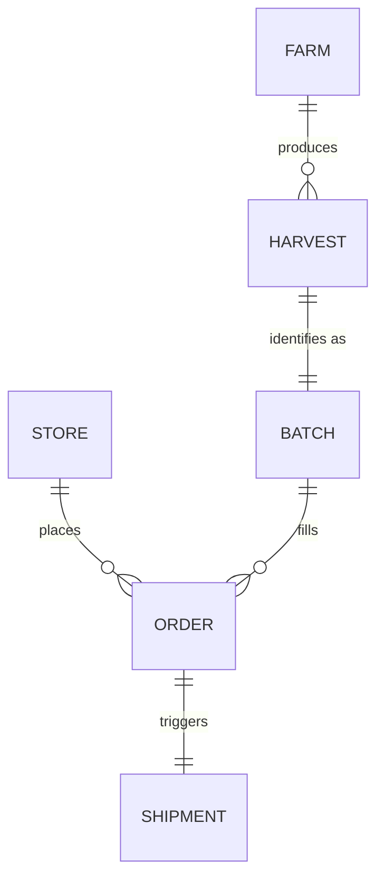

# 🗄️ Technical Reference: Data Models & Persistence

Runtime Roasters uses **PostgreSQL** as the primary source of truth for microservices, managed via the **GORM** ORM. This document details the data structures and the critical consistency mechanisms implemented at the database layer.

---

## 1. Persistence Responsibility Matrix

Runtime Roasters uses polyglot persistence, but each datastore has a strict responsibility boundary.

| Storage | Responsibility | Good For | Not For |
| :--- | :--- | :--- | :--- |
| **PostgreSQL** | Transactional source of truth per service | Orders, harvests, shipments, inventory, assignments, state machines, outbox/inbox | High-volume telemetry history, full-text journey search at scale |
| **PostgreSQL JSONB** | Flexible metadata inside transactional rows | Event payloads, identity traits, request snapshots, small extension fields, idempotency metadata | Replacing normalized business columns, replacing Elasticsearch document search, replacing Cassandra append-only logs |
| **Elasticsearch** | CQRS/read-model for traceability and fast search | Denormalized journey documents, business trace lookup by batch/order/shipment/store, dashboard search/filter | Source-of-truth writes, financial/order state, immutable audit |
| **Cassandra** | Append-only high-write history | Immutable audit logs, optional short-lived trace-service history, high-volume event/span history | Transactional state, ad-hoc joins, primary business query API |
| **Valkey** | Realtime/coordination cache | GEO driver locations, TTL liveness keys, idempotency cache, distributed locks | Durable business state, audit history |

Decision rules:

- Business state is written to PostgreSQL first.
- Events are emitted through outbox/inbox patterns, not by writing directly to read models.
- Elasticsearch is rebuilt from Kafka/domain events when needed.
- Cassandra is append-only and optimized for writes/history, not operational editing.
- JSONB is allowed for flexible payloads and metadata, but important query/scope fields must remain typed columns.

## 2. PostgreSQL JSONB Rules

Use JSONB intentionally:

- `outbox_events.payload`: event payload snapshot published to Kafka.
- `identity.traits`: flexible Ory/Kratos traits such as email, role, org, and store scopes.
- `orders.items`: small embedded order item list if the service does not need item-level joins.
- `span/event attributes`: only when stored as secondary metadata, not as primary query contract.

Do not hide core authorization or business state only inside JSONB:

- `store_id`, `farm_id`, `warehouse_id`, `driver_id`, `shipment_id`, `order_id`, `status`, and timestamps should be typed/indexed columns where they drive authorization, filtering, or workflow transitions.
- If a JSONB key becomes required for filtering, scoping, or dashboard performance, promote it to a real column or a dedicated read model.

## 3. Trace And Audit Storage Boundaries

The final demo has three related but different data products:

| Data Product | Primary Store | Source | Purpose |
| :--- | :--- | :--- | :--- |
| **Business traceability document** | Elasticsearch | Domain events projected by Trace Service | Fast user-facing search and timeline: Farm -> Warehouse -> Retail |
| **Immutable audit log** | Cassandra | Significant domain/security/admin events | Compliance-style append-only history and tamper-evidence |
| **Trace-service live history** | Cassandra table owned by trace-service | OTel spans + selected domain events | Short-lived live visualization/replay for architecture/topology demo |

Elasticsearch and Cassandra should not compete:

- Elasticsearch answers "show me the business journey quickly".
- Cassandra answers "what immutable facts/events/spans were recorded over time".
- Postgres answers "what is the current authoritative state".

Trace-service live history, if implemented, should use short TTL and remain separate from immutable audit logs unless the schema and retention policy are intentionally shared.

---

## 4. Reliability Patterns: Outbox & Inbox

To ensure "Exactly-Once" semantics and prevent data loss in a distributed system, every state-changing service implements the following tables:

### A. Transactional Outbox (`outbox_events`)
When a service saves business data (e.g., creating an order), it also saves an event to this table in the **same transaction**.
- **`id` (UUID)**: Unique identifier for the event.
- **`event_type`**: Name of the event (e.g., `OrderCreated`).
- **`payload` (JSONB)**: The full event data.
- **`status`**: `PENDING`, `COMPLETED`, or `FAILED`.
- **`topic`**: The Kafka topic where this event will be published.

### B. Transactional Inbox (`inbox_events`)
Used by consumers to ensure idempotency. Before processing a message from Kafka, the consumer checks this table.
- **`message_id` (Unique)**: The unique ID from the Kafka message header.
- **`processed_at`**: Timestamp of processing.

## 5. Core Service ER Diagrams

### 🔐 Auth & Identity (PostgreSQL + Kratos)

### ☕ Farm & Origin (PostgreSQL)

### 🛒 Retail & Orders (PostgreSQL)

### 📦 Warehouse & Inventory (PostgreSQL + Valkey)

### 🚛 Logistics & Tracking (Valkey GEO)

---

## 6. Relationship Diagram (High-Level ER)

---

## 7. Persistence Strategy by Service

| Service | Primary DB | Role |
| :--- | :--- | :--- |
| **Auth** | Postgres | Identity traits and Casbin policies. |
| **Retail** | Postgres | Orders and store metadata. |
| **Farm** | Postgres | Farms, harvests, ownership, outbox/inbox. |
| **Warehouse** | Postgres + Valkey | Intakes, batches, inventory, reservations; Valkey locks for concurrent stock guard. |
| **Logistics** | Postgres + Valkey | Shipments, vehicles, assignments in Postgres; realtime GPS/liveness in Valkey GEO. |
| **Trace** | Elasticsearch | High-speed CQRS read model for business traceability search and timeline. |
| **Audit** | Cassandra | Immutable, append-only system/security logs. |
| **Trace live stream** | Trace Service + Cassandra or memory + SSE | Optional short-lived OTel/domain-event history for live topology replay. |

---
*Technical reference for Runtime Roasters Database Architecture.*
