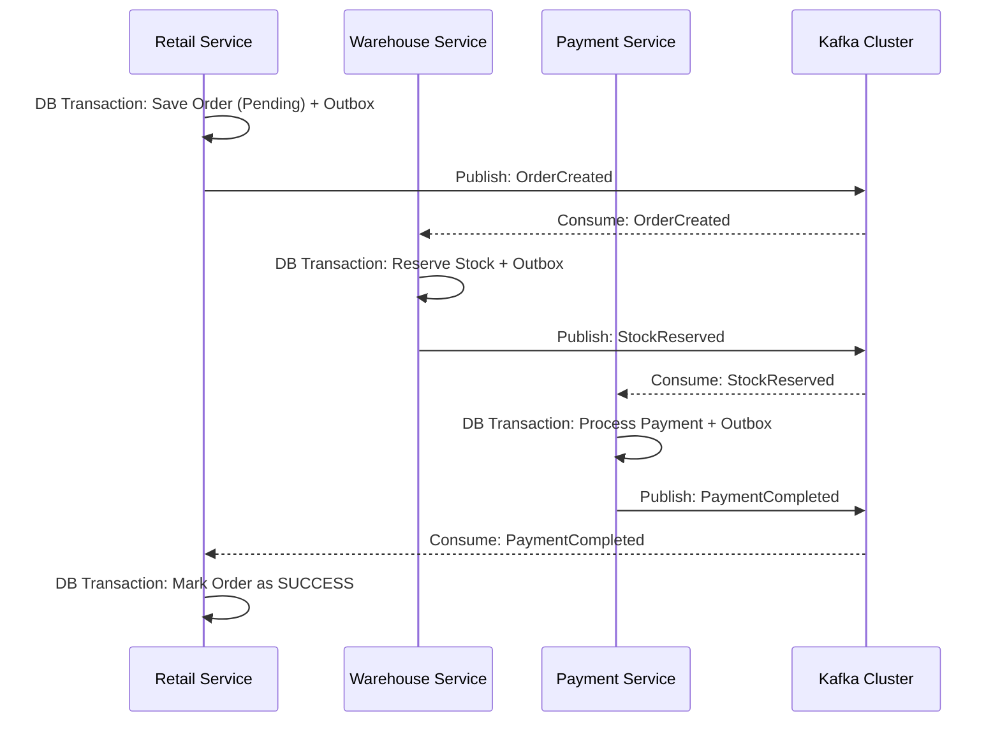
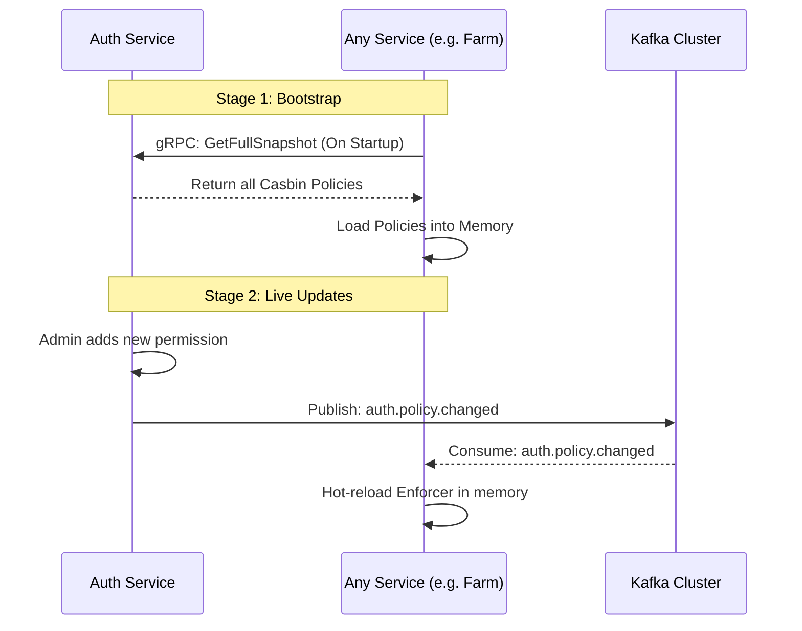
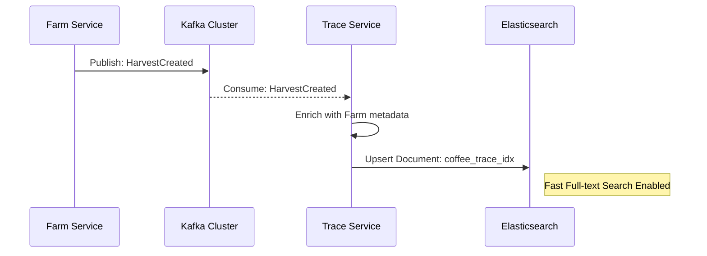
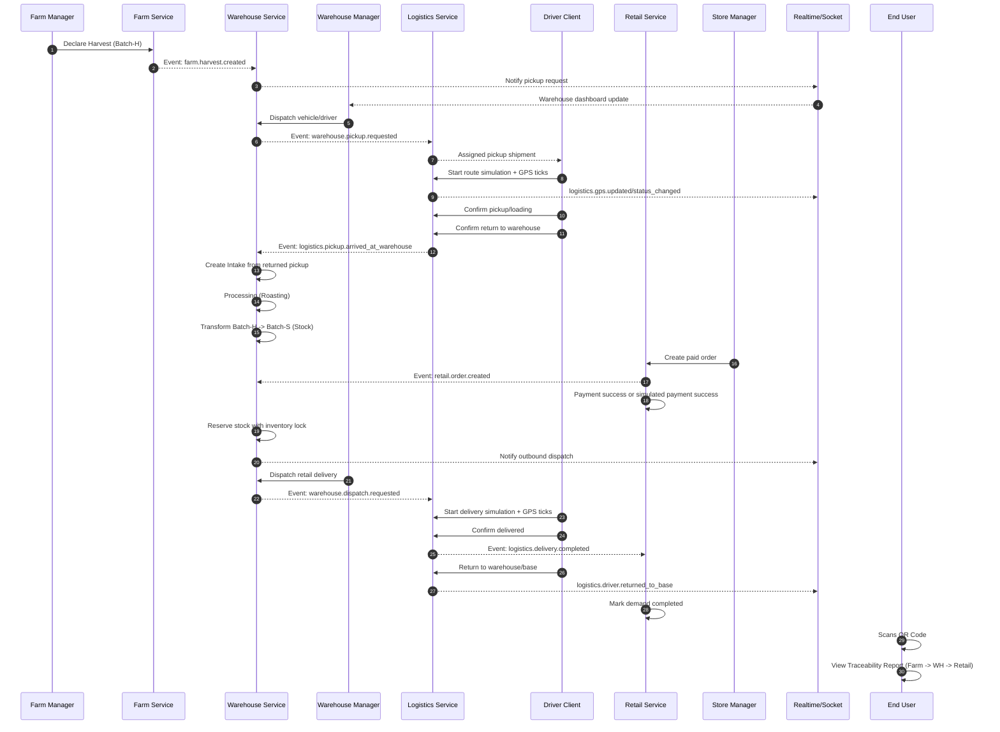
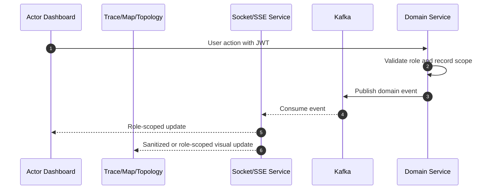
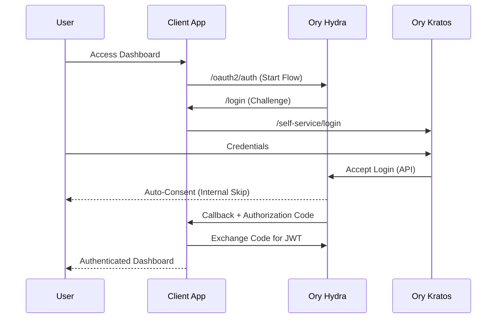

# 🌊 Technical Reference: Core Sequences & Rationale

This document provides a deep dive into the most complex technical flows of the **Runtime Roasters** platform. It explains not only *how* data moves but *why* specific distributed patterns were chosen.

---

## 1. The Distributed Order SAGA (Choreography)

We use **Choreographed Sagas** for order fulfillment. Unlike Orchestrated Sagas, there is no central "master" service; instead, each service knows what to do when it hears a specific event.

### Sequence Diagram

### Technical Rationale: Why Choreography?
- **Decoupling**: The Retail service doesn't need to know that the Warehouse or Payment services even exist. It only cares about publishing and consuming events.
- **Scalability**: Services can be scaled independently based on their load (e.g., the Warehouse service might need more replicas during a harvest season).

---

## 2. Distributed Authorization Sync

To achieve **Zero-Trust** security with high performance, we use a distributed Casbin model.

### Sequence Diagram

### Technical Rationale: Why Distributed Auth?
- **Low Latency**: Authorization checks are performed locally in memory at the service level (ns vs ms). No gRPC round-trip is required for every request.
- **Resilience**: If the Auth Service or Kafka is temporarily down, the services can still function using their cached policies.

---

## 3. CQRS Read-Model Projection

The **Trace Service** provides a fast, searchable view of the supply chain history by projecting data into Elasticsearch.

### Sequence Diagram

### Technical Rationale: Why CQRS?
- **Performance**: Relational databases (Postgres) are great for ACID transactions but slow for complex traceability joins. ES is optimized for high-speed retrieval.
- **Isolation**: Heavy search queries on the Dashboard don't impact the performance of the core business services.

---

## 4. The Journey of a Bean (End-to-End Lifecycle)

This diagram tracks the production-demo lifecycle of a coffee batch across the entire supply chain. The important change from earlier sprint shortcuts is that harvest does not become warehouse intake immediately; it must pass through logistics pickup first.

### UI/Role Notes

- `FARM_MANAGER` creates harvest and watches pickup status.
- `WAREHOUSE_MGR` dispatches vehicles/drivers and controls warehouse receipt/processing.
- `DRIVER` owns route simulation and milestone confirmation in the main demo flow.
- `STORE_MGR` creates paid retail orders and watches incoming delivery status.
- Root Client App `ArchitectureTopology` may be public/no-auth with sanitized topology/demo data.
- Private realtime dashboard streams should be authenticated and role-scoped.

---

## 5. Realtime Demo Stream

The production-demo UI should have enough delay/pacing for viewers to understand the flow.

The socket service is display transport only. Persisted backend state and domain events remain source of truth.

---

## 6. Zero-Consent Identity Flow (Seamless SSO)

To optimize internal operations, we implement a **Zero-Consent** OIDC flow for trusted internal dashboard clients.

### Technical Rationale: Why Zero-Consent?
- **User Experience**: Removes redundant "Allow access" screens for internal employees.
- **Security**: The "skip" logic is only applied to **Trusted Client IDs** verified by the Monitor/Auth service.

---
*Technical reference for Runtime Roasters Architectural Decision Patterns.*
