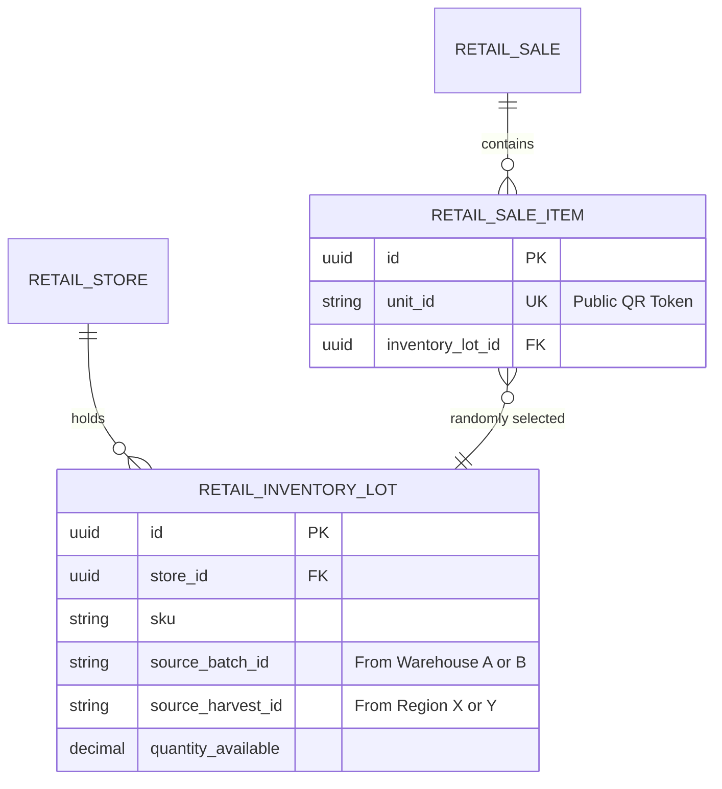
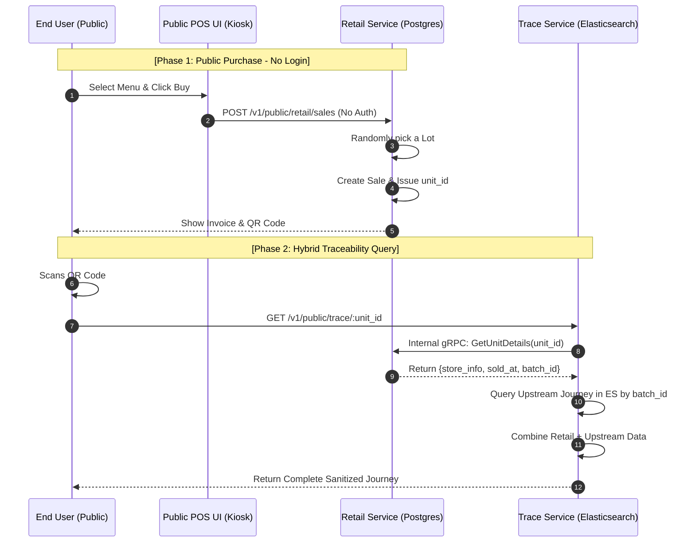

# Technical Detail Design: RR-URG-07 Public Traceability Projection

## 1. Overview & Strategic Intent
Mục tiêu của thiết kế này là đóng lại "vòng lặp dữ liệu" cuối cùng của Runtime Roasters. Chúng ta sẽ triển khai một **Public POS Kiosk UI** cho phép khách hàng chọn sản phẩm và mua hàng trực tiếp (không cần đăng nhập).

Hệ thống sẽ chứng minh tính minh bạch bằng cách kết hợp:
1.  **Dữ liệu thực tế tại Cửa hàng (Live Retail DB)**: Thông tin hóa đơn, Store, và thời gian bán.
2.  **Hành trình thượng nguồn (Elasticsearch - Trace Service)**: Toàn bộ lịch sử từ Farm ➔ Warehouse ➔ Logistics Delivery.

Việc truy xuất nguồn gốc sẽ sử dụng cơ chế **Hybrid Query** (Truy vấn kết hợp) thay vì đẩy toàn bộ dữ liệu bán lẻ vào Elasticsearch, giúp hệ thống tinh gọn và dữ liệu luôn "tươi".

---

## 2. Entity Model & Relationships

Hệ thống hỗ trợ một Store nhập hàng từ nhiều kho/vùng khác nhau.

### Key Logic:
1.  **Multi-Warehouse Support**: `RETAIL_INVENTORY_LOT` lưu trữ `source_batch_id` từ các Warehouse khác nhau. Seed data ban đầu sẽ đảm bảo Store Hoàn Kiếm có cà phê từ cả Cầu Đất và Buôn Ma Thuột.
2.  **Random Lot Picking**: Khi khách hàng mua 1 sản phẩm, Backend sẽ thực hiện **Random Pick** một Lot còn hàng trong kho của Store đó để gán cho sản phẩm. Điều này giúp demo thấy được sự đa dạng về nguồn gốc ngay cả khi mua cùng một loại sản phẩm.

---

## 3. Sequence Diagram: Hybrid Traceability Flow

Luồng này mô tả cách hệ thống kết hợp dữ liệu khi khách hàng quét mã QR.

---

## 4. Flow Details & API Interactions

### 4.1. Flow 1: Public POS Purchase
- **UI**: Một trang công khai (Kiosk mode). Người dùng chọn menu (Cafe, Bánh, v.v.).
- **API**: `POST /v1/public/retail/sales`.
- **Logic**: 
    - Cho phép mua thoải mái không cần đăng nhập.
    - **Random Pick**: `SELECT id FROM retail_inventory_lots WHERE store_id = ? AND sku = ? AND quantity > 0 ORDER BY RANDOM() LIMIT 1`.
    - Gán `unit_id` cho từng item.

### 4.2. Flow 2: Manager Oversight
- **Role**: `STORE_MGR` hoặc `ADMIN`.
- **API**: `GET /v1/retail/sales`.
- **UI**: Manager có thể xem lại toàn bộ hóa đơn và danh sách sản phẩm đã bán của cửa hàng mình quản lý.

### 4.3. Flow 3: Hybrid Traceability (Giải thích kỹ)
- **Tại sao không lưu toàn bộ vào ES?**: Thông tin bán hàng (Sale) thay đổi liên tục và số lượng cực lớn. Thông tin hành trình (Batch) thì cố định và phức tạp.
- **Cơ chế**:
    1. Khi quét QR, `trace-service` nhận `unit_id`.
    2. Nó gọi sang `retail-service` để lấy "Mảnh ghép cuối": Sản phẩm này bán ở đâu? Lúc nào? Và quan trọng nhất: **Nó thuộc Batch nào?**
    3. `trace-service` dùng `batch_id` đó để lấy "Bức tranh lớn" từ Elasticsearch (đã được project từ Farm/Warehouse).
    4. Kết hợp cả hai để trả về cho User.

---

## 5. Simulation vs. Production-Ready Logic

| Thành phần | Cơ chế Simulation (Demo) | Cơ chế Production-Ready |
| :--- | :--- | :--- |
| **Auth** | **Public POS**: Khách hàng mua không cần đăng nhập. | Khách hàng mua qua App (có User ID) hoặc POS (có Staff ID). |
| **Lot Selection** | **Random Pick**: Chọn ngẫu nhiên Lot để demo đa dạng nguồn gốc. | **FIFO/FEFO**: Chọn theo lô nhập trước hoặc hết hạn trước để tối ưu vận hành. |
| **Payment** | Bỏ qua (Mua là xong). | Phải tích hợp Gateway thực tế. |

---

## 6. Seed Data Requirements
Để demo thành công luồng "nhiều kho, nhiều vùng":
1.  **Warehouses**: Seed ít nhất 2 kho (Kho Miền Bắc - HN, Kho Miền Nam - HCM).
2.  **Batches**: 
    - Batch A: Arabica từ Cầu Đất -> Nhập vào Kho HN.
    - Batch B: Robusta từ Buôn Ma Thuột -> Nhập vào Kho HN.
3.  **Retail Inventory**:
    - Store Hoàn Kiếm nhận hàng từ cả Batch A và Batch B.
    - Kết quả: Khi khách hàng mua 2 ly cafe Arabica tại Hoàn Kiếm, nhờ logic **Random Pick**, ly thứ nhất có thể hiện trace từ Cầu Đất, ly thứ hai có thể hiện trace từ vùng khác (nếu có).

---

## 7. UI/FE Requirements

### 7.1. Public POS UI
- Giao diện dạng lưới (Grid) hiển thị các sản phẩm.
- Nút "Thanh toán/Mua ngay" nổi bật.
- Sau khi mua, hiển thị Modal chứa QR Code và thông tin Unit ID.

### 7.2. Manager Dashboard
- Tab "Hóa đơn / Lịch sử bán": Hiển thị danh sách các `retail_sales`.
- Có thể click vào từng hóa đơn để xem chi tiết sản phẩm và mã `unit_id` đã phát hành.

---

## 8. Events
Mặc dù không lưu vào ES để truy xuất, hệ thống vẫn bắn sự kiện `retail.sale.completed` để:
1.  **Audit Service**: Lưu vào Cassandra làm bằng chứng pháp lý (Audit Trail).
2.  **Monitor Service**: Hiển thị hiệu ứng "Glow" trên bản đồ hệ thống khi có một giao dịch thành công tại Store.

---
**BA & TechLead Review Required.**
